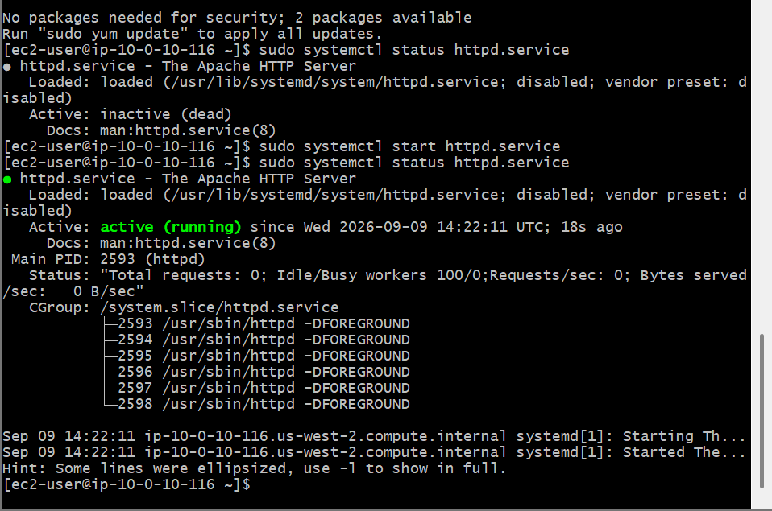
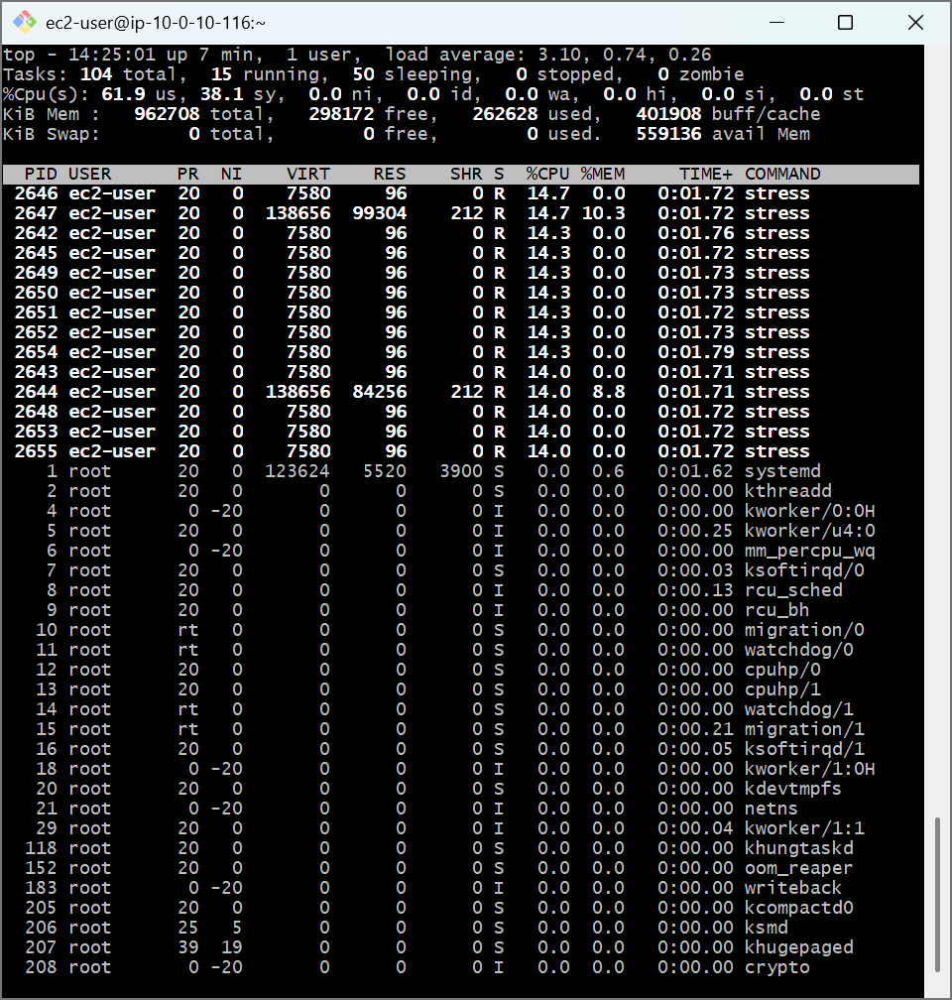
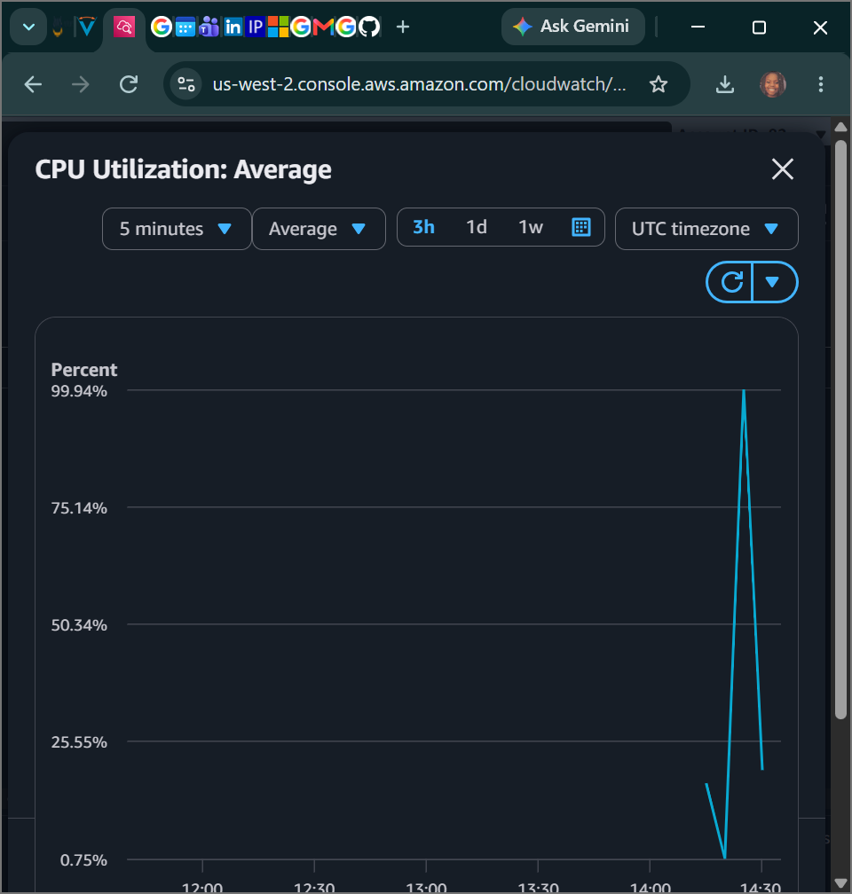

# AWS Cloud Lab: Linux Service Management (systemctl) & Infrastructure Monitoring (AWS CloudWatch)

## 📌 Project Overview
This lab demonstrates system administration workflows centered around service management, application hosting, computational performance testing, and cloud monitoring orchestration. Activating web infrastructure clients via daemon managers (`systemctl`) and evaluating resulting data footprints using cloud performance instrumentation dashboards (AWS CloudWatch) are essential tasks for cloud architecture maintenance.

## 🛠️ Tools Used
- **Cloud Infrastructure:** Amazon Web Services (AWS EC2 & AWS CloudWatch)
- **Host Application Service:** Apache HTTP Web Server (`httpd`)
- **Load Generation Engine:** Linux `stress` telemetry script execution
- **Terminal Client:** Git Bash (POSIX Shell)

## 🚀 Step-by-Step Implementation

### 1. Active Web Daemon Management Configuration (`systemctl`)
- Inspected the running configuration profile baseline of the Apache HTTP Server web environment.
- Used initialization supervisor tools to dynamically boot the inactive process into system memory:
  ```bash
  sudo systemctl start httpd.service
  ```
- Audited running status metrics to confirm a transition to state `Active: active (running)`.
- Verified live network routing parameters by querying the EC2 node's Public IP over standard HTTP in an external browser, loading the default test server application payload page successfully.

### 2. Micro-System Stress Profiling (`./stress.sh`)
- Granted execution rights to administrative script binaries via `chmod +x stress.sh`.
- Launched high-load computation stress workers alongside system monitoring tracking engines to evaluate node bottlenecks under forced stress:
  ```bash
  ./stress.sh & top
  ```
- Evaluated runtime resource parameters inside the system telemetry charts to verify maximum CPU utilization patterns.

### 3. AWS CloudWatch Metrics & Telemetry Analysis
- Opened the **AWS Management Console** and directed the tracking focus onto the automated **AWS CloudWatch EC2 Dashboard**.
- Monitored real-time hypervisor charts mapping historical host performance thresholds.
- Captured and verified the explicit, corresponding spike inside the `CPU Utilization: Average` chart widget, confirming perfect structural convergence between operating system actions and cloud monitoring layers.

---

## 📸 Architectural Proof of Work

### Apache HTTP Web Server Deployment Verification


### Linux Terminal System Resource Stress Mapping


### AWS CloudWatch Metric Graph Aggregation Pipeline

