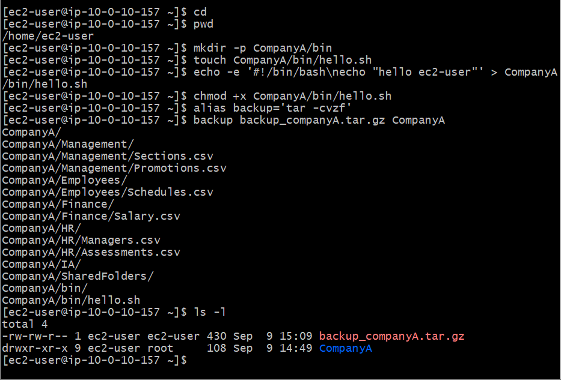
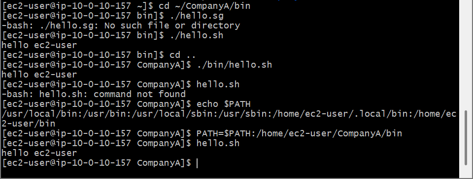

# AWS Cloud Lab: Bash Shell Customization, Aliasing & Environment Variables ($PATH)

## 📌 Project Overview
This lab demonstrates shell optimization strategies, command-line personalization mechanisms, and system execution pathway overrides inside a Linux environment. Developing custom command shortcuts (`alias`) and updating the system lookup tracker array (`$PATH`) are vital operational paradigms for deploying configuration runtimes and managing third-party execution tools across cloud instances.

## 🛠️ Tools Used
- **Cloud Infrastructure:** Amazon Web Services (AWS EC2)
- **Host OS:** Amazon Linux 2 (AMI)
- **Terminal Client:** Git Bash (POSIX Shell)

## 🚀 Step-by-Step Implementation

### 1. Custom Execution Aliasing (`alias`)
- Constructed a localized command macro named `backup` using shell aliasing parameters.
- Mapped the alias string onto a deep tape archive operation (`tar -cvzf`), establishing a two-argument utility capable of backing up dynamic target file paths into isolated zipped archives.
  ```bash
  alias backup='tar -cvzf '
  ```
- Validated shorthand operations by creating a fully compressed tracking archive (`backup_companyA.tar.gz`) from the parent shell layout.

### 2. Execution Scope & System Environment Adjustments (`$PATH`)
- Analyzed runtime folder execution constraints by evaluating why direct loose commands throw `command not found` faults despite scripts existing on disk.
- Audited the current system executable tracking array using environmental echoes:
  ```bash
  echo \$PATH
  ```
- Expanded system search scopes by appending the nested executable directory pathway to the runtime system tracker variable list:
  ```bash
  PATH=\$PATH:/home/ec2-user/CompanyA/bin
  ```
- Confirmed transformation validity by executing standalone custom utilities (`hello.sh`) seamlessly from any directory index on the server without referencing exact relative positions.

---

## 📸 Technical Verification Proofs

### Custom Alias Execution Verification Output


### Variable Path Optimization and Global Command Execution

