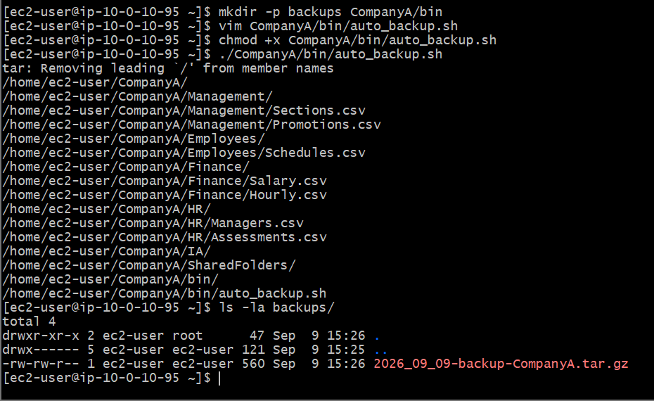

# AWS Cloud Lab: Bash Shell Scripting Automation & Dynamic Variable Interpolation

## 📌 Project Overview
This lab covers the compilation and execution of bash automation scripts used to drive systematic cloud workflows. Developing script engines utilizing dynamic command substitutions (`$()`), state parameters, and custom variables is a mandatory skill block required to orchestrate server baseline configurations, log gathering, and storage backups across AWS nodes.

## 🛠️ Tools Used
- **Cloud Infrastructure:** Amazon Web Services (AWS EC2)
- **Host OS:** Amazon Linux 2 (AMI)
- **Terminal Client:** Git Bash (POSIX Shell)
- **Script Engine:** Bash (Bourne Again Shell)

## 🚀 Step-by-Step Implementation

### 1. Script Architecture & Environment Definition
- Drafted a customized shell utility (`auto_backup.sh`) initialized with the standard system shebang interpreter header (`#!/bin/bash`).
- Configured programmatic token tracking capturing global machine parameters:
  ```bash
  TIMESTAMP=\$(date +"%Y_%m_%d_%H:%M:%S")
  ```

### 2. Variable Interpolation & Archive Structuring
- Implemented dynamic string interpolation arrays (`\${TIMESTAMP}-backup-CompanyA.tar.gz`) to force the system to generate completely custom file configurations based on real-time execution dates.
- Bound the variable directly to the core compression mechanism (`tar -cvzf`), routing target archives into an isolated system storage folder (`/home/ec2-user/backups/`).

### 3. Execution Integration & Verification
- Modified the access control parameters (`chmod +x`) to unlock binary operational attributes on the file structure.
- Executed the script and audited destination spaces using detailed directory trees to confirm the generation of the timestamped archive:
  ```bash
  ls backups/
  ```

---

## 📸 Technical Verification Proofs

### Automated Shell Script Execution and Timestamped Output Validation

