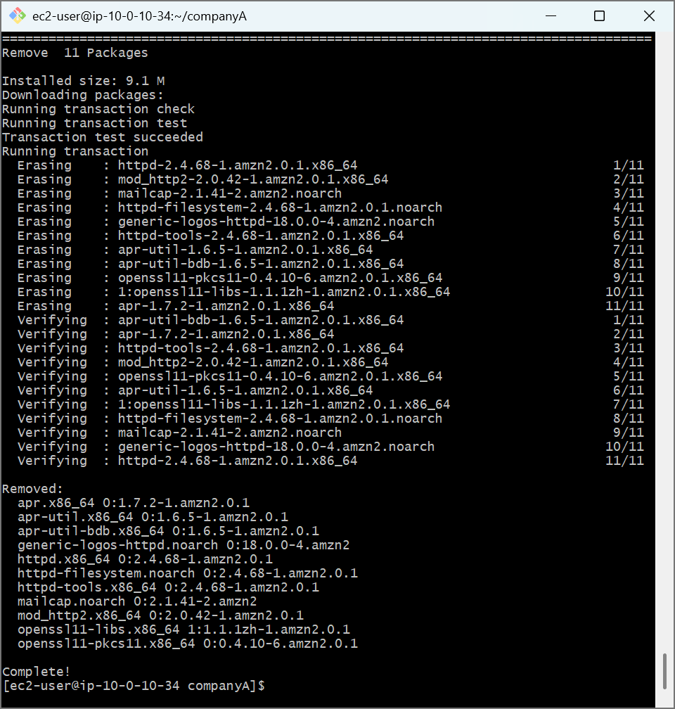
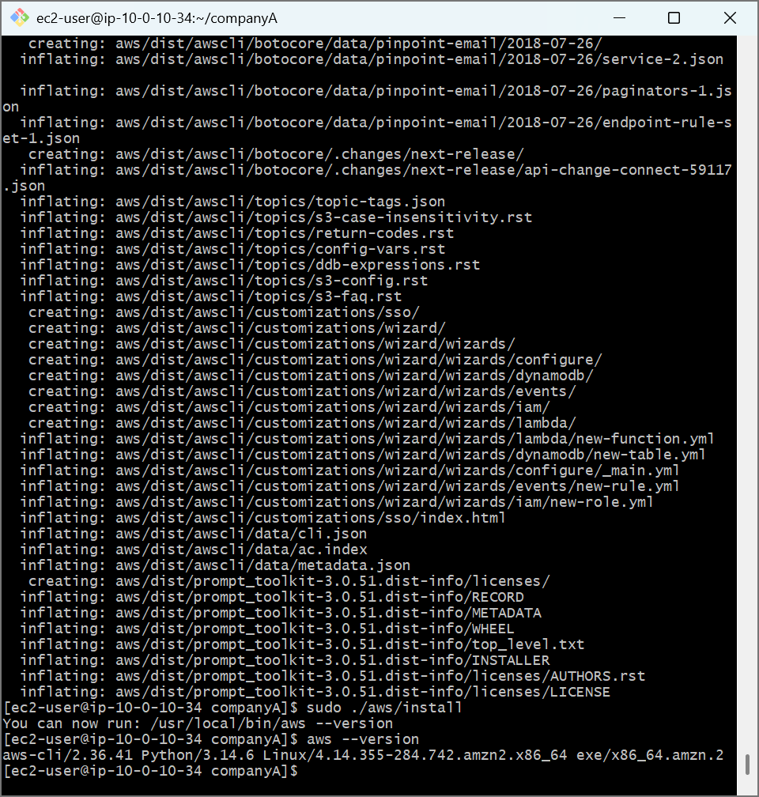
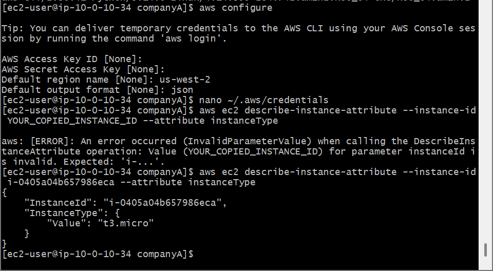

# AWS Cloud Lab: Linux Software Lifecycle Management & Programmatic AWS CLI Infrastructure Orchestration

## 📌 Project Overview
This lab covers advanced software package maintenance, transaction auditing, state dependency rollbacks, and the full architectural deployment/configuration of the AWS Command Line Interface (AWS CLI V2). Programmatically bridging an administrative Linux terminal shell to active cloud platform environments is a core operational milestone for managing infrastructure as code and provisioning cloud servers.

## 🛠️ Tools Used
- **Cloud Infrastructure:** Amazon Web Services (AWS EC2)
- **Host OS:** Amazon Linux 2 (AMI)
- **Package Management:** Yellowdog Updater, Modified (YUM)
- **Terminal Client:** Git Bash (POSIX Shell)
- **Automation Client:** AWS CLI V2 Engine

## 🚀 Step-by-Step Implementation

### 1. Package Baseline Auditing and Transaction Rollbacks (`yum`)
- Queried cloud resource mirrors for system catalog updates via `sudo yum -y check-update`.
- Applied critical patches using `sudo yum update --security` and installed the Apache web server platform package structure.
- Monitored the local installation database by extracting system transaction records:
  ```bash
  sudo yum history list
  ```
- Evaluated non-destructive rollback capabilities by executing a complete package retraction, wiping the recent installation signature safely from disk via:
  ```bash
  sudo yum -y history undo <Transaction-ID>
  ```

### 2. Fetching and Compiling the AWS CLI V2 Binary Pipeline
- Audited local runtime environments via `python3 --version` to ensure environment compatibility.
- Downloaded the official AWS compressed distribution package block directly from Amazon's cloud endpoints using `curl`.
- Extracted the installation components via `unzip awscliv2.zip` and executed the deployment binary engine to establish global symlinks across system bin directories:
  ```bash
  sudo ./aws/install
  ```

### 3. Programmatic AWS Account Authentication & Infrastructure Querying
- Initialized local system variable configuration grids via `aws configure` to define regional targets (`us-west-2`) and payload returns (`json`).
- Updated the secure account token configuration warehouse using terminal text editors:
  ```bash
  nano ~/.aws/credentials
  ```
- Validated absolute secure cloud-to-terminal synchronization by executing an operational API query targeting a live infrastructure asset ID to capture instance footprint metrics:
  ```bash
  aws ec2 describe-instance-attribute --instance-id <Target-Instance-ID> --attribute instanceType
  ```

---

## 📸 Technical Verification Proofs

### Package Manager History Undoing and State Rollback Output


### Global AWS CLI Engine Version Registration Capture


### Programmatic Cloud Query and Real-Time JSON API Response

