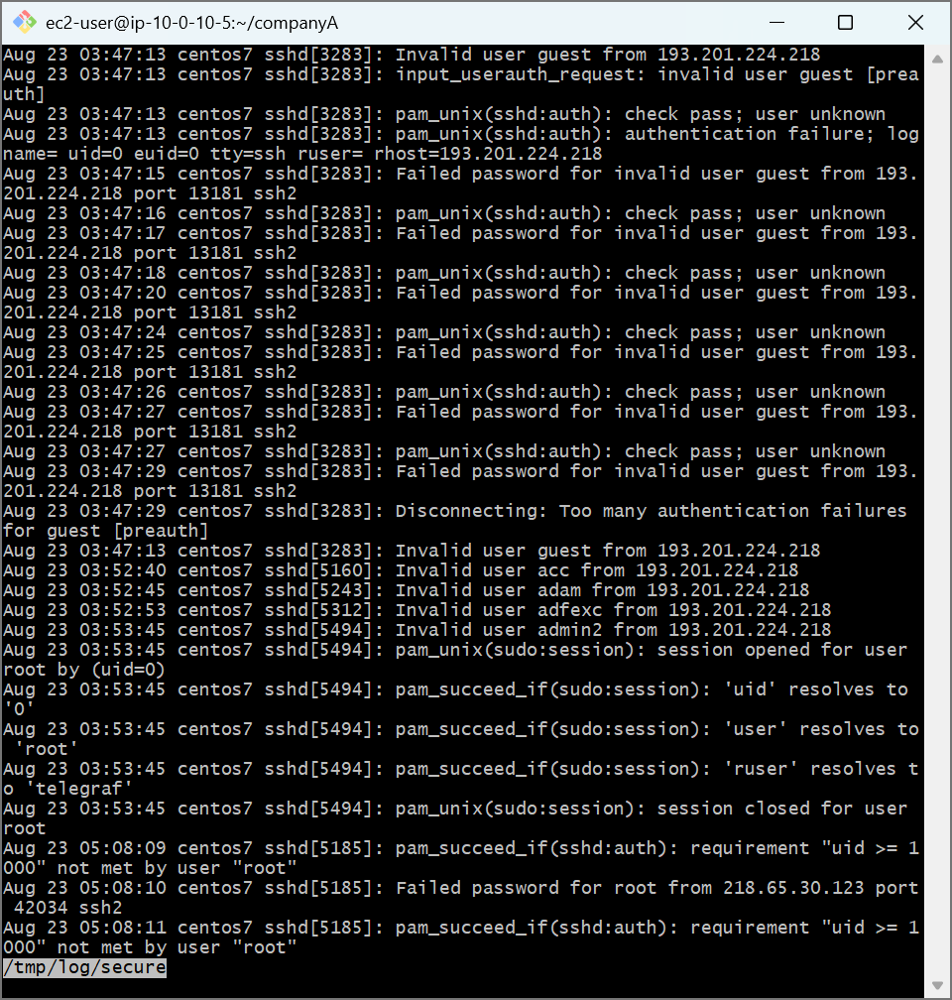
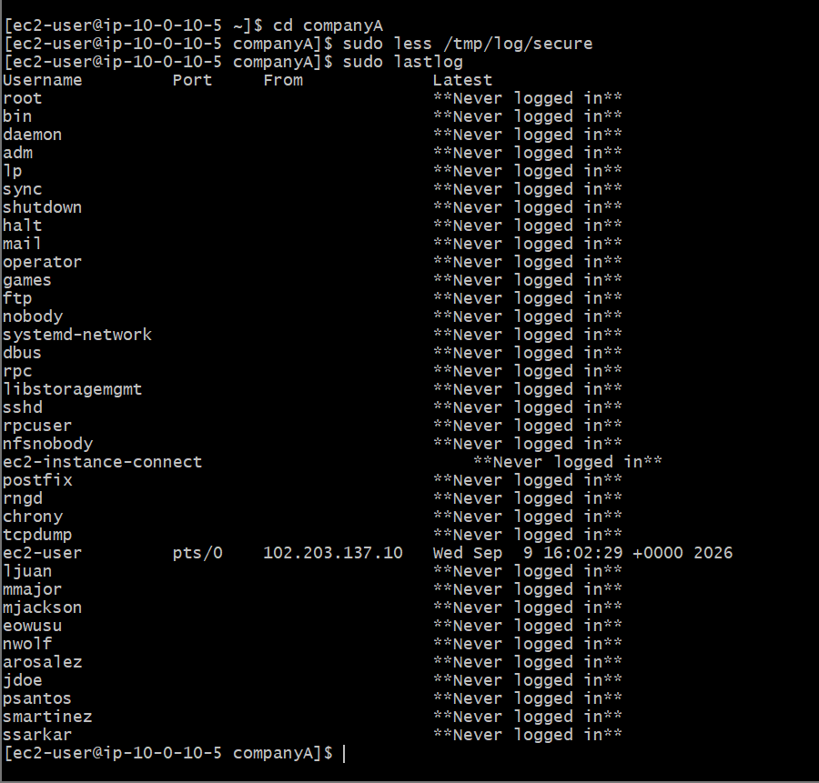

# AWS Cloud Lab: Linux Security Auditing — Authentication Log Monitoring & Access Tracking

## 📌 Project Overview
This lab covers the essential mechanics of monitoring system authentication footprints, parsing security event streaming arrays, and auditing global session histories on an Amazon Linux server node. Reviewing audit repositories (`/var/log/secure`) and identity entry matrices (`lastlog`) establishes baseline incident response and compliance verification capabilities required to protect enterprise cloud workloads.

## 🛠️ Tools Used
- **Cloud Infrastructure:** Amazon Web Services (AWS EC2)
- **Host OS:** Amazon Linux 2 (AMI)
- **Terminal Client:** Git Bash (POSIX Shell)
- **Log Management Utilities:** less, lastlog

## 🚀 Step-by-Step Implementation

### 1. Interactive Authentication Stream Inspection (`less`)
- Leveraged the memory-efficient `less` pager application to review structural security logs without loading massive data files directly into system volatile storage.
  ```bash
  sudo less /tmp/log/secure
  ```
- Analyzed trace streams to identify authentication anomalies, isolating remote connection vectors, unauthorized incoming source IP addresses, and specific port connection flags.

### 2. Global Identity Lifecycle Auditing (`lastlog`)
- Executed system database reports to compile an exhaustive list tracking the relative access histories of all registered identities.
  ```bash
  sudo lastlog
  ```
- Evaluated session metadata fields (Username, Port Line, and Target Timestamp) to verify system daemon containment (confirming service layers like `bin` and `daemon` stay restricted to `**Never logged in**`) while verifying operational logins.

---

## 📸 Technical Verification Proofs

### Security Log Ingestion and Authentication Event Analysis


### Global Account Entry Timelines Audit Report

