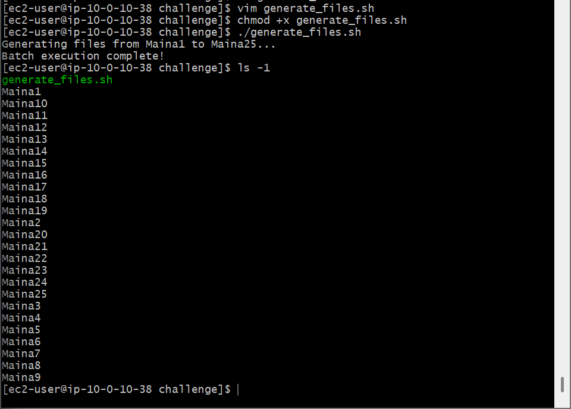
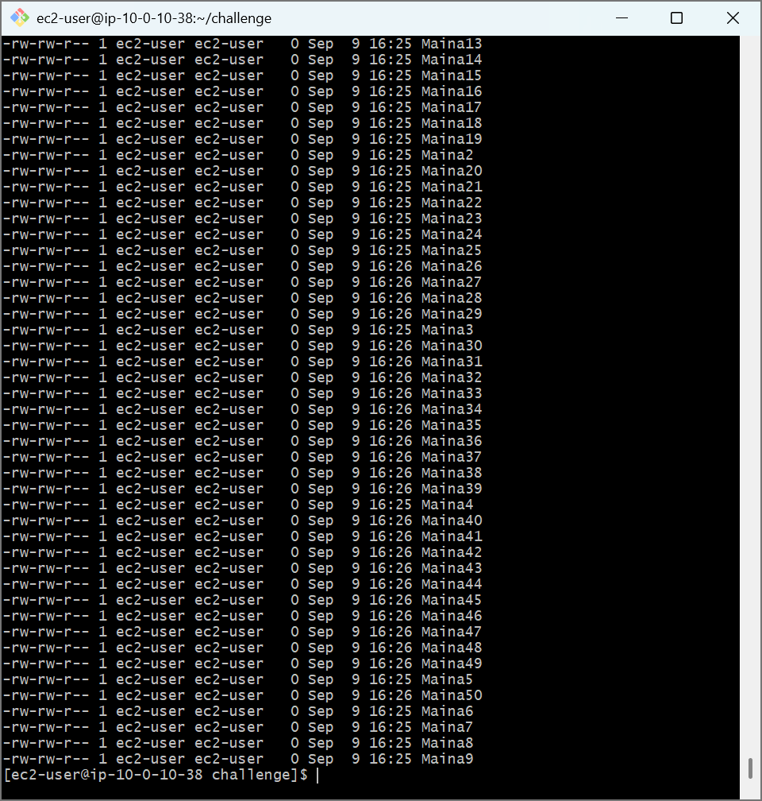

# AWS Capstone Challenge Lab: Dynamic Bash Scripting Automation & Sequential File Generation

## 📌 Project Overview
This capstone challenge lab combines multiple core Linux systems engineering concepts into a single, production-grade automation script. The objective is to write an intelligent Bash script that evaluates an active workspace folder, isolates variable patterns dynamically without hardcoded limits, computes mathematical progressions, and auto-generates the next sequential batches of operational file payloads.

## 🛠️ Tools Used
- **Cloud Infrastructure:** Amazon Web Services (AWS EC2)
- **Host OS:** Amazon Linux 2 (AMI)
- **Terminal Client:** Git Bash (POSIX Shell)
- **Scripting Language:** Bash (Bourne Again Shell)
- **Data Engineering Tools:** grep, sort, tail, arithmetic expansion

## 🚀 Step-by-Step Implementation

### 1. Programmatic State Discovery & Arithmetic Computation
- Engineered a modular shell script (`generate_files.sh`) initialized with standard kernel execution interpreters (`#!/bin/bash`).
- Configured a dynamic file check sequence utilizing inverted error pipes (`2>/dev/null`) paired with Regular Expressions (`grep -o -E '[0-9]+'`) to extract index numbers from any pre-existing files matching a user prefix string.
- Appended numeric pipelines (`sort -n | tail -n 1`) to accurately isolate the absolute highest historical sequence index ceiling value on the disk.

### 2. Logic Control and Sequential Allocation Loops
- Structured conditional statements (`if [ -z "$LATEST_NUMBER" ]`) to seamlessly switch execution parameters: initializing starting points at base `1` if the folder is blank, or running structural mathematical evaluations (`$((LATEST_NUMBER + 1))`) to dynamically increment forward.
- Orchestrated a standard C-style looping matrix (`for ((i=START; i<=END; i++))`) to auto-scale out blocks of exactly 25 zero-byte telemetry target tracking assets via the `touch` command parameter string.

---

## 📸 Technical Verification Proofs

### Initial Batch Automation Run (Files 1 - 25 Allocation Verification)

### Consecutive Batch Execution Check (Intelligent State Evaluation & Files 26 - 50 Allocation)

