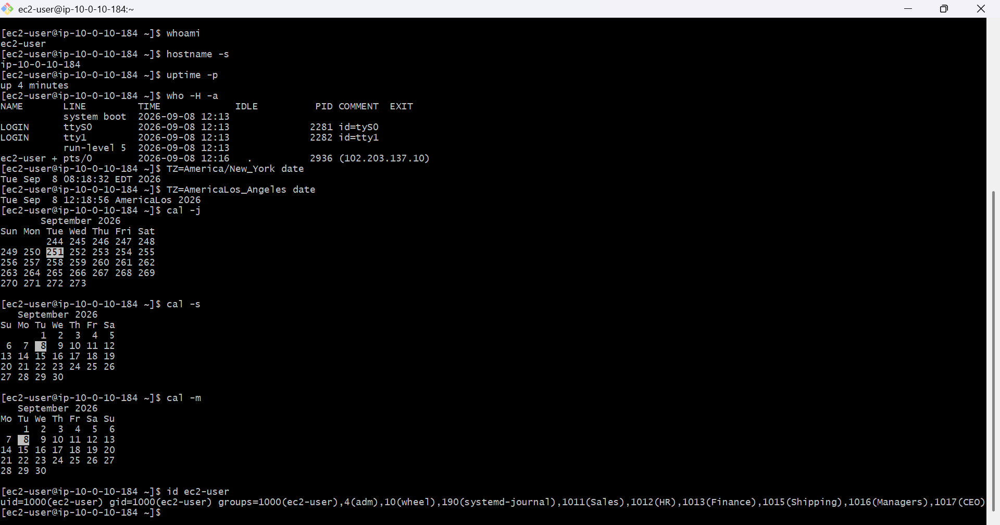
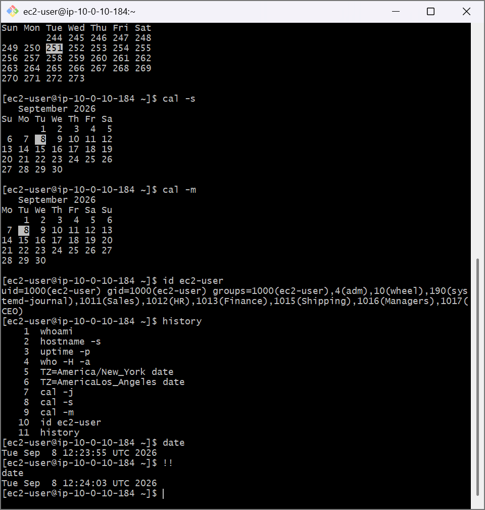

# AWS Cloud Lab: Linux Command Line Mechanics & Shortcuts

## 📌 Project Overview
This module demonstrates foundational Linux system administration tools, regional environment configuration variables, and command-line shell shortcuts executed on a cloud-hosted infrastructure instance.

## 🛠️ Tools Used
- **Cloud Infrastructure:** Amazon Web Services (AWS EC2)
- **Host OS:** Amazon Linux 2 (AMI)
- **Local Client:** Git Bash (POSIX-compatible shell interface)

## 🚀 Step-by-Step Implementation

### 1. System Identity and Inspection Commands
Executed administrative commands to extract runtime data from the machine:
- `whoami`: Verified standard `ec2-user` session credentials.
- `hostname -s`: Checked the node's local internal private network hostname.
- `uptime -p`: Extracted human-readable service availability intervals.
- `id ec2-user`: Audited internal user permissions, primary UID, and group identifiers.

### 2. Timezone & Locale Operations
Manipulated local shell environment variables (`TZ`) to cross-reference global datestamps and alternate formats:
- Tracked temporal offsets via `TZ=America/New_York date` and `TZ=America/Los_Angeles date`.
- Inspected chronological tracking formats using Julian layout structures via `cal -j`.

### 3. Shell Optimization & Workflow Acceleration
Leveraged native Bash shortcuts to reduce manual terminal input sequences:
- `history`: Visualized the sequential input command array log.
- `Ctrl + R`: Conducted real-time reverse search querying to pull previous operations.
- `!!`: Utilized structural bang-bang notation to force-repeat the immediately preceding shell command.

---

## 📸 Visual Verification

### System and Calendar Inspection Log

### Terminal History and Bang-Bang Execution Verification

