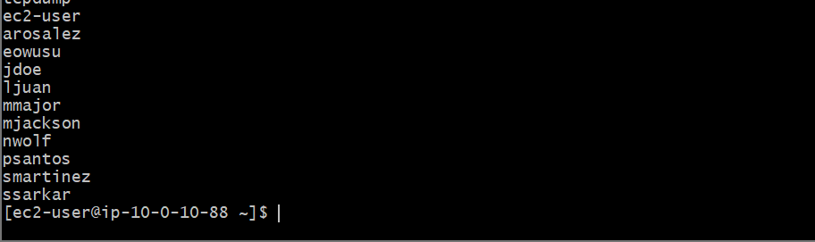
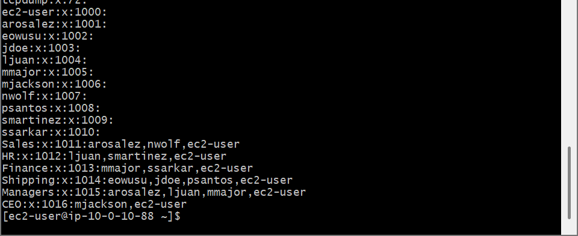
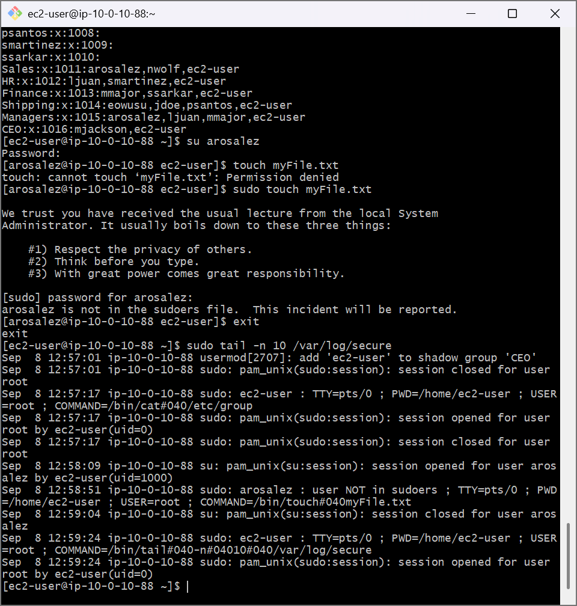

# AWS Cloud Lab: Linux User Administration & Security Logging

## 📌 Project Overview
This lab demonstrates core system administration tasks focused on User Identity Management (IAM concepts applied at the OS level), functional group mapping, security boundaries, and unauthorized escalation log tracking on an Amazon Linux server.

## 🛠️ Tools Used
- **Cloud Infrastructure:** Amazon Web Services (AWS EC2)
- **Host OS:** Amazon Linux 2 (AMI)
- **Local Terminal Client:** Git Bash 

## 🚀 Step-by-Step Implementation

### 1. Multi-User Creation Configuration
Provisioned separate local accounts for 10 corporate identities spanning multiple business units (Sales, Shipping, HR, Finance, and Executive).
- Used `sudo useradd <username>` to generate distinct system user spaces.
- Leveraged `sudo passwd <username>` to define unique authorization keys.
- Audited the user directory index file:
  ```bash
  sudo cat /etc/passwd | cut -d: -f1
  ```

### 2. Functional Business Group Assignments
Created corporate functional containers and mapped individual employee identities to enforce segregation of roles:
- Built group profiles using `sudo groupadd <GroupName>`.
- Appended users into matching groups without rewriting default profiles:
  ```bash
  sudo usermod -a -G <GroupName> <username>
  ```
- Audited group arrays using `cat /etc/group`.

### 3. Permission Boundaries & Security Auditing
Tested structural OS guardrails by attempting unauthorized root access escalation:
- Substituted the session profile over to a standard user (`su arosalez`).
- Attempted write actions inside root folders, generating automated system `Permission Denied` faults.
- Intentional invocation of `sudo` triggered an implicit warning: *"User is not in the sudoers file. This incident will be reported."*
- Returned to administrative access (`exit`) and extracted security logs to confirm system audit capture:
  ```bash
  sudo tail -n 10 /var/log/secure
  ```

---

## 📸 Architectural Proof of Work

### Multi-User Database Roster Verification


### Group Membership Strategy Matrix


### Incident Tracking Security Logs (/var/log/secure)

