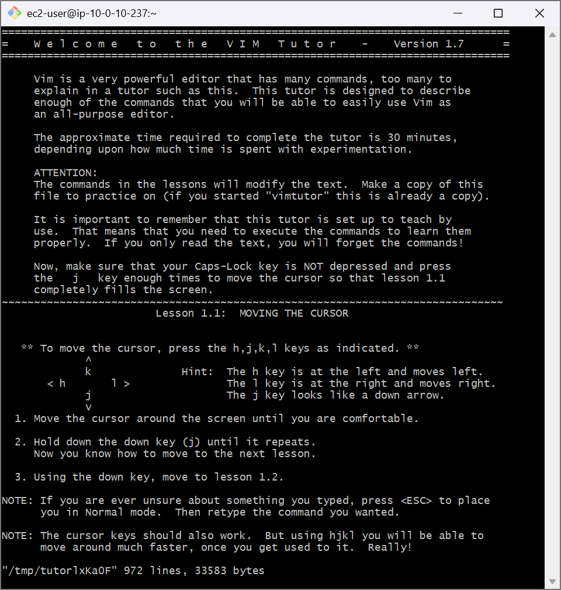
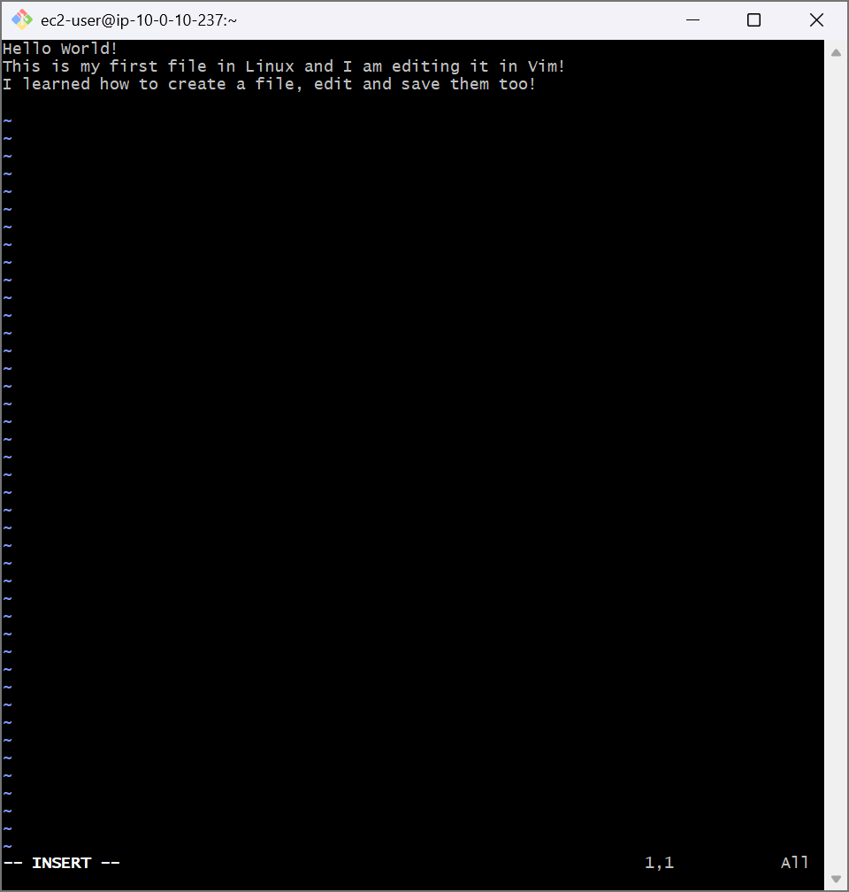
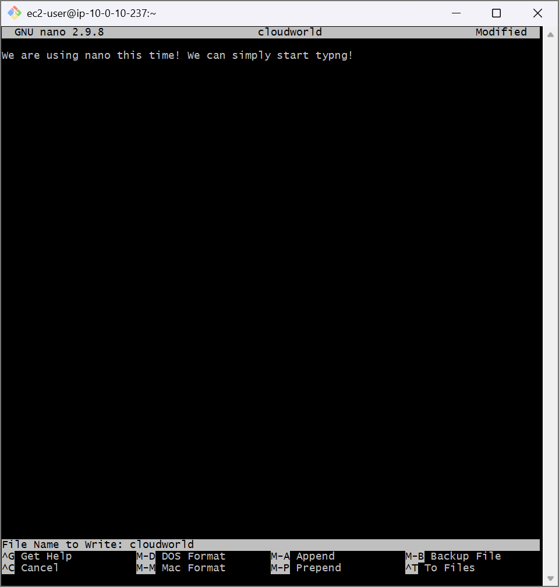

# AWS Cloud Lab: Editing Files in Linux (Vim vs Nano)

## 📌 Project Overview
This lab covers the essential mechanics of terminal-based text editors in Linux. Mastering command-line editors like Vim and Nano is a core requirement for system administration, configuration file management, and writing automation scripts in the cloud.

## 🛠️ Tools Used
- **Cloud Infrastructure:** Amazon Web Services (AWS EC2)
- **Host OS:** Amazon Linux 2 (AMI)
- **Editors Explored:** Vim (Vi Improved) & Nano

## 🚀 Step-by-Step Implementation

### 1. Interactive Vim Mechanics (`vimtutor`)
- Launched the native interactive training system via `vimtutor`.
- Practiced text navigation mechanics using keyboard mappings (`j`, `k`, `h`, `l`) instead of a mouse.

### 2. File Modification via Vim
- Created a fresh configuration file using `vim helloworld`.
- Switched to **Insert Mode** using the `i` key to record structural text inputs.
- Exited editing states via `Esc` and committed the write buffer to disk using the **Write & Quit** command:
  ```bash
  :wq
  ```
- Experimented with standard buffer destruction protocols (`:q!`) to intentionally drop unsaved experimental updates.

### 3. Alternative Text Operations via Nano
- Created an identical document structure utilizing a streamlined buffer model via `nano cloudworld`.
- Utilized mode-less textual stream processing, bypassing state transitions.
- Evaluated internal environment shortcut execution commands to finalize writes (`Ctrl + O`) and exit cleanly (`Ctrl + X`).

---

## 📸 Technical Verification Proofs

### Vim Interactive Tutorial Layout Verification


### Vim Active Configuration In-Line Text Capture


### Nano File Workspace Architecture Execution

