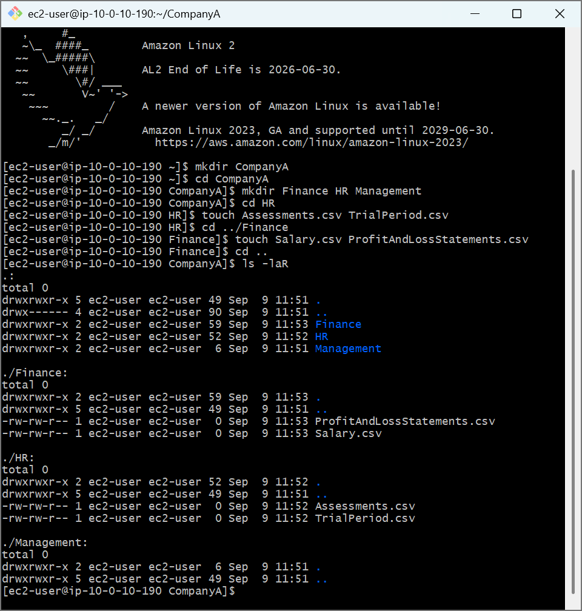
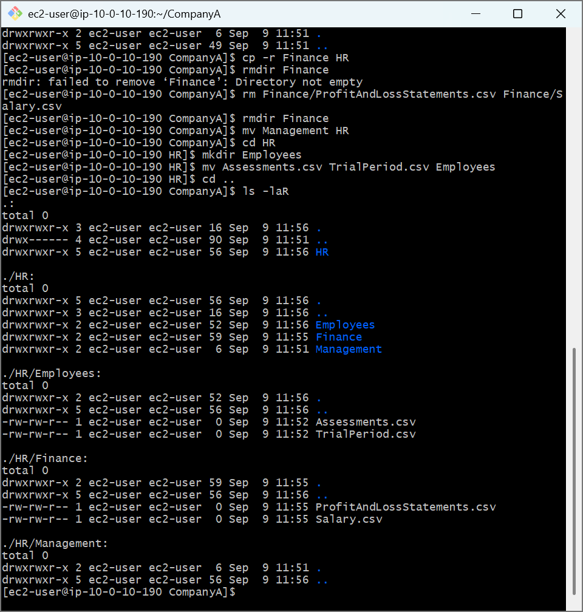

# AWS Cloud Lab: Linux File System Architecture & Directory Reorganization

## 📌 Project Overview
This lab covers advanced file system navigation, nested directory tree architecture creation, and file system pruning/restructuring. These techniques are fundamental for maintaining application directory layouts, deployment packages, and storage volumes in AWS cloud infrastructure environments.

## 🛠️ Tools Used
- **Cloud Infrastructure:** Amazon Web Services (AWS EC2)
- **Host OS:** Amazon Linux 2 (AMI)
- **Terminal Client:** Git Bash (POSIX Shell)

## 🚀 Step-by-Step Implementation

### 1. Generating a Multi-Tiered Directory Architecture
Recreated a multi-department file mapping skeleton (`CompanyA`) directly inside the user workspace:
- Used `mkdir` parameters to form parent and sibling directory branches simultaneously (`Finance`, `HR`, `Management`).
- Implemented relative file creation strategies using `touch` parameters to deploy empty `.csv` templates across distinct target paths without leaving the working directory tree.
- Audited complete system layouts recursively using the directory flag combo:
  ```bash
  ls -laR
  ```

### 2. File Migration and Recursive Directory Pruning
Executed a systemic directory restructuring to nest specific departmental folders under a consolidated workflow layout:
- Duplicated active folders and data structures recursively using the copy command:
  ```bash
  cp -r Finance HR
  ```
- Evaluated directory safety guardrails by attempting to use `rmdir` on a non-empty directory, validating that Linux prevents accidental cluster deletion by default.
- Cleared out files using `rm`, pruned empty workspaces cleanly with `rmdir`, and relocated whole folder infrastructure layouts instantly using the move command:
  ```bash
  mv Management HR
  ```

### 3. Final Consolidation Formatting
- Created an inner `Employees/` compartment inside the nested folder structures and ran file-level migrations (`mv Assessments.csv TrialPeriod.csv Employees`) to finish the production environment cleanup loop.

---

## 📸 Architectural Proof of Work

### Initial Recursive File System Structure Verification


### Final Restructured Global Directory Topology

