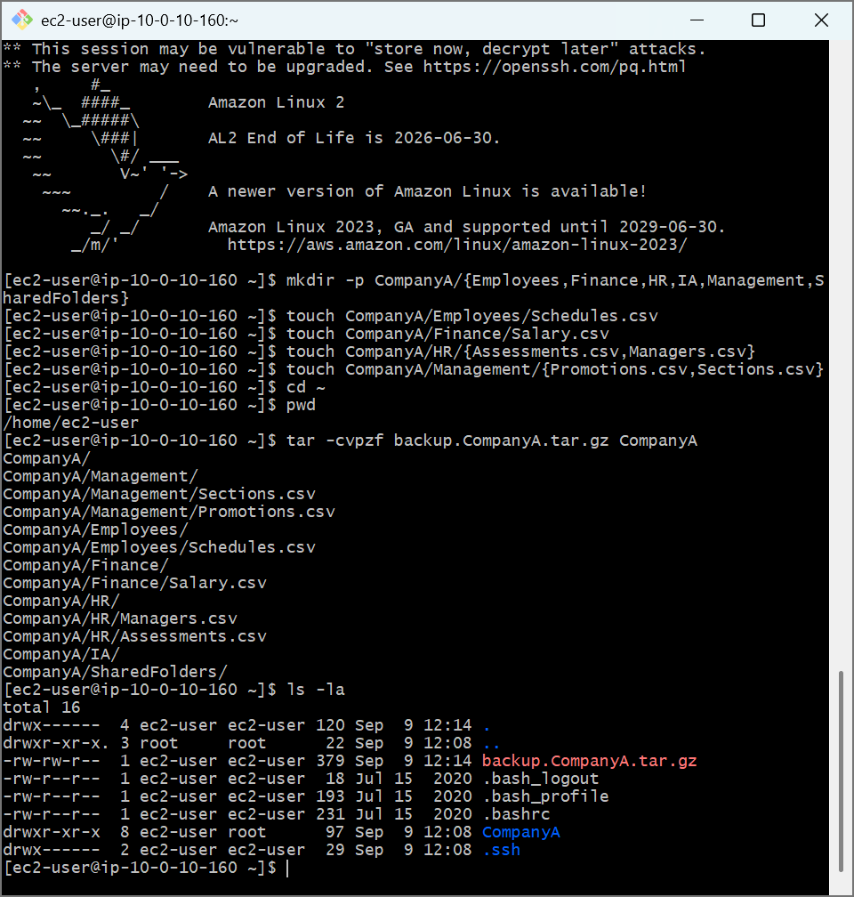
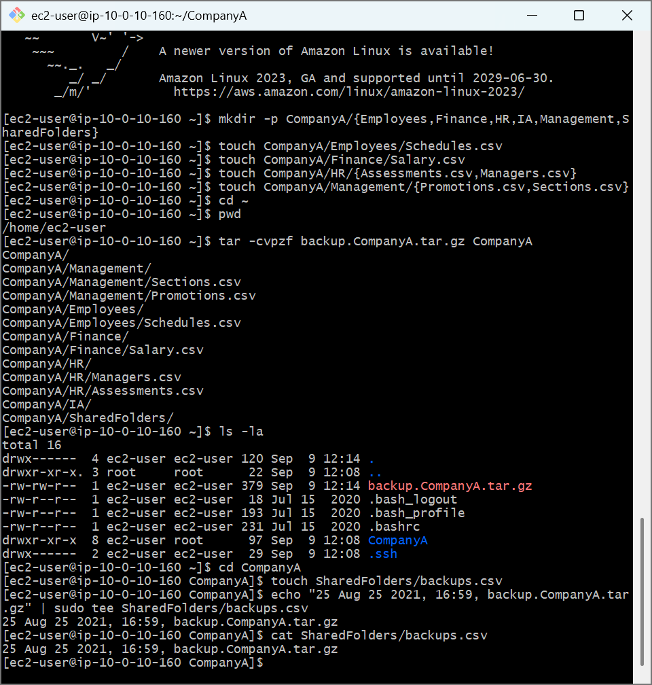
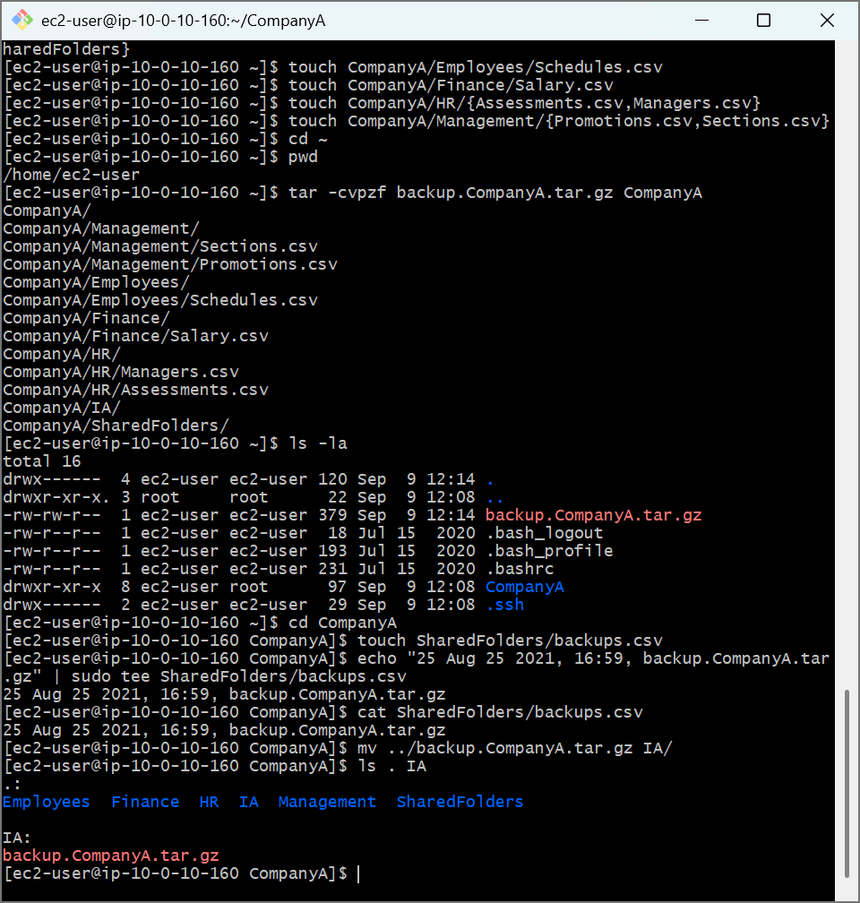

# AWS Cloud Lab: Archive Management, Data Stream Piping & Telemetry Logging

## 📌 Project Overview
This lab demonstrates systemic system backup execution, administrative log creation, and file asset relocation. Mastering utilities like `tar` and handling standard streams with `tee` or pipelining is essential for automating backups and system telemetry reporting in AWS instance environments.

## 🛠️ Tools Used
- **Cloud Infrastructure:** Amazon Web Services (AWS EC2)
- **Host OS:** Amazon Linux 2 (AMI)
- **Terminal Client:** Git Bash (POSIX Shell)

## 🚀 Step-by-Step Implementation

### 1. Recursive System Tarball Archive Creation
Executed full directory compression to bundle a nested corporate environment layout into an immutable system artifact:
- Utilized the `tar` (Tape Archive) program with standard parameter flags (`-csvpzf`) to systematically compile, compress, preserve permissions, and gzip the root layout.
  ```bash
  tar -csvpzf backup.CompanyA.tar.gz CompanyA
  ```
- Evaluated disk footprints using local query listing tools (`ls -la`) to verify generation of the standalone compressed asset.

### 2. Stream Interception and Administrative Logging
Constructed a running audit trail tracking configuration alterations using POSIX pipelines:
- Generated an activity trace index inside a team directory tree via `touch SharedFolders/backups.csv`.
- Used structural pipeline redirectors (`|`) to forward string streams from `echo` directly to the `tee` utility, mirroring runtime verification to the terminal while cleanly executing root-privileged writes to disk.
  ```bash
  echo "25 Aug 25 2021, 16:59, backup.CompanyA.tar.gz" | sudo tee SharedFolders/backups.csv
  ```

### 3. Archive Migration Mechanics
- Relocated storage blobs across directories using explicit parent paths (`mv ../backup.CompanyA.tar.gz IA/`).
- Verified resource relocations simultaneously by executing double target checks via `ls . IA`.

---

## 📸 Architectural Proof of Work

### Tarball Archive Creation Log Output


### Standard Stream Piping and Tee Activity Capture


### Final Storage Blob Relocation Verification

