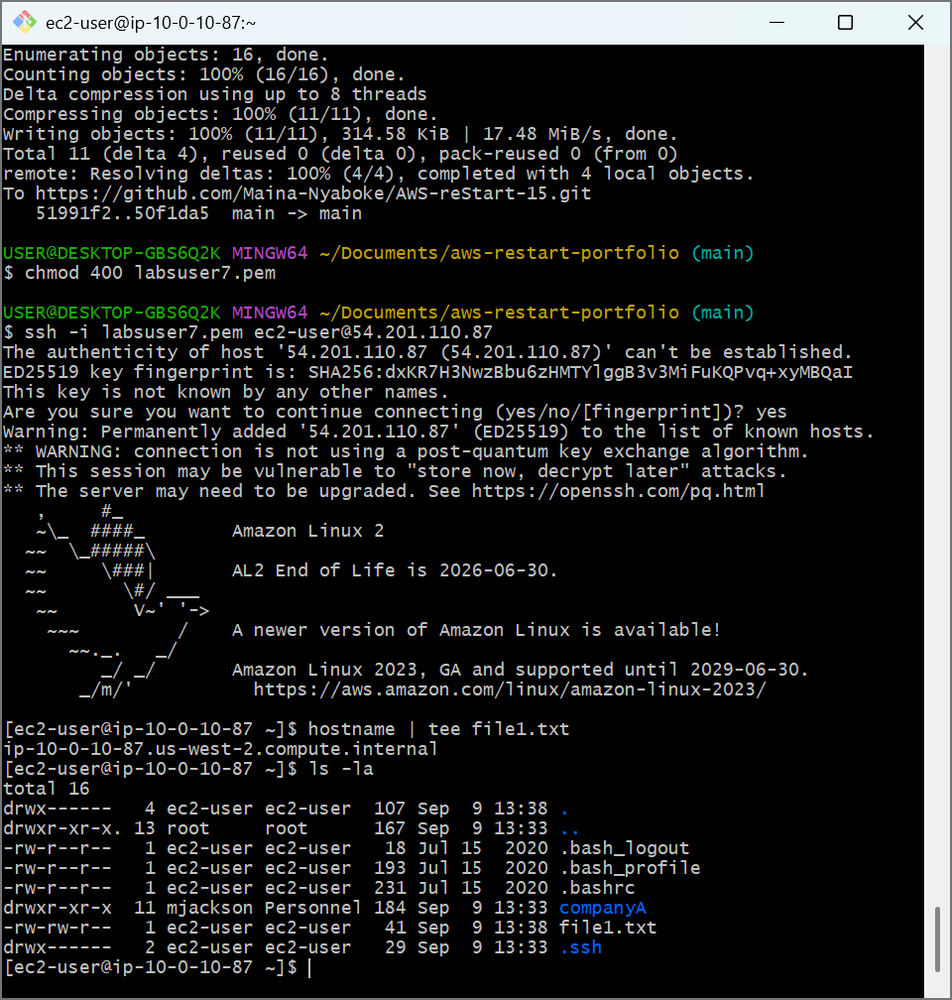
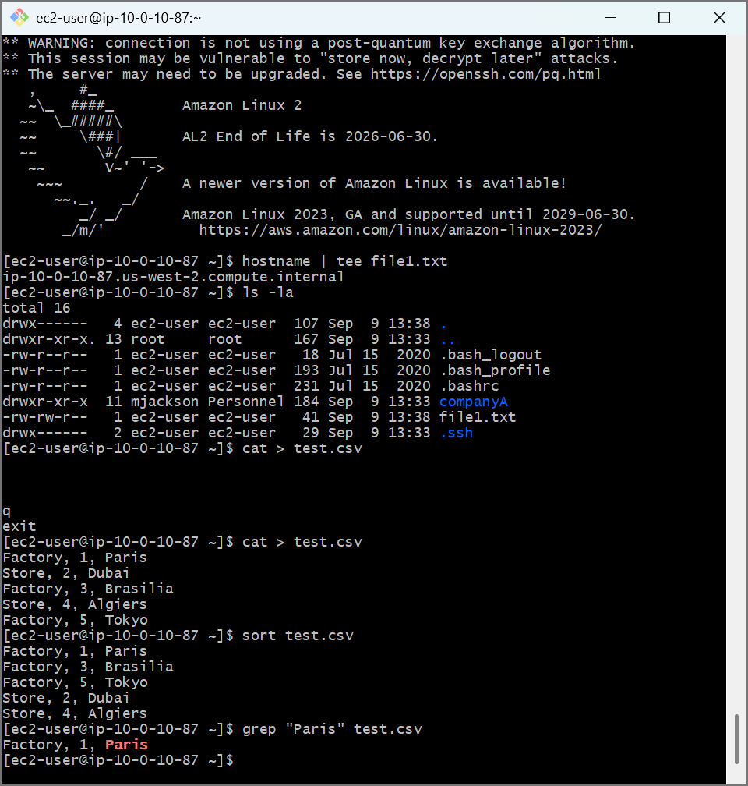
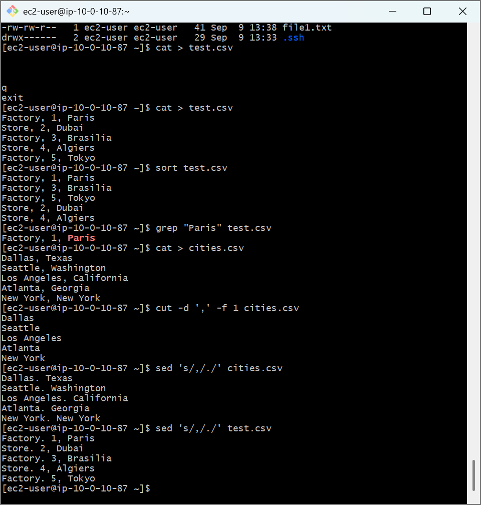

# AWS Cloud Lab: Advanced Linux Text Processing, Redirection & Stream Operations

## 📌 Project Overview
This lab covers core command-line utility configurations used to parse, filter, split, and programmatically transform raw text data and stream buffers. Mastering tools like `tee`, `sort`, `grep`, `cut`, and `sed` is essential for parsing application errors, managing system configuration profiles, and analyzing telemetry logs inside cloud servers.

## 🛠️ Tools Used
- **Cloud Infrastructure:** Amazon Web Services (AWS EC2)
- **Host OS:** Amazon Linux 2 (AMI)
- **Terminal Client:** Git Bash (POSIX Shell)

## 🚀 Step-by-Step Implementation

### 1. Multi-Directional Stream Redirection (`tee`)
- Leveraged the `tee` utility paired with standard POSIX pipelines (`|`) to intercept and duplicate data streams.
- Configured a workflow to output system instance telemetry (`hostname`) onto the live monitoring terminal console while simultaneously outputting the stream directly into a configuration text file (`file1.txt`).

### 2. Stream Sorting & Target Pattern Extraction (`sort`, `grep`)
- Generated a simulated asset data table using a direct stream capture block (`cat > test.csv`).
- Used the `sort` tool to reorganize raw text records into clean alphabetical and numerical columns.
- Implemented pattern searching via `grep` to filter out specific records (e.g., querying rows matching the string label `"Paris"`) without manually opening the document structure.

### 3. Delimiter Field Extraction & Stream Editing (`cut`, `sed`)
- Created a regional geographic index map (`cities.csv`).
- Utilized the `cut` field-splitting engine with custom delimiters (`-d ','`) and field flags (`-f 1`) to extract target column ranges cleanly.
- Executed the non-destructive **Stream Editor (`sed`)** using regex substitution syntax (`sed 's/,/./'`) to programmatically find and replace targeted characters inside live data loops.

---

## 📸 Architectural Proof of Work

### Tee Stream Duplication and Capture Validation

### Chronological Data Sorting and Filter Redirection Output

### Programmatic Field Splitting and Sed Substitutions

