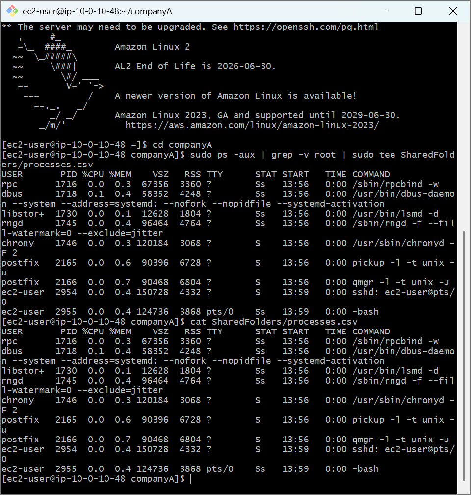
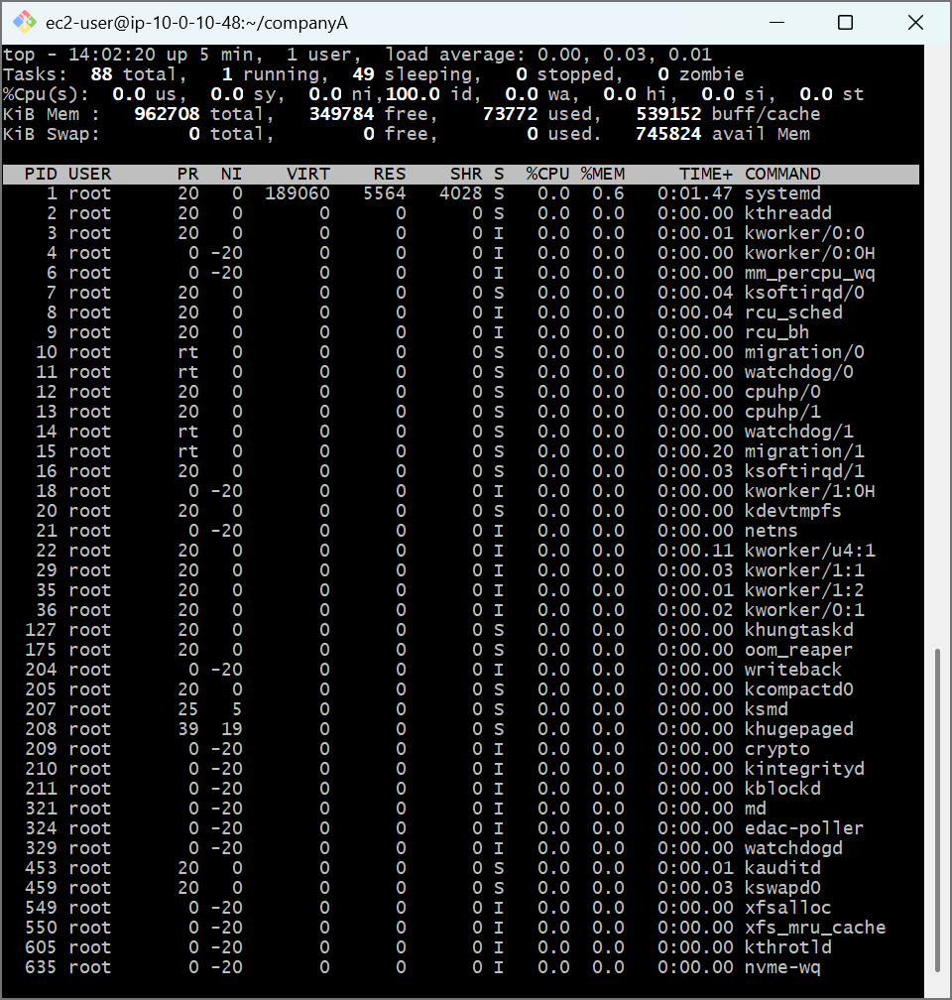
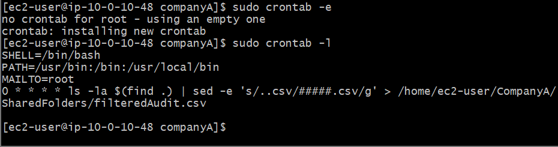

# AWS Cloud Lab: Linux Process Management, Resource Telemetry & Task Automation (Cron)

## 📌 Project Overview
This lab covers runtime process observation, active resource infrastructure auditing, and time-based task orchestration workflows on an Amazon Linux node. Mastering background lifecycle control (`ps`, `top`) and automation daemons (`cron`) is fundamental for configuring automated infrastructure logging, data backups, and health checks across cloud environments.

## 🛠️ Tools Used
- **Cloud Infrastructure:** Amazon Web Services (AWS EC2)
- **Host OS:** Amazon Linux 2 (AMI)
- **Terminal Client:** Git Bash (POSIX Shell)

## 🚀 Step-by-Step Implementation

### 1. Process Extraction and Stream Isolation (`ps`)
- Extracted a real-time list of system-wide running tasks using the snapshot process monitoring tool:
  ```bash
  sudo ps -aux
  ```
- Constructed an interception pipeline using inverted regex checking flags (`grep -v root`) to isolate user-space operational logs, routing the final output to a telemetry tracking dashboard file (`SharedFolders/processes.csv`) via the standard `tee` filter tool.

### 2. Real-Time Resource Monitoring (`top`)
- Launched the continuous kernel stream telemetry display dashboard via `top`.
- Observed server hardware performance indices, profiling thread balances across active states (Running, Sleeping, Stopped, and Zombie) alongside volatile computational memory tracking parameters.

### 3. Task Schedule Orchestration (`cron` Automation)
- Opened the system automated clock table via the crontab configuration utility:
  ```bash
  sudo crontab -e
  ```
- Provisioned the execution environment variables (`SHELL`, `PATH`, `MAILTO`) and deployed a recurring top-of-the-hour job signature template (`0 * * * *`). 
- Scheduled a chained background pipeline script using non-destructive stream editing tools (`sed`) to run an automated discovery check, mask sensitive extension names into protected templates (`#####.csv`), and output an execution log tracking report into a centralized auditing file (`filteredAudit.csv`).
- Audited the operational state tracking rule map cleanly using the list command:
  ```bash
  sudo crontab -l
  ```

---

## 📸 Technical Verification Proofs

### Process Extraction Pipeline Validation Log


### Continuous Performance Dashboard Status Capture


### Active Cron Orchestration Schedule Deployment Check

