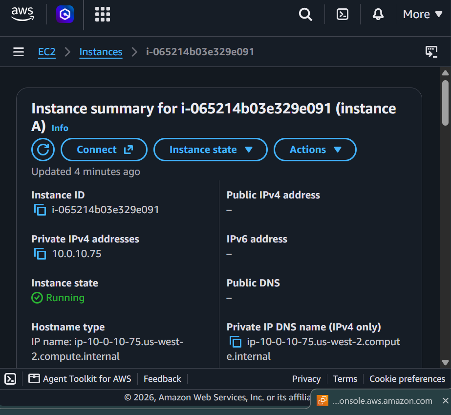
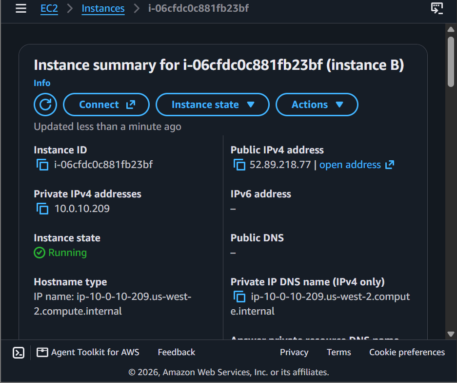
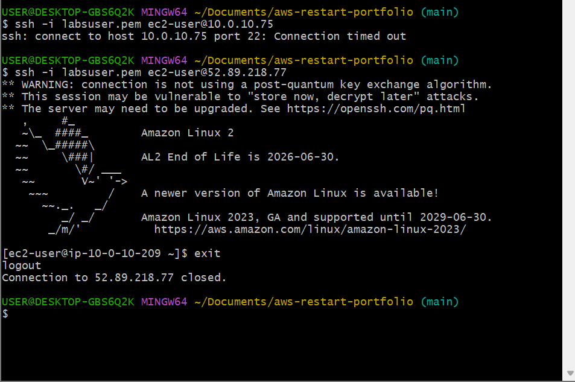
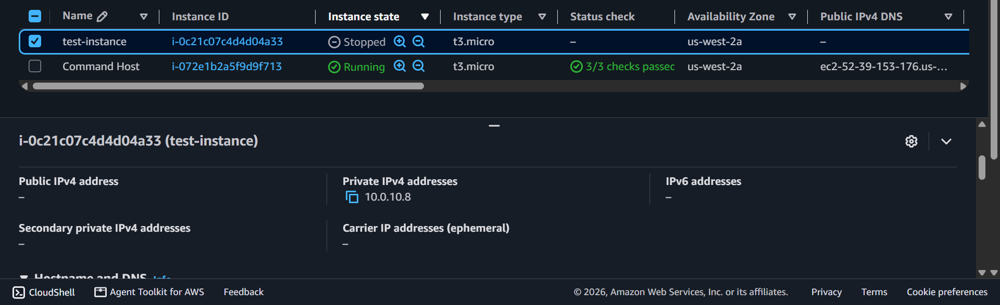
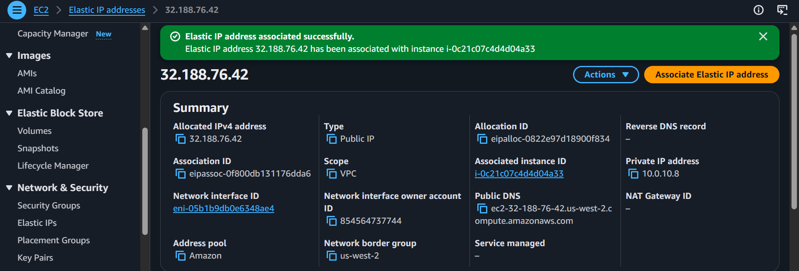

# AWS Networking: Internet Protocols — Address Types & Persistence Boundaries

This module covers two distinct practical implementations exploring how Public, Private, Static, and Dynamic IPv4 address boundaries behave across cloud infrastructure environments.

---

## 🛠️ Lab 1: Public vs. Private IP Behavior (Connectivity Isolation)

### 📌 Objective
Investigate a VPC environment containing two running virtual machines and observe why some nodes fail to connect to the public internet while others succeed.

### 🔍 Connection Observations Noted
- **Instance A (Private IP Only) — Connection: FAILED ❌**
  - **Configuration:** Allocated *only* a Private IPv4 address (`10.0.x.x`).
  - **Behavior:** Attempting to SSH via Git Bash timed out and failed completely.
  - **Why:** Private IP addresses are strictly for communication *inside* the local cloud network. Without a Public IP, it is invisible to the external internet.
- **Instance B (Public + Private IP) — Connection: SUCCESSFUL  **
  - **Configuration:** Allocated both a Private and a routable Public IPv4 address.
  - **Behavior:** Successfully accepted the OpenSSH handshake protocol and authenticated into the shell prompt.
  - **Why:** Public IPs are globally routable, allowing home users to discover and securely log into the machine over the web.

---

## 🛠️ Lab 2: Static vs. Dynamic Addresses (Elastic IP Architectures)

### 📌 Objective
Launch a new Amazon EC2 node (`test instance`) to evaluate IP address behaviors across power-state transitions, and resolve a common customer dilemma: keeping a permanent public web endpoint address.

### 🔍 Operational Discoveries & Core Concepts

#### 1. Standard Public IP Behavior (Dynamic Address)
- **The Experiment:** Noted the instance's initial Public IP, **Stopped** the instance, and then **Started** it back up.
- **Observation:** The Private IP stayed exactly the same, but the **Public IP changed to a completely new number**.
- **Conclusion:** Standard AWS public IP addresses are **Dynamic**. When an instance stops, AWS reclaims that IP and returns it to the global cloud pool. When restarted, a new random public address is assigned.

#### 2. The Solution: AWS Elastic IP (Static Address)
- **The Remediation:** Allocated a dedicated **Elastic IP Address (EIP)** under Network & Security configurations and associated it directly with the server.
- **The Behavior:** After stopping and starting the instance a second time, the Public IP **remained permanently fixed**.
- **Conclusion:** An Elastic IP is a **Static Public IPv4 address** designed for dynamic cloud computing. It provides a permanent, unchanging public entry point for web servers, resolving the customer's mapping issues completely.

---

## 📸 Technical Verification Proofs

### Lab 1: Network Boundary Records
- 
- 
- 

### Lab 2: Address Persistence & Allocation Records
- 
- 
