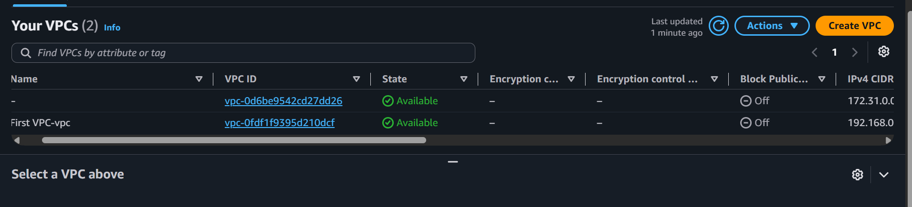
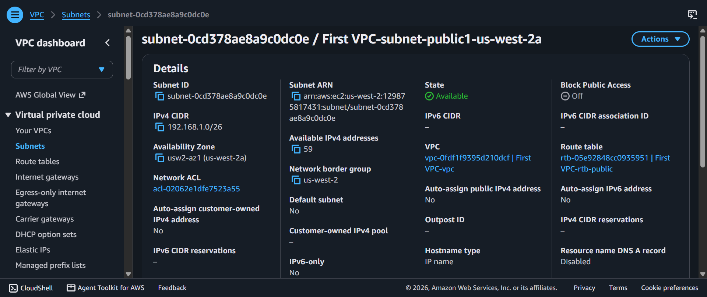
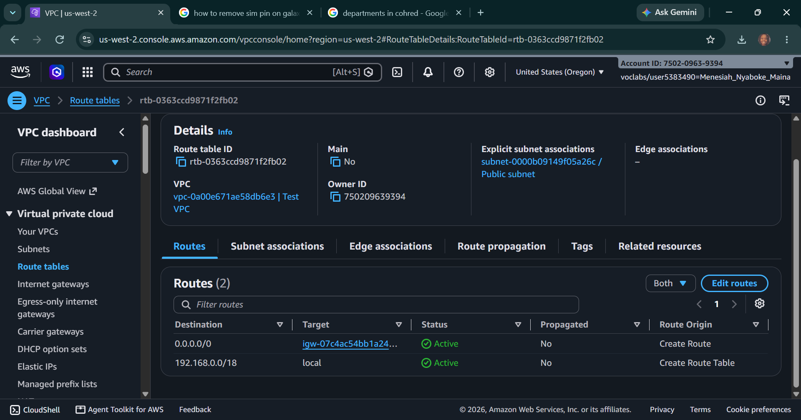
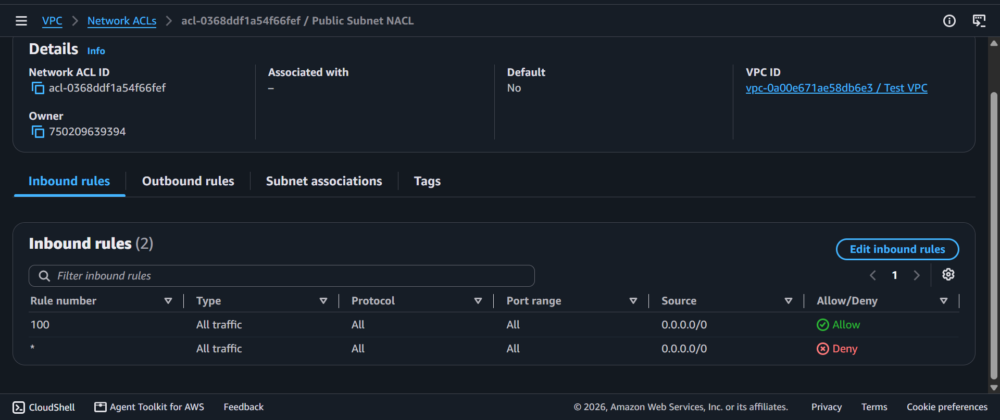
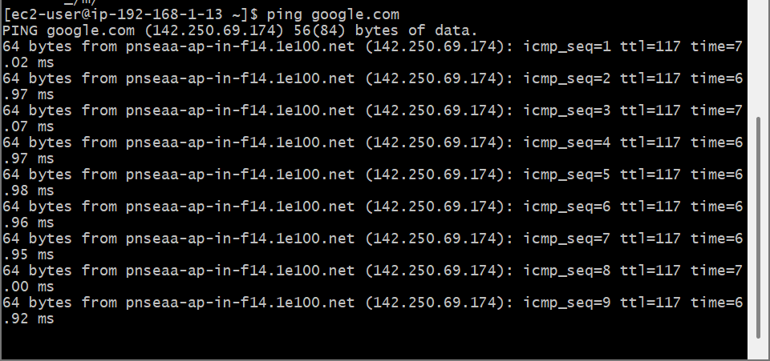

# AWS Networking: Designing Custom VPC Topologies — Automated Wizards vs Manual Core Infrastructure Builds

This module documents two distinct implementation paths for deploying a logically isolated cloud datacenter network (Amazon VPC) under RFC 1918 private addressing guidelines, concluding with network access security controls and live terminal routing audits.

---

## 🛠️ Lab 1: Automated Network Allocation via VPC Wizard

### 📌 Objective
Rapidly provision a secure, logically isolated cloud perimeter matching custom corporate capacity boundaries (approximately 15,000 internal host capacities and an internet-facing landing zone for at least 50 host endpoints).

### 🔍 Architectural Calculations Applied
- **Global Network Envelope:** A allocation of **`/18`** provides a threshold of **16,384** private addresses, matching the target 15,000 threshold without infrastructure overhead.
- **Ingress Edge Zone Subnet:** A allocation of **`/26`** yields **64** isolated addresses, satisfying the 50 IP customer threshold requirements.

### 🚀 Implementation Steps
- Initialized the AWS Automated VPC Orchestration Engine Wizard.
- Created `First VPC` utilizing the calculated `192.168.0.0/18` private block range.
- Isolated a front-end directory workspace segment named `Public Subnet` restricted to `192.168.1.0/26`.

---

## 🛠️ Lab 2: Component-by-Component Manual Core Network Construction

### 📌 Objective
Deconstruct cloud automated abstractions by building a production-grade VPC manually from scratch. This includes implementing explicit edge gateways, public traffic route paths, stateless subnet firewalls (NACLs), and conducting end-to-end communication validations.

### 🚀 Step-by-Step Manual Core Infrastructure Build

#### 1. Isolation Foundations & Subnet Segmentation
- **VPC Allocation:** Created `Test VPC` manually with an explicit address footprint of `192.168.0.0/18`.
- **Subnet Carving:** Segmented the space by creating an active `Public Subnet`.

#### 2. Gateways, Target Routing & Internet Association
- **Edge Attachment:** Formed a standalone **Internet Gateway (IGW)** and explicitly attached it to the parent `Test VPC` framework to enable public traffic capabilities.
- **Route Table Injection:** Generated a custom `Public Route Table`, associated it with the Public Subnet, and edited the routing array to inject a default internet route gateway entry:
  - **Destination:** `0.0.0.0/0` (Any traffic bound for the external public web)
  - **Target:** Associated `Internet Gateway` ID clone.

#### 3. Security Perimeter Enforcement (Stateless NACLs vs Stateful Security Groups)
- **Subnet Guardrails (Network ACL):** Configured a stateless **Network Access Control List (NACL)** named `Public Subnet NACL` and bound it directly to the subnet perimeter:
  - **Inbound Rule 100:** Allowed `All Traffic` on all protocols from any source (`0.0.0.0/0`).
  - **Outbound Rule 100:** Allowed `All Traffic` out to any destination (`0.0.0.0/0`) to guarantee execution of return traffic handshakes.
- **Instance Guardrails (Security Group):** Bound a stateful firewall resource (`Linux Instance SG`) to intercept traffic at the specific virtual NIC instance boundary.

#### 4. End-to-End Infrastructure Routing Verification
- Provisioned a t3.micro compute node inside the new manual custom subnet structure with public address attributes enabled.
- Connected via OpenSSH and executed a real-time network path tracer verification probe targeting external global domains:
  ```bash
  ping google.com
  ```
- **Result:** Confirmed **0% packet loss** with continuous stable transmission replies, verifying that the manual VPC, subnet boundaries, Internet Gateway routing tables, stateless NACL rules, and stateful security groups are all configured perfectly without blocking traffic flow.

---

## 📸 Technical Verification Proofs

### Lab 1: Automated Configuration Blueprints
- 
- 

### Lab 2: Manual Infrastructure Build & Routing Telemetry Logs
- 
- 
- 
