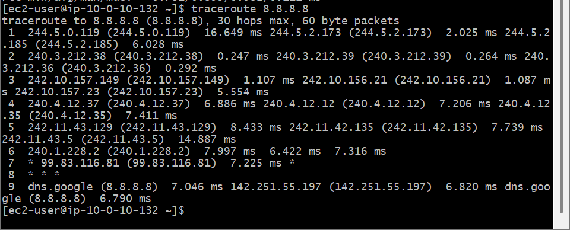
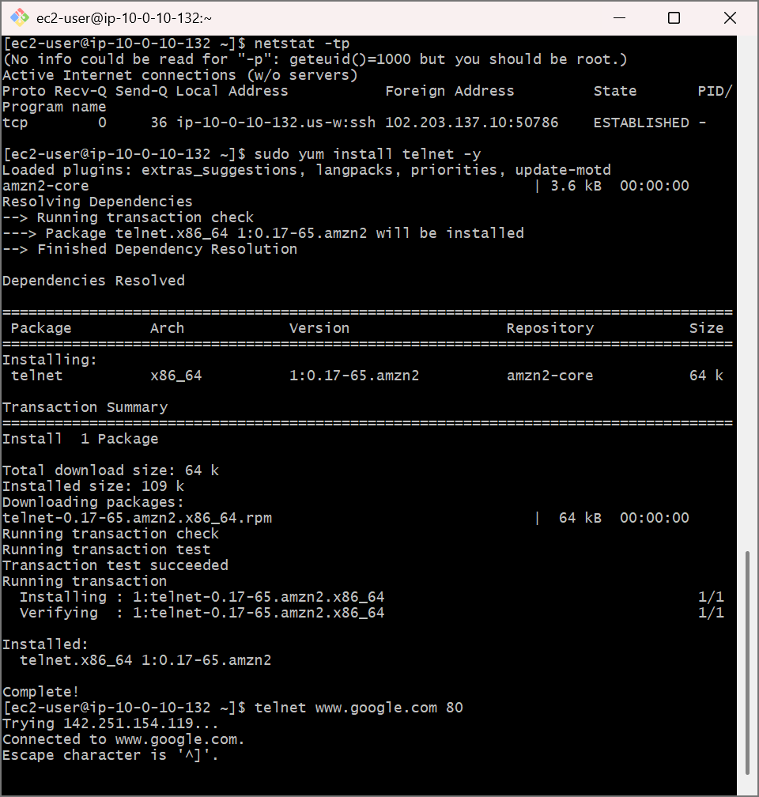
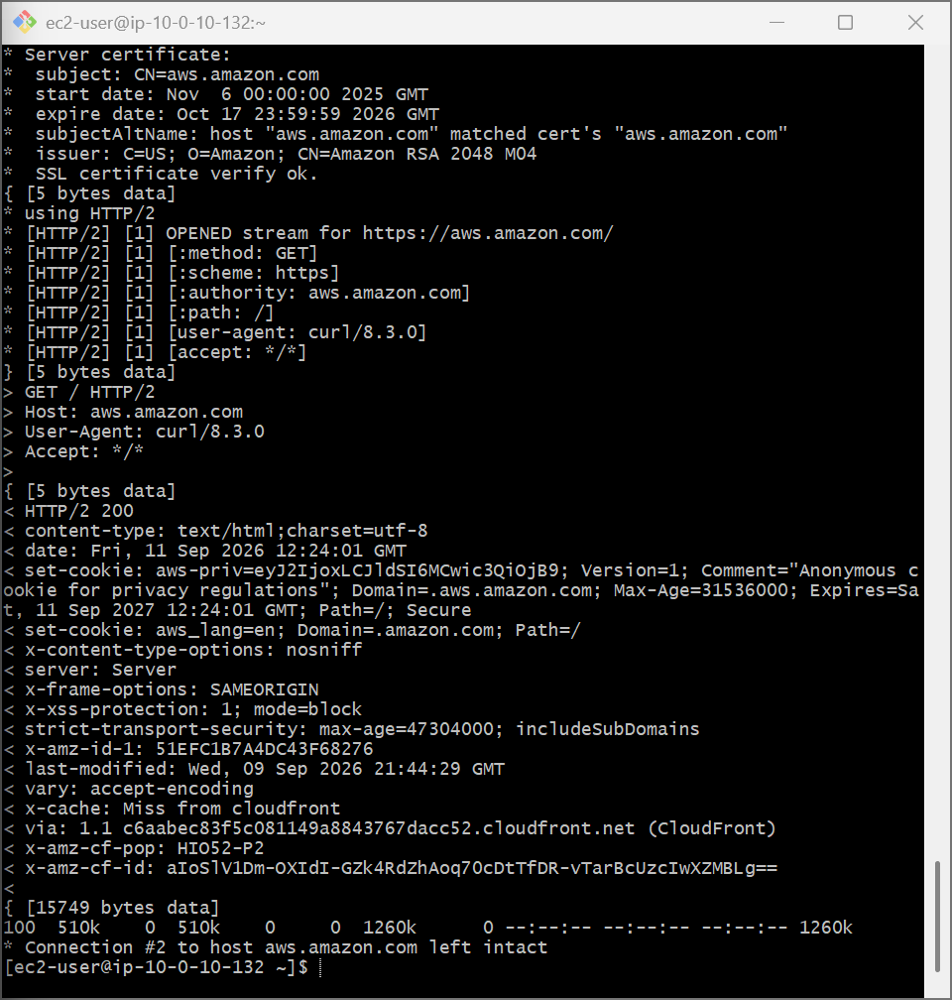
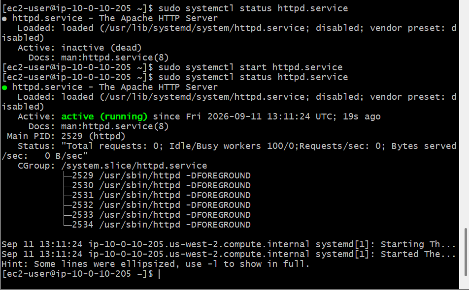
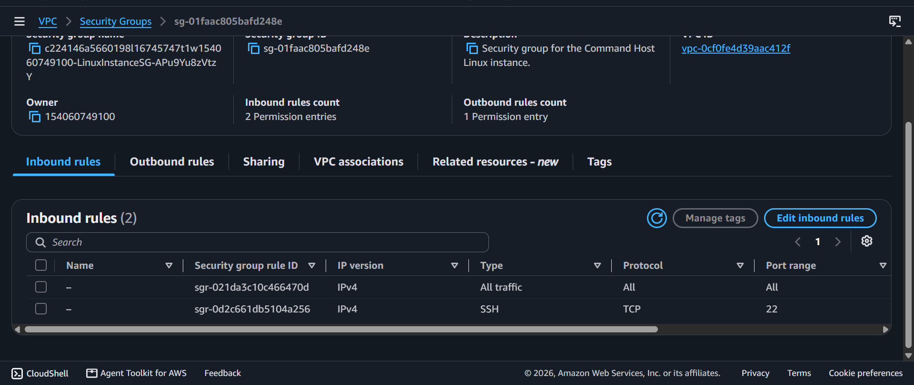
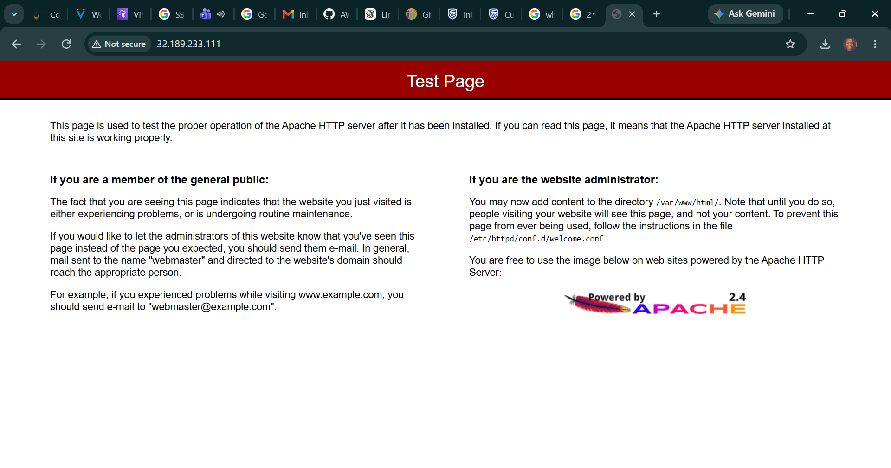

# AWS Cloud Networking: Systematic OSI Layer Triage & Network Diagnostics

This module documents two distinct implementation labs exploring network diagnostic utilities mapped across the OSI model and an active production environment firewall triage case study.

---

## 🛠️ Lab 1: Comprehensive OSI Layer Triage Mechanics

### 📌 Objective
Perform systematic operational network diagnostics on an Amazon Linux EC2 instance by mapping standard terminal utilities directly across specific layers of the **Open Systems Interconnection (OSI) Model**.

### 🚀 Diagnostics Architecture Matrix

| OSI Layer | Focus Area | Core Terminal Command | Operational Purpose |
| :--- | :--- | :--- | :--- |
| **Layer 7: Application** | Web Traffic & HTTP Headers | `curl -vLo /dev/null` | Audits raw application response tracking, SSL validations, and HTTP return state codes (e.g., 200 OK). |
| **Layer 4: Transport** | Ports & TCP Session Handshakes | `netstat -tp` <br> `telnet` | Audits local listening port metrics and probes remote server boundaries to verify if specific service ports are open or firewalled. |
| **Layer 3: Network** | Packets, IPs & Routing Paths | `ping -c 5` <br> `traceroute` | Evaluates basic ICMP reachability, packet degradation limits, and maps hop-by-hop node infrastructure latency routes. |

---

## 🛠️ Lab 2: Support Case Simulation — Web Server Firewall Triage

### 📌 Case Scenario Summary
- **Client Account:** Ana (Enterprise Application Developer)
- **Problem Statement:** The customer launched an Apache HTTP Web Server on an EC2 instance. The background daemon service is verified as running, and the underlying VPC network routes are stable, but external public users experience infinite connection timeouts when trying to load the webpage.

### 🚀 Step-by-Step Triage & Infrastructure Remediation

#### 1. Verifying Local Operating System Health (OSI Layer 5/7)
- Connected to the instance via SSH and checked the system initialization states:
  ```bash
  sudo systemctl start httpd.service
  sudo systemctl status httpd.service
  ```
- **Finding:** The service output registered as `active (running)`. This proved the core application layer was executing properly in memory.

#### 2. Auditing VPC Routing Frameworks (OSI Layer 3)
- Tested external outbound path reachability from the shell:
  ```bash
  ping www.amazon.com -c 3
  ```
- **Finding:** Packets returned successfully with 0% loss, confirming that the **Internet Gateway (IGW)** and **Route Tables** were fully operational.

#### 3. Isolating and Resolving the Security Block (OSI Layer 4)
- **The Diagnosis:** Because the server was healthy and the routes were open, the timeout boundary pointed directly to Layer 4 (Transport/Port access). Web browsers send initial traffic over **HTTP (Port 80)**, but an inspection of the instance's stateful firewall properties showed that Port 80 was not allowed inbound.
- **The Remediation:** Navigated to the AWS Console, edited the instance's associated **Security Group**, and appended an explicit ingress rule:
  - **Type:** HTTP
  - **Port Range:** 80
  - **Source:** `0.0.0.0/0` (Anywhere)
- **Result:** The stateful firewall immediately accepted the traffic adjustment. Refreshing the browser tab successfully loaded the **Apache HTTP Server Test Page**, resolving the customer's traffic isolation issue completely.

---

## 📸 Technical Verification Proofs

### Lab 1: OSI Multi-Layer Diagnostics Logs
- 
- 
- 

### Lab 2: Web Server Remediation Logs
- 
- 
- 
