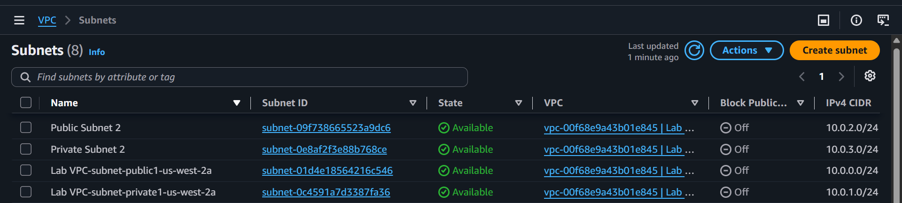
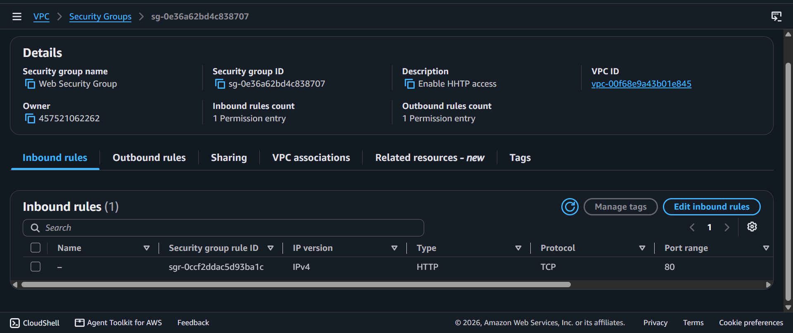
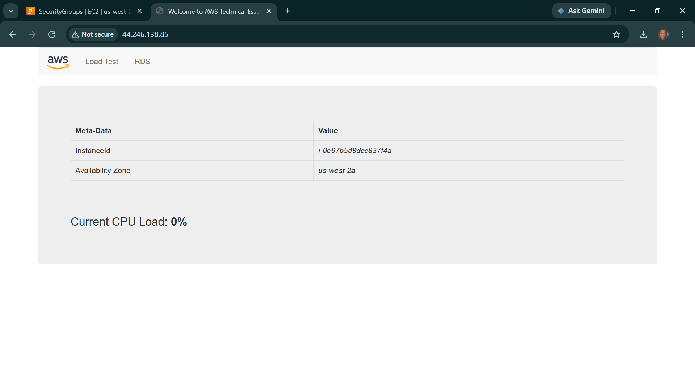

# AWS Cloud Lab: Engineering Highly Available Multi-AZ Network Topologies & Automated Web App Bootstrapping

## 📌 Project Overview
This lab demonstrates the manual engineering of a resilient, fault-tolerant, Multi-Availability Zone (Multi-AZ) virtual network environment on AWS. It covers custom multi-subnet segmentation, cross-zone routing table configurations, custom security perimeters, and automated application provisioning using native EC2 User Data bootstrap runtime scripts.

## 🛠️ High-Availability Architecture Spec Sheet
- **Parent Network Envelope:** `10.0.0.0/16` (Lab VPC)
- **Availability Zone A (us-west-2a):**
  - `Public Subnet 1`: `10.0.0.0/24` (Internet Gateway Routed)
  - `Private Subnet 1`: `10.0.1.0/24` (NAT Gateway Routed)
- **Availability Zone B (us-west-2b):**
  - `Public Subnet 2`: `10.0.2.0/24` (Cross-Zone Redundant Public)
  - `Private Subnet 2`: `10.0.3.0/24` (Cross-Zone Redundant Private)

---

## 🚀 Infrastructure Implementation Lifecycle

### 1. High Availability (HA) Multi-Zone Expansion
- Initialized `Lab VPC` using an automated blueprint to map out baseline public/private networks inside the primary zone.
- Expanded the infrastructure footprint manually by carving out an alternate availability zone layer to prevent single-point-of-failure vulnerabilities:
  - Deployed `Public Subnet 2` (`10.0.2.0/24`) and `Private Subnet 2` (`10.0.3.0/24`).
- Updated the network lookups by modifying the explicit **Subnet Associations** on both your `Public Route Table` and `Private Route Table` to seamlessly tie the new zone blocks into the active cloud gateway channels.

### 2. Micro-Perimeter Firewall Implementation
- Engineered a custom stateful host firewall named `Web Security Group`.
- Configured a precise ingress authorization rule to block unvetted network layer ports while opening up the standard Application Layer pathway:
  - **Protocol/Type:** HTTP (Port 80)
  - **Source Scope:** `0.0.0.0/0` (Anywhere IPv4 to allow global web requests)

### 3. Automated User Data Script Application Bootstrapping
- Provisioned a `t3.micro` instance (`Web Server 1`) nested into the newly constructed `Public Subnet 2` environment.
- Leveraged the native **EC2 User Data** field to inject an un-attended Bash installation script that executes automatically upon initial hardware initialization:
  - Updates system binary registries and silences dependency verification loops (`yum install -y httpd mysql php`).
  - Remotely fetches zipped web application payload repositories using `wget` tools.
  - Extracts web code straight into the server's root operational content library (`/var/www/html/`).
  - Configures background services to survive hardware power-state recycles (`chkconfig httpd on`) and boots the engine live.
- **Result:** Querying the host's Public IPv4 DNS address inside a web browser successfully resolved the custom application frontend dashboard, validating flawless network engineering and server automation hooks!

---

## 📸 Technical Verification Proofs

### Multi-AZ Subnet Expansion Core Topology Map

### Stateful Inbound Web Firewalls Rules Grid

### Automated Bootstrap Script Application Landing Verification

