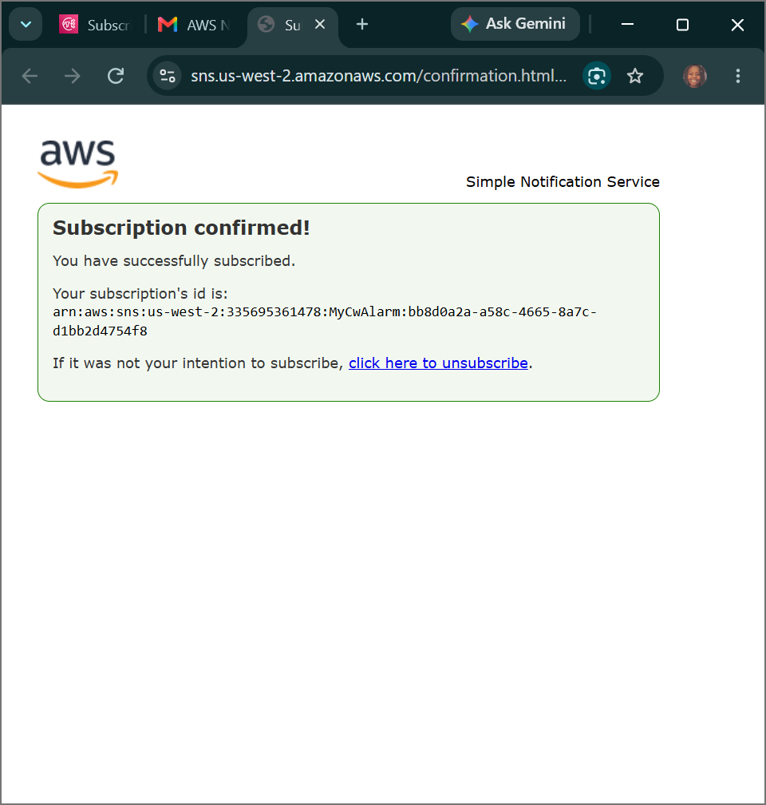
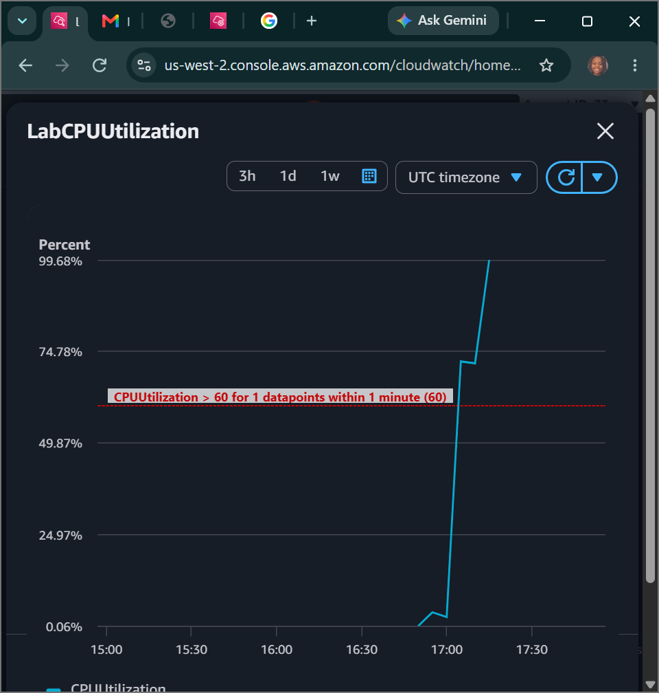
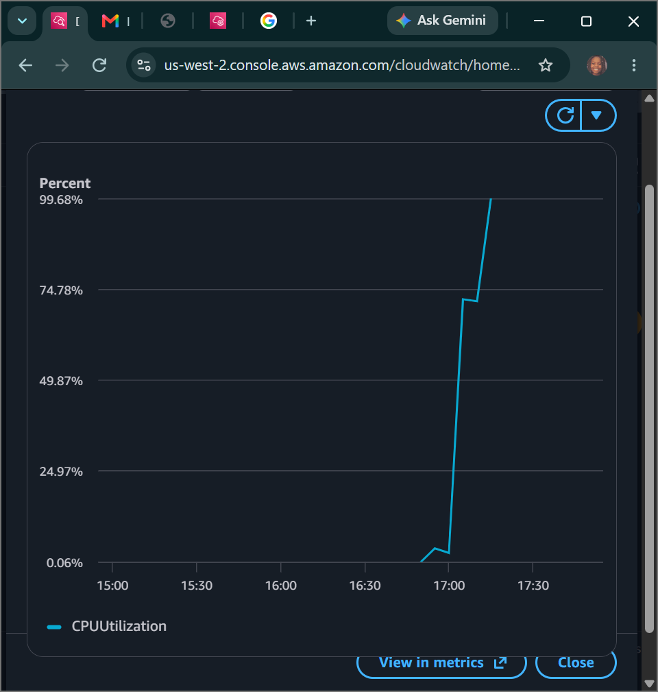

# AWS Security Lab: Operational Telemetry & Post-Incident Forensic Auditing - Metric Alerts & Automated Event Analysis via Amazon CloudWatch & SNS

## 📌 Project Overview
This lab documents the practical execution of the **Analysis** phase within the security lifecycle. To enforce comprehensive cloud governance and proactive threat auditing, we configured pub/sub notification frameworks via **Amazon SNS**, mapped real-time threshold alert evaluations inside **Amazon CloudWatch Alarms**, simulated a systemic high-load hardware stress exploit using native Linux binary injections (`stress`), and engineered a custom telemetry tracking dashboard to analyze infrastructure data variations.

---

## 🚀 Analysis Architecture, Compliance & Telemetry Governance

### 1. Root Cause Analysis (RCA) & Risk Mitigation Strategy
- **Root Cause Analysis (RCA):** The systematic forensic practice of investigating log records, tracing timestamps, and evaluating anomalous events to isolate exactly *why* a fault loop or security breach occurred, preventing recurring systemic exposure.
- **Risk Assessment & Response Strategies:** Quantifying infrastructure vulnerability metrics and defining risk postures (Accept, Mitigate, Transfer, or Avoid) based on organizational compliance data frameworks.
- **Acceptable Use Policies (AUP):** Clear regulatory governance metrics defining authorized operations across company compute channels. Continuous analysis loops ensure that resources do not drift into non-compliant, unvetted use bounds.

### 2. Enterprise Logging & Monitoring Policies
- **Monitoring vs Logging:** Logging acts as the cold, historical data collection ledger recording deep audit trails over time. Monitoring serves as the real-time extraction filter engine, turning raw data into actionable intelligence alerts.
- **Monitoring Policy & MaaS:** Deploying Monitoring-as-a-Service (MaaS) wrappers to standardize metrics gathering across all virtual hosts.
- **Retention & Logging Policies:** Establishing strict retention timelines governing how long security logs (such as CloudTrail API records or VPC Flow Logs) are kept in secure, cold S3 archives before being lifecycle-purged for compliance.

---

## 🛠️ Step-by-Step Security Implementation Lifecycle

### 1. Architecting the Event Notification Sub-Pub Mesh
- Navigated to the **Amazon Simple Notification Service (SNS)** console and generated a Standard messaging topic named `MyCwAlarm`.
- Provisioned a downstream communications subscription channel mapped to the **Email** protocol, entering a valid administrative email account.
- Handshaked the authorization request via external mailbox loops to flip the tracking status parameter from *Pending Confirmation* to a valid **Confirmed** runtime state.

### 2. Compiling the Threshold Validation Alarm Rules
- Accessed **Amazon CloudWatch** to audit the raw compute namespace infrastructure (`Per-Instance Metrics`).
- Engineered a precise, automated metric alert engine named `LabCPUUtilizationAlarm` configured with strict evaluation triggers:
  - **Metric Evaluated:** `CPUUtilization` (Statistic: `Average`)
  - **Granularity Period Evaluation Window:** 1 Minute
  - **Static Condition Rule:** Greater than `>` threshold limit value of **60%**
  - **Action Target Routing:** If the metric enters an `In alarm` state, immediately route an automated JSON execution payload token directly to the `MyCwAlarm` SNS topic to trigger emergency administrator emails.

### 3. Injecting Computational Load Stress
- Connected securely to the target node (`Stress Test`) using **SSM Session Manager** web links.
- Fired off an aggressive, multi-threaded hardware compression script designed to lock computing capacity buffers to simulate an infrastructure exploit or heavy malicious threat flow:
  ```bash
  sudo stress --cpu 10 -v --timeout 400s
  ```
- Opened a parallel terminal node session running **`top`** to visually witness the machine processing streams lock out at a maxed configuration density.

### 4. Live Alarm Interception and Dashboard Visualization Analytics
- Monitored the CloudWatch dashboard layout to watch the metric cross the critical evaluation line.
- **Result:** Within minutes of the script execution, CloudWatch caught the threshold violation, flipped the status code flag to a prominent red **`In alarm`** configuration state, and successfully pushed a real-time email notification directly to the administrative inbox.
- Completed the lifecycle analysis layer by building a custom visual operations center named `LabEC2Dashboard`, attaching a line widget to display the instance's performance footprint on a single screen.

---

## 📸 Technical Verification Proofs

### Amazon SNS Pub-Sub Messaging Layer Token Subscription Confirmation


### Amazon CloudWatch Metric Breach Triggered In Alarm Status Output


### Custom CloudWatch Executive Metrics Logging Dashboard Summary Layout

