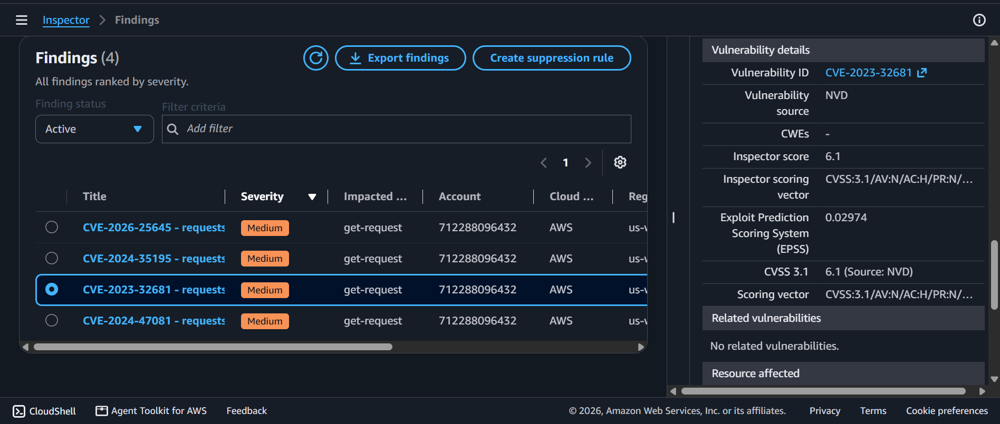
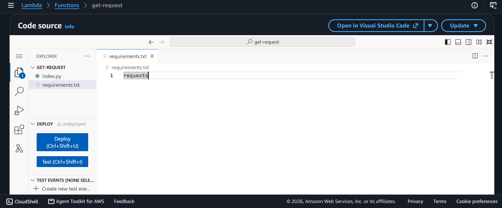
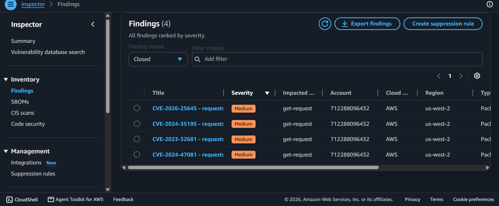

# AWS Security Lab: Network & Architecture Hardening - Automated Vulnerability Scanning via Amazon Inspector

## 📌 Project Overview
This lab documents the application of defensive infrastructure hardening strategies, threat detection modeling, and automated remediation workflows. Using **Amazon Inspector**, a continuous security assessment engine, we systematically audited cloud computing layers to isolate high-risk supply chain software vulnerabilities (CVE dependencies), interpret standardized data from the National Vulnerability Database (NVD/NIST), and deploy precise security patches to enforce an airtight network defense stance.

---

## 🚀 Architectural Concepts & Hardening Strata

### 1. Network & Discovery Hardening Theory
- **Network Security Threats:** Analyzed how outdated application dependencies and unpatched software packages introduce severe operational security vectors, allowing adversarial elements to breach local data perimeters.
- **Network Discovery Hardening:** Minimizing the global reconnaissance footprint by utilizing automated cloud scanners like Amazon Inspector to continuously inventory active compute footprints, intercept hidden architectural vulnerabilities, and prevent exploitation vectors.
- **Network Architecture Hardening:** Enforcing tight code-level manifest definitions and scanning boundaries alongside standard subnets and firewalls to ensure that serverless application hooks remain resilient against modern zero-day attacks.

---

## 🛠️ Step-by-Step Security Implementation & Triage

### 1. Activating Automated Environment Coverage
- Initialized **Amazon Inspector** across the account environment to trigger an automated, continuous compliance assessment grid across compute and serverless layers (Amazon EC2, Amazon ECR, and AWS Lambda).
- Monitored the dashboard summary grid until the execution environment reached 100% scanning coverage.

### 2. Vulnerability Isolation & NIST Data Synthesis
- Audited the real-time findings matrix and isolated an active security flaw:
  - **Vulnerability ID:** `CVE-2023-32681` (Medium Severity)
  - **Target Asset:** `get-request` AWS Lambda Function
- Synthesized data by tracking the vulnerability link out to the **National Vulnerability Database (NVD)** hosted by the **National Institute of Standards and Technology (NIST)**. 
- **The Diagnosis:** The serverless resource was executing an outdated, vulnerable version of the Python `requests` package (`version 2.20.0`), creating a supply-chain vulnerability. The structural recommendation required a force-upgrade of the application package.

### 3. Deploying Code-Level Remediation Patches
- Navigated to the **AWS Lambda Console**, accessed the file layout for the `get-request` function, and targeted the manifest dependency file: `requirements.txt`.
- Hardened the package script by stripping out the rigid, outdated version string (`requests==2.20.0`) and replacing it with the global parameter:
  ```text
  requests
  ```
- **The Mechanic:** Removing explicit old version parameters forces the Lambda runtime machine to automatically fetch and deploy the latest, most secure version of the package from vetted registries during deployment.
- Triggered the **Deploy** command to send the secure updates live.

### 4. Automated Compliance Verification
- Returned to the Amazon Inspector engine to monitor the automated re-scan lifecycle.
- Filtered the tracking dashboard status from *Active* to **Closed**.
- **Result:** Confirmed that `CVE-2023-32681` transitioned successfully into a **Closed/Remediated** state with an updated timestamp, verifying that the serverless application code is officially secure and hardened against dependency attacks!

---

## 📸 Technical Verification Proofs

### Amazon Inspector Active Vulnerability Scan Output (CVE-2023-32681)


### AWS Lambda Package Manifest Dependency Hardening (`requirements.txt`)


### Verified Closed & Remediated Security Compliance Matrix

