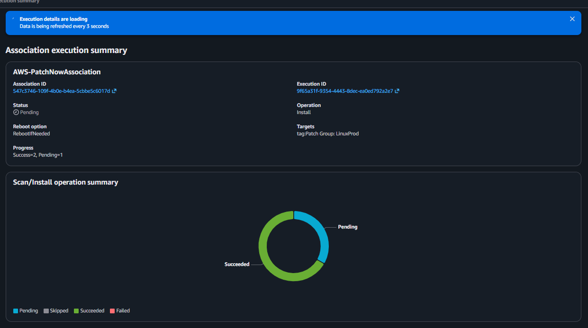
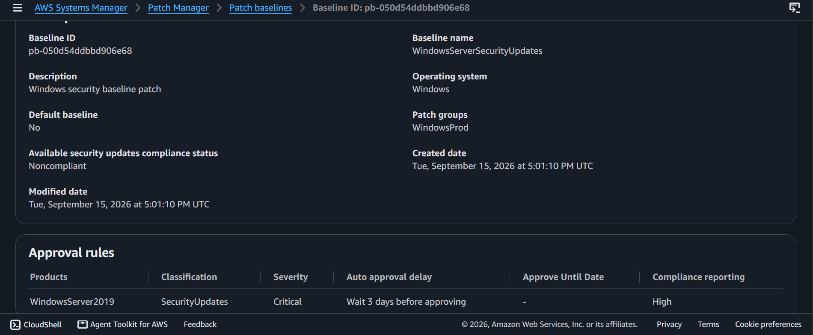
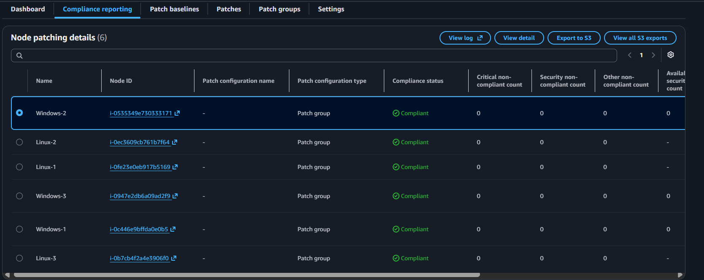

# AWS Security & Operations Lab: Systems Hardening — Automated Enterprise Patch Management & Fleet Compliance via AWS Systems Manager (SSM)

## 📌 Project Overview
This lab documents the practical execution of enterprise-grade Systems Hardening, automated vulnerability mitigation, and continuous software governance across cross-platform virtual server infrastructures. Leveraging **AWS Systems Manager (SSM)**, **Fleet Manager**, and **Patch Manager**, we built a centralized operations hub to catalog compute assets, establish strict custom update baselines, modify logical patch groups, execute automated code deployment scripts via **SSM Run Command**, and achieve 100% security compliance across multi-OS target fleets.

---

## 🚀 Systems Hardening Architecture & Governance

### 1. Introduction to Systems Hardening
Systems Hardening is the tactical practice of securing an operating system's baseline configuration to minimize its overall attack surface. This is achieved by removing unnecessary software layers, disabling default open settings, enforcing strict access credentials, and maintaining patch compliance.

### 2. The AAA & Corporate Protection Framework
- **Authentication, Authorization, and Accounting (AAA):** Implemented implicitly through secure IAM roles assigned to instances, granting Fleet Manager secure administrative handshakes.
- **Software Application & Server Hardening:** Mitigating software vulnerabilities by ensuring the OS kernel and binary libraries are continuously scanned, patched, and audited.
- **AWS System Hardening Tools:** Utilizing AWS Systems Manager as an automated operations engine to displace manual shell-by-shell patching, ensuring consistency across hundreds of virtual machine nodes.

---

## 🛠️ Step-by-Step Patch Orchestration Lifecycle

### 1. Cross-Platform Fleet Inventory Auditing
- Accessed **SSM Fleet Manager** to audit the node infrastructure footprint, evaluating pre-provisioned node states spanning three Linux nodes and three Windows server instances.
- Inspected explicit administrative node properties to confirm the attachment of required system orchestration service IAM roles.

### 2. Executing Automated Linux Baseline Upgrades
- Triggered an on-demand fleet upgrade using **Patch Manager** to orchestrate immediate system corrections.
- Mapped explicit tag targets to isolate production spaces:
  - **Operation Parameter:** `Scan and install` (Reboot if needed)
  - **Target Selection Filter:** `Patch Group` = `LinuxProd`
- Systems Manager executed the baseline (`AWS-AmazonLinux2DefaultPatchBaseline`) to discover out-of-date assets and push critical security adjustments.

### 3. Engineering a Custom Windows Security Patch Baseline
- Designed a custom regulatory security baseline profile named `WindowsServerSecurityUpdates` for the `WindowsServer2019` product line to enforce strict corporate compliance:
  - **Rule 1 (Critical Severity):** Automatically approves all `SecurityUpdates` exactly 3 days post-release, flagging non-compliance markers as `Critical`.
  - **Rule 2 (Important Severity):** Automatically approves matching security releases 3 days post-release, logging system vulnerabilities as `High`.
- Structural Association: Modified the tracking profiles to bind the custom rule framework directly to the target environment footprint string: **`WindowsProd`**.

### 4. Tag Configuration & Fleet Deployment Execution
- Navigated to the **Amazon EC2 Console** to apply inventory tags onto the running instances (`Windows-1`, `Windows-2`, and `Windows-3`), matching the target key parameters (`PatchGroup` = `WindowsProd`).
- Re-opened the patch manager configuration loop to deploy the updates via the **SSM Run Command** framework, triggering the background `PatchBaselineOperations` document pipeline to safely inspect and patch the systems.

### 5. Final Compliance & Audit Verification
- Evaluated the global **Patch Manager Compliance Dashboard** to parse the final telemetry statistics grid.
- **Result:** Confirmed **`Compliant: 6`** across the entire cross-platform cluster. The dashboard verified 0 non-compliant artifacts (Critical, Security, or Other) across all Linux and Windows systems, proving successful enterprise fleet hardening!

---

## 📸 Technical Verification Proofs

### Centralized Automated Patch Execution and Run Command Progress

### Custom Windows Server Security Baseline and Patch Group Alignment

### Verified Fleet Compliance Telemetry Dashboard Summary (Compliant: 6)

