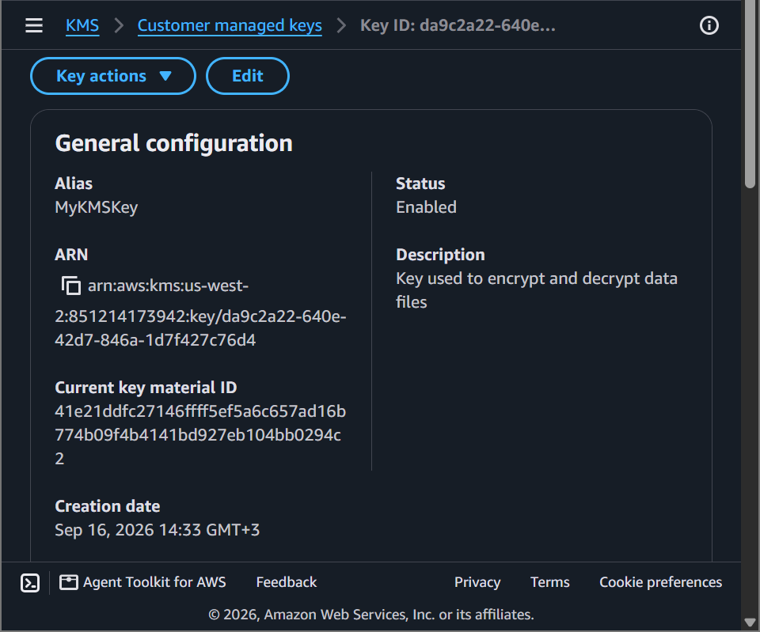
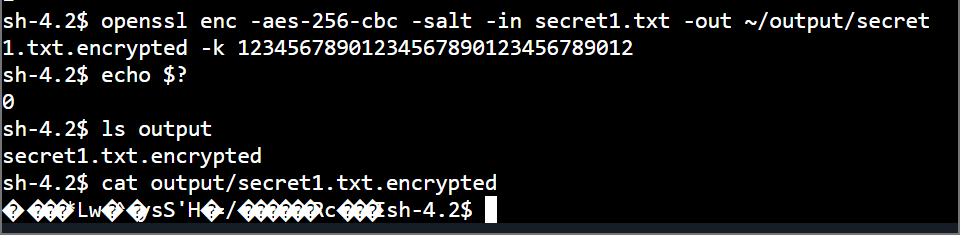
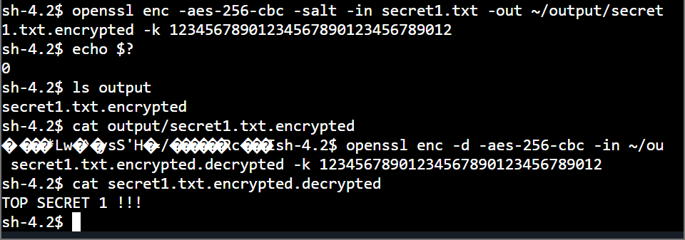

# AWS Security Lab: Data Security Controls — Symmetric Cryptography & Envelope Encryption via AWS KMS

## 📌 Project Overview
This lab documents the engineering implementation of **Data Security Controls** within the prevention security lifecycle phase. To enforce absolute data confidentiality and integrity benchmarks (The CIA Triad), we provisioned a hardware-secured cryptographic master key via **AWS Key Management Service (KMS)**, authenticated an enterprise file server instance via **SSM Session Manager**, deployed the **AWS Encryption CLI** engine, and executed full programmatic symmetric encryption/decryption loops to transform plaintext assets into immutable ciphertext.

---

## 🚀 Cryptographic Engineering & Data Protection Strata

### 1. Data States and Protection Vectors
- **Data at Rest:** Securing passive data stored physically on storage volumes against localized extraction or multi-tenant visibility breaches. (Mitigated via AWS KMS envelope encryption).
- **Data in Motion:** Protecting transactional text streams traversing live networks using active TLS/SSL transport handshakes.

### 2. Cryptographic Architecture Theory
- **Symmetric Encryption:** Utilizing a singular, shared cryptographic key matrix to handle both the mathematical scramble (encryption) and recovery (decryption) parameters. This provides massive computational optimization and speed.
- **Asymmetric Encryption:** Utilizing mathematically linked dual-key geometry pairs (a public key for ingestion encryption and an isolated private key for data recovery decryption).
- **Hardware Security Modules (HSM):** AWS KMS leverages physical FIPS 140-2 validated hardware storage layers to protect key integrity, ensuring cryptographic roots cannot be extracted by host users or administrators.

---

## 🛠️ Step-by-Step Security Implementation Lifecycle

### 1. Provisioning the Cryptographic Root Key Block
- Navigated to the **AWS Key Management Service (KMS)** console and initialized a dedicated **Symmetric Key** container mapped with the alias `MyKMSKey`.
- Confirmed administrative access and usage parameters explicitly onto the default execution context profiles (`voclabs`).
- Extracted and logged the unique global identifier: **Amazon Resource Name (ARN)**.

### 2. File Server Session Manager Ingestion & Authentication
- Established a secure terminal connection to the file server host instance bypassing traditional open-port SSH vectors by using **AWS Systems Manager Session Manager**.
- Modified the cloud client profile layout (`vi ~/.aws/credentials`) to drop temporary placeholders and paste active, short-term cryptographic session tokens securely mapping permission handshakes.
- Deployed the programmatic text processing developer framework and updated lookup environments:
  ```bash
  pip3 install aws-encryption-sdk-cli
  export PATH=\$PATH:/home/ssm-user/.local/bin
  ```

### 3. Programmatic Plaintext Ciphertext Transformations
- Generated a simulated sensitive document asset (`echo 'TOP SECRET 1!!!' > secret1.txt`) and mapped the KMS ARN to a local environment shell token array (`keyArn`).
- Executed the **AWS Encryption CLI** to pass the plaintext block through a symmetric cipher algorithm with strict security parameters:
  ```bash
  aws-encryption-cli --encrypt \
                     --input secret1.txt \
                     --wrapping-keys key=\$keyArn \
                     --metadata-output ~/metadata \
                     --encryption-context purpose=test \
                     --commitment-policy require-encrypt-require-decrypt \
                     --output ~/output/.
  ```
- Checked the pipeline exit parameters (`echo \$?` = `0`) to confirm successful execution. Auditing the target output file via `cat` confirmed the text stream successfully scrambled into raw unreadable **ciphertext**.

### 4. Executing Cryptographic Data Recovery Loops
- Reversed the cryptographic calculation loop by calling the `--decrypt` mechanism, passing the ciphertext file back through the matching KMS key ARN with the associated metadata context string parameter.
- Audited the recovered file asset via terminal commands:
  ```bash
  cat secret1.txt.encrypted.decrypted
  ```
- **Result:** The stream successfully mapped back to its original plaintext form (`TOP SECRET 1!!!`), validating absolute end-to-end data security, authorization control mapping, and secure cryptographic storage management!

---

## 📸 Technical Verification Proofs

### AWS Key Management Service (KMS) Symmetric Key Status and ARN Mapping


### Programmatic File Scrambling & Secure Ciphertext Manipulation Proof


### Successful Symmetric Key Decryption Loop & Plaintext Data Recovery

