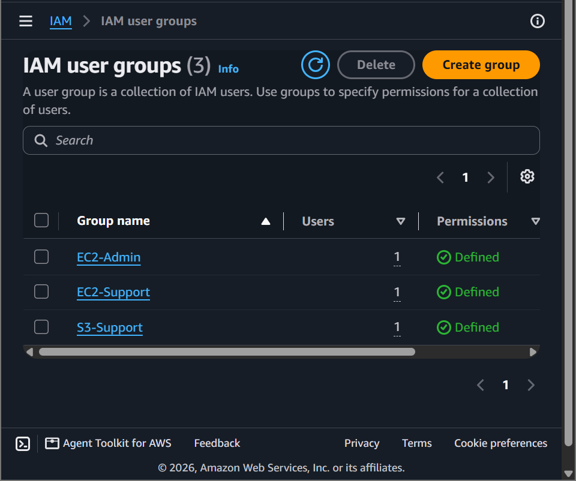
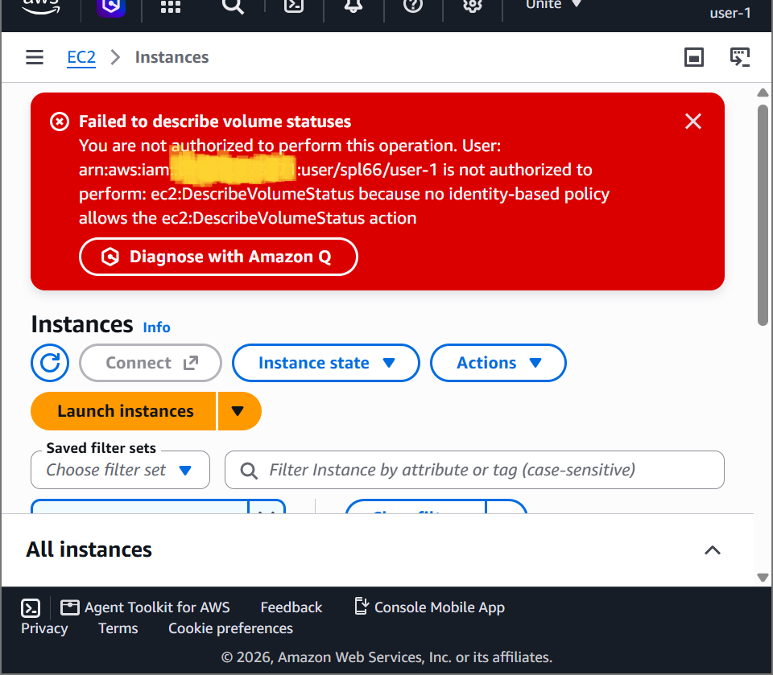
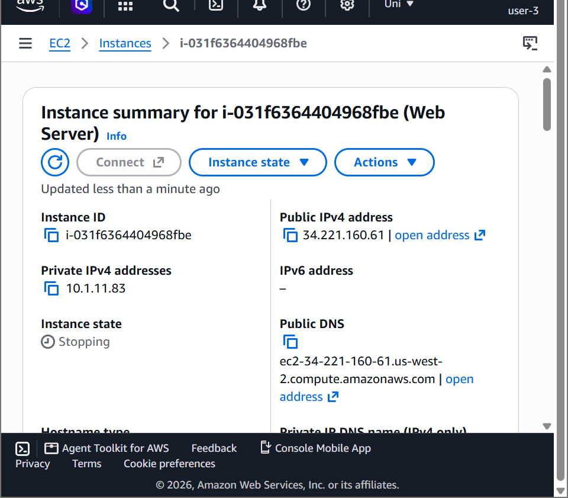

# AWS Security Lab: Access Control & Authorization — Granular Identity Management & Least Privilege Enforcement via AWS IAM

## 📌 Project Overview
This lab documents the engineering implementation of **Identity Governance and Authentication Frameworks** using native **AWS Identity and Access Management (IAM)** ciphers. To enforce absolute adherence to the **Principle of Least Privilege (PoLP)**, we optimized account-wide password policies, mapped out structured **User Groups**, assigned both **AWS Managed Policies** and complex **Customer Inline Policies**, and executed simulation cross-account testing across distinct identity roles to visually validate absolute access containment boundaries inside the cloud.

---

## 🚀 Identity Architecture & Authorization Matrix

### 1. AWS IAM Operational Foundations
AWS Identity and Access Management is a web service that helps securely control access to AWS resources:
- **IAM Users:** Unique identity entities created within an AWS account representing a human operator or automated service mechanism with persistent security credentials.
- **IAM Groups:** Structural collection containers used to cluster multiple users under a unified identity banner, simplifying the management of common permission sets.
- **IAM Roles:** Temporary privilege vectors that do not have persistent credentials, designed to be safely assumed by trusted services, applications, or cross-account human federations.

### 2. Policy Paradigms & Evaluation Logic
- **AWS Managed Policies:** Pre-built, stand-alone permission structures crafted and maintained by AWS (e.g., `AmazonEC2ReadOnlyAccess`). Updates automatically trickle down to all associated attachments.
- **Customer Inline Policies:** Highly customized permission sets embedded strictly inside a single explicit user or group identity. Inline policies guarantee a strict 1-to-1 linkage, preventing accidental expansion to external resources.
- **IAM Authorization Chain:** Every operational request sent to the AWS API defaults to an implicit **Deny**. Access is unlocked *only* when an evaluation rule maps an explicit **Allow** matching the exact `Effect`, `Action`, and `Resource` parameter blocks.

---

## 🛠️ Step-by-Step IAM Implementation Lifecycle

### 1. Hardening Global Account Password Policies
- Navigated to the **AWS IAM Console** under *Account Settings* to review account-wide credential baselines.
- Upgraded configuration safety structures to prevent credential dictionary vulnerabilities by enforcing complex corporate pass-rules (minimum length requirements, multi-character sets, and mandatory expirations).

### 2. Provisioning the Group Role Topology
Evaluated three pre-existing functional business groups to audit their permission sets:
- **`S3-Support` Group:** Attached to the `AmazonS3ReadOnlyAccess` managed policy, allowing users to list and get objects.
- **`EC2-Support` Group:** Attached to the `AmazonEC2ReadOnlyAccess` managed policy, restricting users to view-only instance states.
- **`EC2-Admin` Group:** Configured with an embedded Customer Inline Policy (`EC2-Admin-Policy`), granting precise rights to query metadata (`Describe*`) alongside administrative state alterations (`StartInstances` and `StopInstances`).

### 3. Assigning Personnel Identities
Orchestrated the personnel integration workflow by adding the clean user nodes into their respective operational groups to establish explicit compliance boundaries:
- **`user-1`** ──> Map to **`S3-Support`** (Storage Support Staff)
- **`user-2`** ──> Map to **`EC2-Support`** (Compute Support Analyst)
- **`user-3`** ──> Map to **`EC2-Admin`** (Compute Systems Administrator)

### 4. Simulating Identity Boundary Triage (Cross-User Audits)
Leveraged isolated private browser environments to run live cross-verification access audits:
- **User-1 Testing (S3-Support):** Successfully traversed the object namespace to browse bucket keys. Attempting to access the Amazon EC2 menu threw an immediate **`You are not authorized to perform this operation`** fault boundary.
- **User-2 Testing (EC2-Support):** Successfully parsed the active virtual machine fleet grid. Attempting to click **Stop instance** was intercepted and blocked by the API with a **`Failed to stop the instance`** denial event, proving read-only policy enforcement.
- **User-3 Testing (EC2-Admin):** Logged into the compute console and executed a command state override. The target virtual machine successfully shifted into a yellow **`Stopping`** status block, validating flawless authorization mapping.

---

## 📸 Technical Verification Proofs

### Centralized IAM User Group Containment Matrix Grid

### User-1 Isolation Triage: Successful S3 Object Access with Explicit EC2 Denied Banner

### User-3 Administrator Clearance Validation: Authorized EC2 Machine State Shutdown

