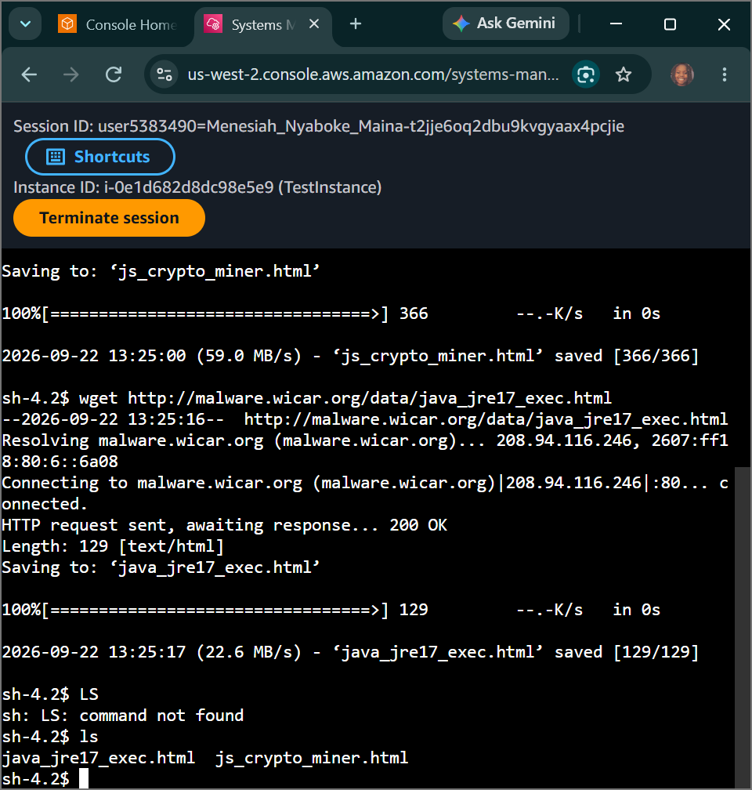
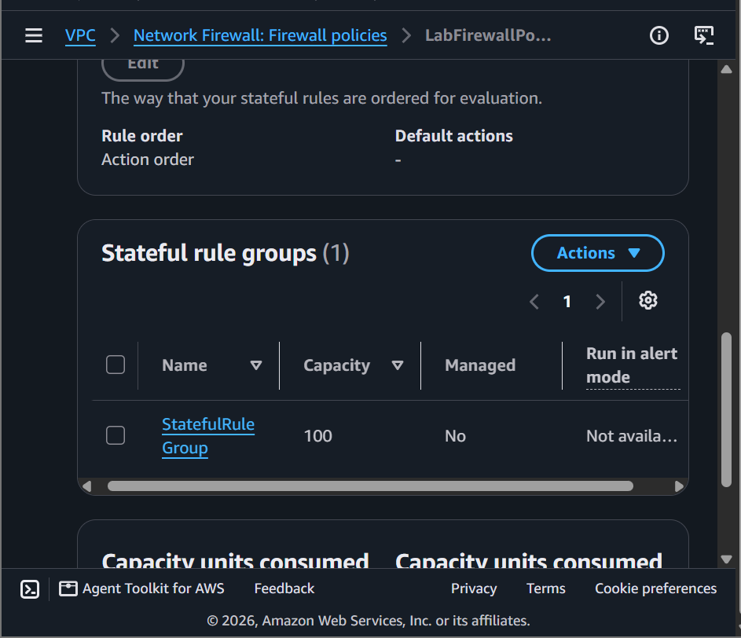
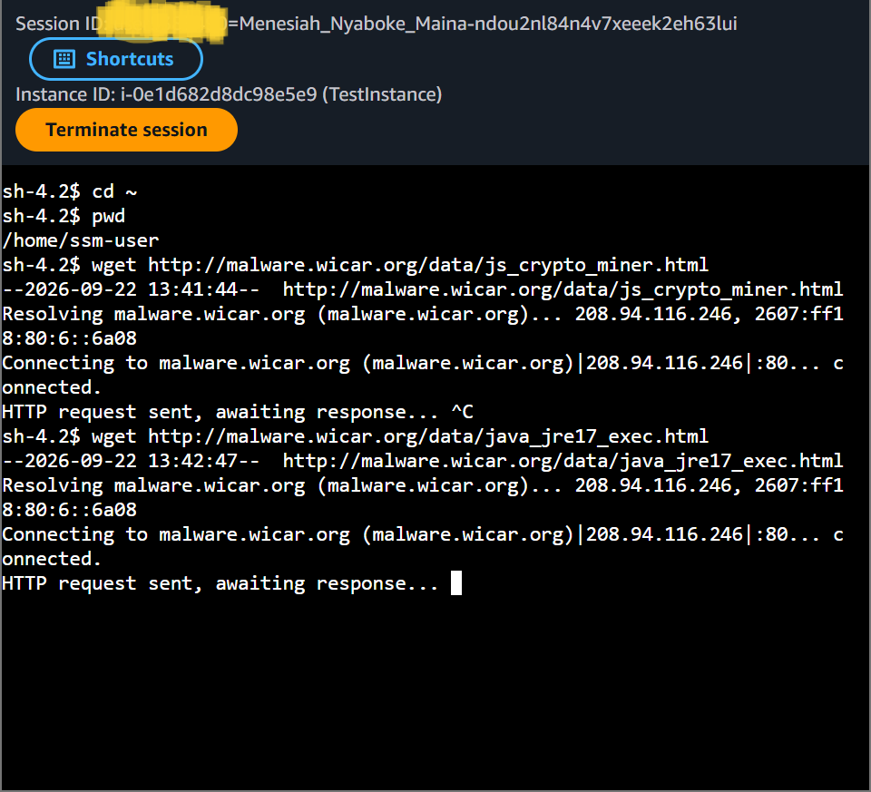

# AWS Security Lab: Threat Detection & Intrusion Prevention - Custom Suricata Rule Engineering via AWS Network Firewall

## 📌 Project Overview
This lab documents the practical execution of the **Detection** and intrusion prevention phase within the security lifecycle. To protect cloud network boundaries against modern threat vectors, we simulated a malware payload exploit on an internal compute instance, configured stateless-to-stateful packet forwarding pipelines, engineered custom **Suricata-compatible signature rules** to intercept malicious web streams, deployed security barriers inside **AWS Network Firewall**, and verified deep packet inspection drop actions via live terminal logs.

---

## 🚀 Detection Lifecycle Architecture & Threat Modeling

### 1. The Core Threat Matrix
- **Malware & Infection Methods:** Explored how payloads like Trojans and background crypto-miners infiltrate corporate subnets through standard web ports (HTTP/S Port 80/443), necessitating packet-filtering boundaries.
- **Intrusion Detection Systems (IDS) vs Intrusion Prevention Systems (IPS):** 
  - *IDS:* Passive network visibility mechanisms that monitor traffic arrays and flag anomalous events without blocking data streams.
  - *IPS:* Active inline infrastructure walls that inspect live packet payloads against known signature databases and block malicious flows instantly.
- **NIDS vs HIDS:** Differentiating between Host-Based IDS (HIDS), which track kernel anomalies locally on the server, and Network-Based IDS (NIDS / AWS Network Firewall), which intercept data packets traversing entire subnets.

### 2. AWS Native Detection Tools
- **Amazon GuardDuty:** Continuous, intelligent threat detection service that uses machine learning, anomaly detection, and integrated threat intelligence to monitor cloud accounts, network flows, and API trails without adding latency to network traffic.

---

## 🛠️ Step-by-Step Intrusion Prevention Lifecycle

### 1. Replicating the Exploit Vector
- Logged into the compute node (`TestInstance`) using **SSM Session Manager**.
- Replicated an un-vetted end-user web download by fetching test signature malware files from the public web using standard network command utilities:
  ```bash
  wget http://wicar.org
  wget http://wicar.org
  ```
- Confirmed payload delivery using local storage file queries (`ls`), proving the baseline network lacked payload inspection controls.

### 2. Re-Routing Stateless Traffic Controls
- Navigated to the **Amazon VPC Console** under *Network Firewall* to inspect the perimeter boundary guardrail (`LabFirewall`).
- Modified the structural traffic routing behavior inside the `LabFirewallPolicy` to pivot the security architecture from basic stateless filtering to deep-packet stateful inspection:
  - **Stateless Default Action Override:** Set to `Forward to stateful rule groups` for all standard and fragmented data packets.

### 3. Engineering Suricata-Compatible Stateful Rule Groups
- Engineered a brand-new **Stateful Rule Group** named `StatefulRuleGroup` with an evaluation matrix set to **Action order**.
- Compiled raw, custom **Suricata IPS signature scripts** inside the code container block to intercept specific web parameters matching malicious Trojan indicators:
  ```suricata
  drop http $HOME_NET any -> $EXTERNAL_NET 80 (msg:"MALWARE custom solution"; flow: to_server,established; classtype:trojan-activity; sid:2002001; content:"/data/js_crypto_miner.html";http_uri; rev:1;)
  drop http $HOME_NET any -> $EXTERNAL_NET 80 (msg:"MALWARE custom solution"; flow: to_server,established; classtype:trojan-activity; sid:2002002; content:"/data/java_jre17_exec.html";http_uri; rev:1;)
  ```
- *The Rule Mechanics:* This explicitly instructs the network engine to parse outgoing HTTP headers from the local environment to external paths on port 80. If the packet's `http_uri` content string contains the exact malicious signatures, the firewall drops the packet entirely.

### 4. Policy Attachment & Live Network Validation
- Bound the custom `StatefulRuleGroup` to the primary `LabFirewallPolicy` perimeter structure, achieving successful real-time edge security synchronization.
- Re-opened the terminal session on `TestInstance` and attempted to execute the malicious download script a second time.
- **Result:** The console output locked indefinitely on:
  ```text
  HTTP request sent, awaiting response...
  ```
  This validated that the AWS Network Firewall successfully intercepted the signature match at the perimeter and dropped the packets before they could infiltrate the network. Cleared out the local file markers (`rm`) to restore an immaculate compliance state.

---

## 📸 Technical Verification Proofs

### Initial Payload Delivery: Replicating Threat Exploitation via Terminal Downloads


### Centralized Perimeter Guardrail Configuration: Policy Rule Group Attachment


### Intrusion Prevention Validation: Live Signature Interception and Traffic Drops

