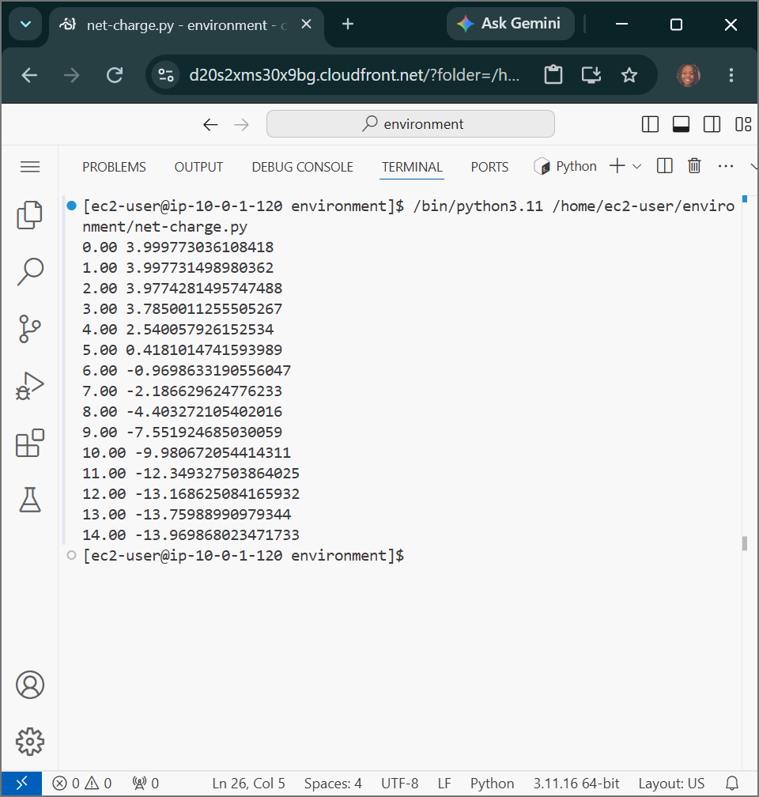

# AWS Programming Foundations: Python Flow Control - Algorithmic Titration, Iterative Loop Architectures & Nested Sequence Parsing

## 📌 Section Overview
This module documents the practical implementation of **Flow Control mechanisms, Multi-Branch Conditionals, and Iterative Loops** within the software development lifecycle. To evaluate how conditional switches and statement blocks execute dynamically, we engineered an automated biochemical simulator inside an integrated development environment (IDE). The program uses **Henderson-Hasselbalch algebraic formulas** within an event-driven loop to continuously process values across a titration spectrum (pH 0 through 14), mapping data objects to simulate protein net charges.

---

## 🚀 Architectural Concepts & Logic Processing Strata

### 1. Flow Control & Multi-Branch Decisions
- **Flow Control Definition:** The order in which individual statements, instructions, or function blocks are evaluated and executed by the runtime engine.
- **Conditionals:** Directing code paths using comparison validation flags. Python enforces block structural grouping boundaries using clean white-spacing (indentations) instead of brackets.

### 2. Iterative Loops & Computation Collections
- **`while` loops:** Conditional-driven control blocks that repeat an internal statement chain continuously *as long as* the baseline state expression remains true (`while pH <= 14`).
- **`for` loops:** Sequence-driven iterators engineered to step through structured arrays, data keys, or integer sequences (such as using `for x in ...` loop ranges) one item at a time.
- **Lists and Dictionaries Interaction:** Combining flexible mutable lists with structured key-value dictionaries to perform rapid database lookups. 

### 3. Applied Use Case: Calculating the Net Charge of Human Insulin
- **The Data Layer:** Leveraged list comprehension methods to count the exact occurrence of specific ionizable amino acid residues (`y`, `c`, `k`, `h`, `r`, `d`, `e`) inside the combined active insulin sequence chains.
- **The Logic Layer:** Programmed an automated `while` loop that increments a `pH` tracker by 1 on each iteration. 
- **The Math Engine:** During each loop execution step, the program references a static pKa dictionary (`pKR`), passes the values through a nested mathematical summation block, and prints out a calibrated telemetry grid displaying how changes in pH directly mutate the molecule's chemical net charge.

---

## 📸 Technical Verification Proofs

### Automated Titration Model: Live Metric Tracking and Charge Output Calculations

