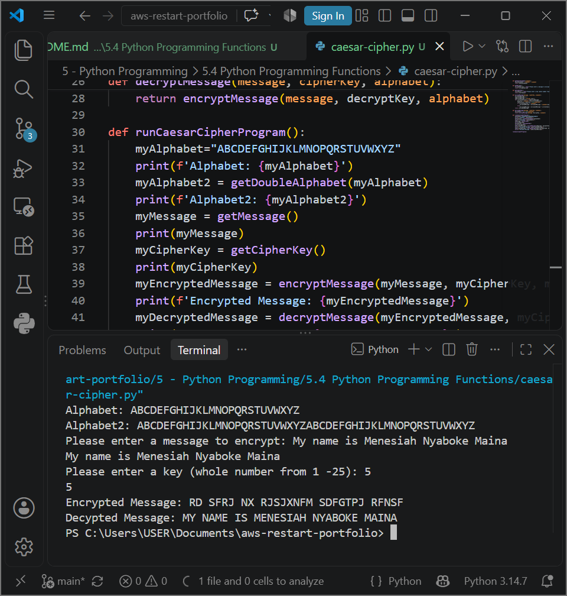

# AWS Programming Foundations: Python Programming Functions - Applied Cryptography, Code Reusability & Modular Software Architecture

## 📌 Section Overview
This module documents the architectural implementation of **User-Defined Functions, Code Reusability patterns, and Structural Organization** within software development. To analyze how parameters transit between isolated functional boundaries and evaluate how code blocks can be effectively decoupled, we engineered a complete programmatic **Caesar Cipher Cryptographic Engine**. The application leverages mathematical string index manipulations, user input collections, and functional nesting configurations to encrypt and decrypt arbitrary text streams.

---

## 🚀 Architectural Concepts & Functional Decomposition

### 1. Functional Paradigms & Code Reusability
- **Function Definition:** Named segments of reusable code engineered to isolate a single specific operational responsibility (`def`). Functions remain inactive in memory until explicitly called upon by an entrypoint invocation statement.
- **Code Reusability Optimization:** Writing modular routines eliminates redundant duplication blocks across a script tree. Decoupling distinct operational concerns into individual functions allows developers to update system behaviors globally without refactoring downstream runtime calls.
- **Built-in vs User-Defined Functions:** Standardizing everyday tasks using native platform libraries (such as `input()`, `print()`, `.upper()`, or `.find()`) alongside custom developer-defined methods carrying tailored operational logic loops.

### 2. Applied Case Study: The Caesar Cipher Cryptographic Loop
- **The Alphabet Wrap-Around Challenge:** Built a functional array duplicator (`getDoubleAlphabet`) that links a string sequence to itself, mapping out a safe lookup space to evaluate shifted indices without exceeding memory string bounds.
- **Transposition Cipher Mechanics:** The `encryptMessage` function translates inputs to upper-case variables, runs a sequence-driven `for` loop to evaluate character positions, adds an encryption shift parameter string (`cipherKey`), and references the doubled lookup matrix to append the shifted ciphertext. Non-alphabetic spaces or characters bypass modification parameters natively.
- **Algorithmic Re-Use via Code Inversion:** Rather than writing an entirely separate, heavy code block to handle data recovery, the `decryptMessage` function implements elite reusability by taking the input payload, multiplying the user's `cipherKey` by `-1` to cleanly invert the shift index, and feeding the updated parameters straight back into the existing `encryptMessage` core engine.

---

## 📸 Technical Verification Proofs

### Caesar Cipher Cryptographic Runtime: Modular Text Encryption and Decryption Executions

