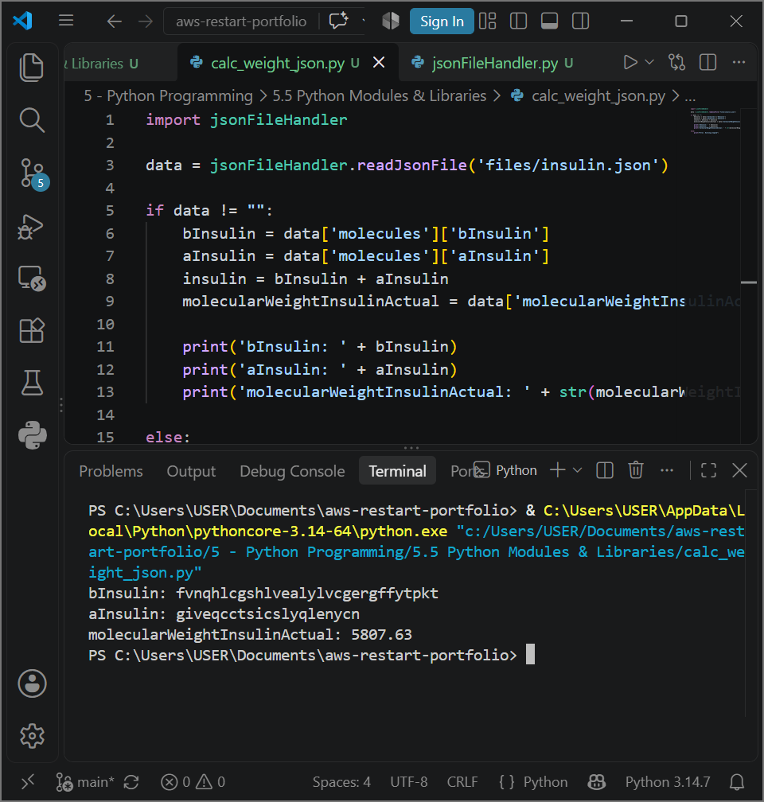

# AWS Programming Foundations: Python Modules & Libraries - Modular Application Architecture, JSON Parsing Modules & Defensive Exception Handling

## 📌 Section Overview
This module documents the architectural implementation of **Modular Application Contexts, Custom Package Creation, and Defensive Exception Handling** within software development pipelines. To analyze how file boundaries isolate operational dependencies and evaluate how complex schemas can be cleanly translated into structured in-memory primitives, we engineered a multi-file data ingestion pipeline. The architecture leverages a standalone file handler module to open data payloads via streaming file contexts (`with open`) and parse data packets using the standard `json` core module.

---

## 🚀 Architectural Concepts & Application Decoupling

### 1. Modules, Libraries & Package Sovereignty
- **Modules (`.py` files):** Independent text scripts containing functions, variables, and logic definitions designed to be cleanly imported (`import`) by external driver programs to maintain code isolation.
- **The Python Standard Library:** A native suite of pre-built, robust software utilities bundled into the interpreter runtime engine to carry out everyday infrastructure mechanics (such as file processing via `json` or OS kernel bridging).
- **Package Management via Pip:** Utilizing `pip` tools to download, maintain, and resolve package dependencies from public software registries.

### 2. Defensive Exception Handling and JSON Stream Ingestion
- **Robust Try/Except Blocks:** Runtime failures are proactively managed using defensive code shells (`try/except`). Ingesting file handlers parameters carries an explicit `IOError` boundary catch trap. If an asset is missing or corrupted, the block intercepts the runtime fault gracefully, printing a descriptive error string without triggering a terminal application crash.
- **The JSON Data Blueprint (`json.load`):** JavaScript Object Notation (JSON) serves as the industry-standard lightweight, textual format for data interchange across web endpoints and AWS resource configurations. The application leverages `json.load()` from standard libraries to open a static asset, automatically converting string documents into highly responsive, nested native Python dictionaries at runtime.

---

## 📸 Technical Verification Proofs

### Custom File Handler Package Execution: Successful JSON Parsing and Bioinformatics Mapping

