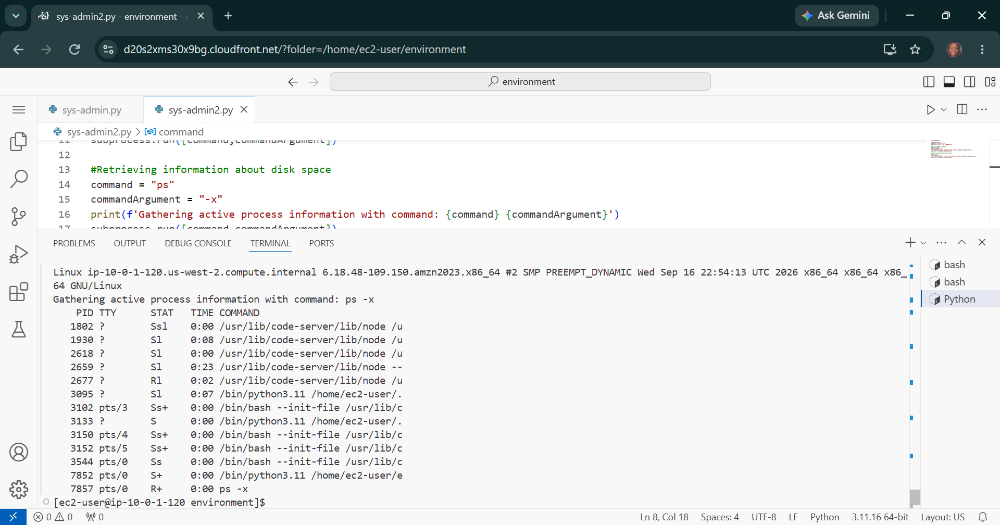

# AWS Programming Foundations: Python System Administration - Infrastructure Automation, Kernel Interfacing & Shell Subprocess Orchestration

## 📌 Section Overview
This module documents the architectural implementation of **System Administration Automation, Process Spawning, and Kernel Interfacing** within cloud infrastructure operations. To analyze how Python can displace manual shell configuration scripting and evaluate the mechanics of safely bridging runtime code to underlying Linux kernels, we engineered an automated environment audit script. The application leverages native system libraries to spawn process threads, intercept standard output streams, and retrieve active server telemetry.

---

## 🚀 Architectural Concepts & Infrastructure Automation

### 1. The Core Paradigm of Automated System Administration
- **SysAdmin Automation Foundations:** Traditional system administration relies on manual command inputs to manage operating system environments. Scripting these tasks using Python allows cloud engineers to automate critical server lifecycles—such as adding/removing user groups, auditing active package versions, or checking local disk spaces—guaranteeing consistency across massive multi-server deployments.
- **The Core Benefits:** Mitigates human parsing errors, facilitates scale, and integrates seamlessly into cloud configuration management and infrastructure-as-code deployment engines.

### 2. Process Interfacing: `os.system()` vs `subprocess.run()`
Investigated the security and performance mechanics that handle kernel interaction calls:
- **Legacy `os.system()` Framework:** A simple, high-level legacy utility that accepts a single, raw command string and pushes it straight to the host shell for execution. However, it lacks deep pipe management capabilities and introduces severe security liabilities (such as command injection vulnerabilities if raw user strings are passed unfiltered).
- **Modern `subprocess.run()` Architecture:** The industry-standard recommended system interface wrapper. Subprocess creates a secure, isolated sub-token process execution frame, passing parameters safely inside an immutable **List Array String `[]`**. This structure forces the system to treat inputs strictly as non-executable arguments, neutralizing injection attack paths while unlocking direct controls to standard input/output/error pipes (`stdout`, `stderr`) and system return exit codes.
- **Kernel Telemetry Capture:** Leveraged the subprocess engine to programmatically execute native Linux core utilities—including long-format directory listing matrices (`ls -l`), kernel system diagnostics (`uname -a`), and real-time active execution process tables (`ps -x`)—to pipe critical server system logs directly to the console runtime.

---

## 📸 Technical Verification Proofs

### Automated SysAdmin Telemetry Ingestion: Successful Kernel Interfacing and Process Thread Mapping

