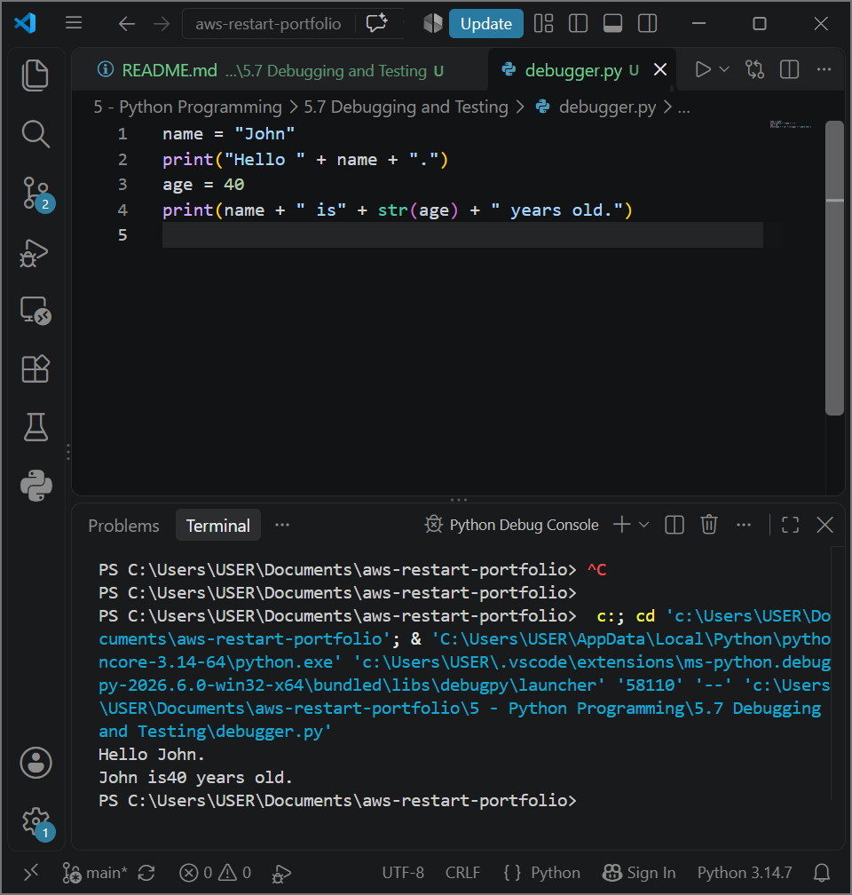
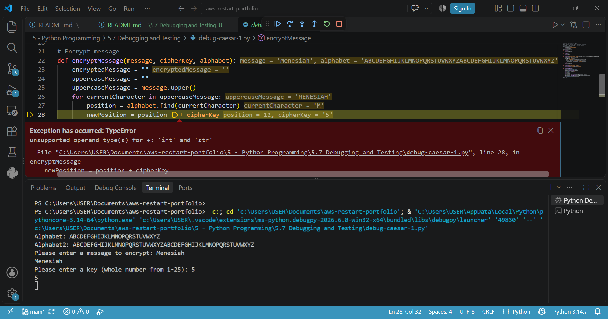

# AWS Programming Foundations: Python Debugging and Testing - Dynamic Code Analysis, Memory Inspection & Quality Assurance (QA) Frameworks

## 📌 Section Overview
This module documents the architectural implementation of **Dynamic Code Analysis, Breakpoint Configuration, Memory Inspection, and Software Testing Strategies** within code delivery pipelines. To evaluate how application state vectors compile inside system memory and analyze methods for isolating complex algorithmic defects, we implemented two separate debugging workflows: an integrated environment debugger utilizing watch-expression grids, and a terminal-native interactive command-line debugger loop via the standard `pdb` core module.

---

## 🚀 Architectural Concepts & Quality Assurance Engineering

### 1. The Core Paradigms of Testing & Analysis
Maintaining production-ready cloud scripts requires implementing structured diagnostic parameters:
- **Static Analysis vs Dynamic Analysis:**
  - *Static Analysis:* Auditing and checking text source code files for syntax flaws or rule infractions before execution (e.g., code linter reviews).
  - *Dynamic Analysis:* Evaluating script performance and memory behavior *during active runtime execution* to isolate hidden logical flaws.
- **The Software Testing Spectrum:**
  - **Unit Tests:** Isolating and testing the smallest independent blocks of code logic (such as a single standalone function) to verify it returns expected values.
  - **Integration Tests:** Verifying that multiple decoupled modules or custom file handlers function seamlessly when linked together.
  - **System & Acceptance Tests:** Testing the unified end-to-end software stack against core technical requirements and business delivery goals.
- **Assertions & Log Monitoring:** Using automated constraint validations (`assert`) and analyzing operational system logs to continuously audit runtime infrastructure states.

### 2. The Isolation Mechanics of Python Debugging
Investigated the core diagnostic tools used to inspect application states inside the memory heap:
- **Gutter Breakpoints & Watch Matrices:** Setting explicit memory-halt checkpoints maps manual code stops. Coupling these stops with custom **WATCH** expressions lets engineers monitor how data values (e.g., names, integer strings) shift inside their variable containers row-by-row.
- **Terminal-Native Headless Debugging via `pdb`:** Utilizing the standard `pdb` library module (`python3 -m pdb`) to execute headless command-line debugging loops. This enables rapid code triage inside remote cloud servers where graphical UIs are unavailable. Engineers issue low-level keyboard arguments to manipulate execution paths:
  - `b <line>` ──> **Breakpoint Configuration** (Instructs the interpreter to halt right before a line compiles)
  - `c` ──> **Continue Instruction** (Resumes normal program run until the next checkpoint)
  - `p <variable>` ──> **Print Evaluation** (Queries and outputs the exact string data currently stored inside a RAM index)
  - `s` / `n` ──> **Step Operations** (Manually drills down into function interiors line-by-line)

---

## 📸 Technical Verification Proofs

### VS Code GUI Debugger Run: Active Watch Expression Grid and Breakpoint Halts

### Command-Line PDB Terminal Trace: Headless Script Inspection and Memory Value Auditing

