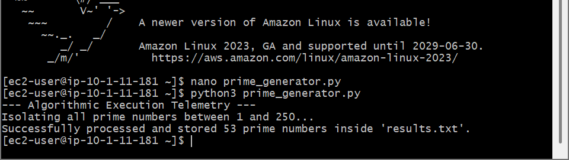
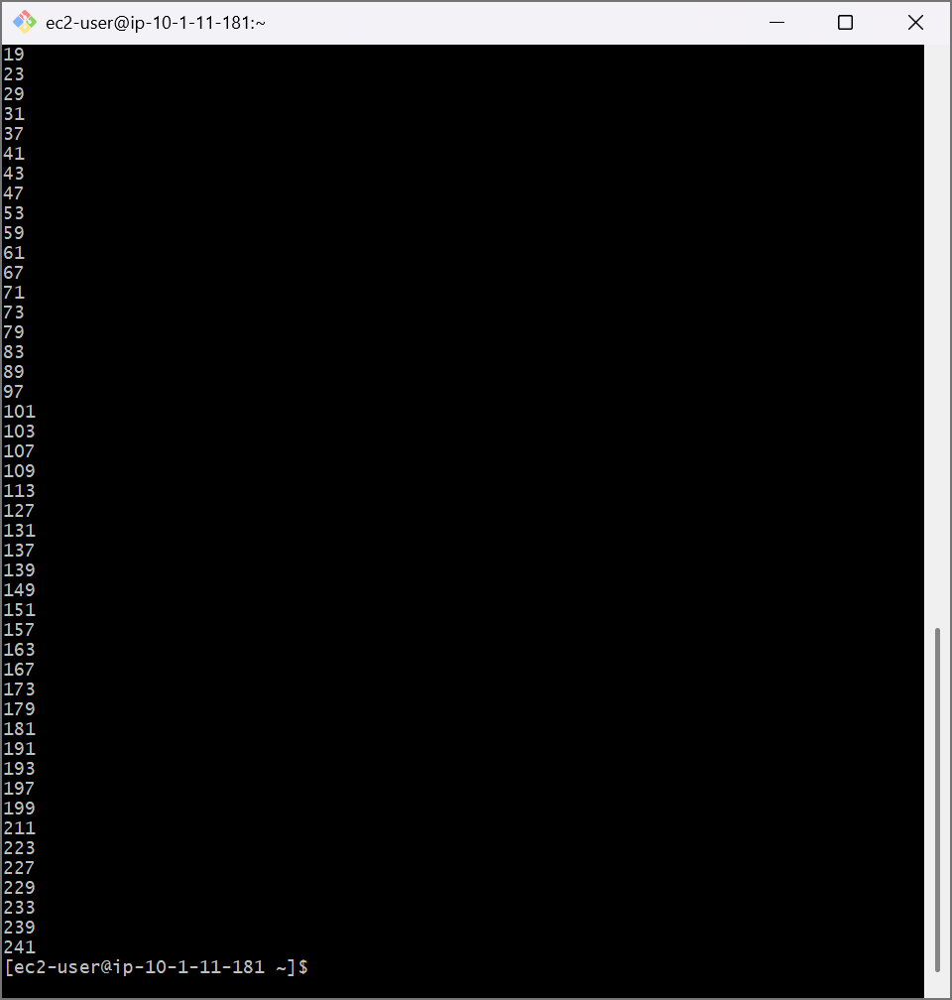

# AWS Programming Foundations: Capstone Challenge Lab - Algorithmic Prime Number Calculation & Non-Inclusive File I/O Pipelines

## 📌 Section Overview
This capstone module documents the final engineering implementation of the **Python Programming Foundations Challenge**. To demonstrate absolute competency in algorithmic code architecture, data extraction loops, and remote cloud compute management, we established an SSH link payload to a remote Amazon EC2 instance, designed an optimized algorithmic module to discover prime numbers across a specified index range (1 through 250), and handled data output streams to create an immutable physical log metric onto the host file system.

---

## 🚀 Algorithmic Design & Computational Mathematics

### 1. The Logic Matrix of Prime Determination
- **Mathematical Definition:** A prime number is a natural whole number greater than 1 that possesses exactly two distinct positive divisors: 1 and itself. 
- **Algorithmic Optimization:** Rather than iterating exhaustively across every single digit up to the target number (which degrades computing processing memory at scale), the script uses an efficient square-root bounding limit constraint (`int(num ** 0.5) + 1`). If no divisor factors are discovered below this mathematical boundary, the number is securely classified as a prime object.

### 2. Multi-Tiered Flow Control & File Stream Contexts
- **Nested Loops Execution:** The system combines sequence-driven outer `for` loop ranges with inner factorization evaluation loops to step through data metrics line-by-line.
- **Persistent Data Stream Logging:** Utilizing programmatic file context managers (`with open()`) hooked with write flag parameters (`"w"`). This isolates and locks storage streams to write each integer object followed by explicit newline string parameters (`\n`), converting volatile RAM states into permanent, text-based log files (`results.txt`) on the hard drive.

---

## 📸 Technical Verification Proofs

### Custom Algorithmic Script Compilation: Python 3 Code Execution Telemetry Logs

### Persistent File I/O Verification: Printed Ledger Matrix Tracking Prime Array Results

