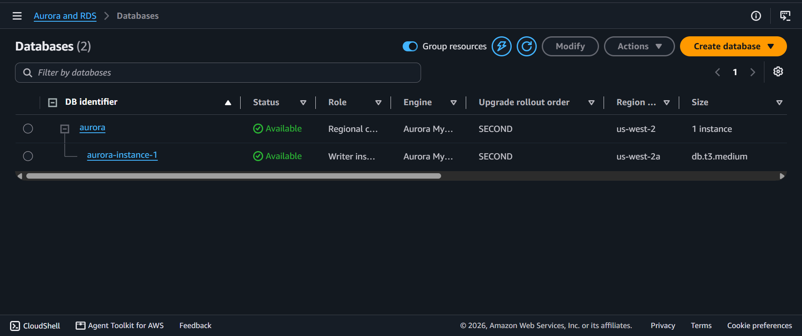
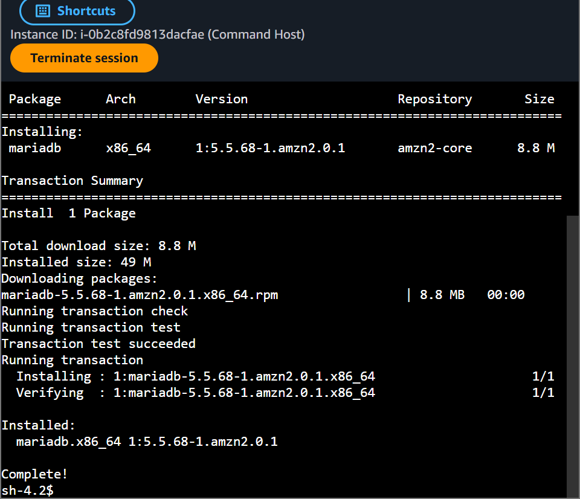
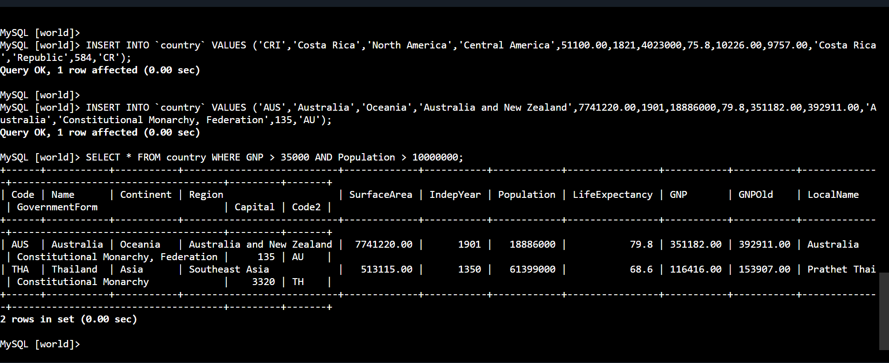

# AWS Cloud Architecture: Managed Relational Engines - Amazon Aurora DB Clusters, Compute/Storage Decoupling & High-Velocity Data Querying

## 📌 Section Overview
This module documents the cloud architecture configuration and database engine metrics that govern **Amazon Relational Database Service (RDS) and Amazon Aurora Clusters**. To evaluate how enterprise-grade distributed databases maximize data availability and durability, we provisioned an Amazon Aurora (MySQL Compatible) database cluster inside a secure Private Subnet partition, established an SSH pipeline using AWS Session Manager to a client staging server, configured database client dependencies (`mariadb`), authenticated directly into the cluster's Writer endpoint layer, and executed transactional schema scripts and compound data queries.

---

## 🚀 Managed Cloud Storage Strategies & Cluster Topologies

### 1. Amazon RDS vs. Cloud-Native Amazon Aurora
Traditional cloud relational hosting deployments model data inside standard single-server compute instances. Amazon Aurora mutates this paradigm completely:
- **Compute and Storage Decoupling:** Aurora splits processing compute cores away from the actual database storage drives entirely. Compute instances handle SQL parsing and routing transactions, while an independent, high-velocity storage grid manages data blocks.
- **Continuous Multi-AZ Virtual Sharding:** Every byte written to an Aurora cluster is automatically copied six times across three independent Availability Zones (AZs) behind the scenes. This guarantees that the system can survive the loss of an entire data facility location or up to two concurrent disk failures without data loss or application downtime.
- **Writer and Reader Endpoints:** The parent cluster registers a single **Writer Endpoint** that routes straight to the primary compute node handling write operations, alongside a cluster-level **Reader Endpoint** that automatically load-balances read-only traffic queries across available replicas to maximize processing speed.

### 2. Operational Use Cases and Cloud Scalability
- **Scalability:** Aurora storage arrays dynamically scale up in 10GB segments up to a massive 128TB limit automatically, eliminating the operational overhead of manually executing volume expansions on live production systems.
- **Enterprise Use Cases:** Critical banking ledgers, heavy e-commerce checkout platforms, and multi-tenant SaaS application backends that require strict relational consistency, ACID compliance, and low latency under severe traffic spikes.

---

## 🛠️ Step-by-Step Distributed Database Lifecycle

### 1. Provisioning the Cloud-Native Cluster
- Initiated a Standard Create wizard inside the Amazon RDS console to launch an **Amazon Aurora (MySQL Compatible)** cluster engine under the `Dev/Test` configuration blueprint template.
- Anchored the system parameters within the `LabVPC` canvas, binding it strictly to a private `dbsubnetgroup` and the `DBSecurityGroup` network firewall to isolate the environment from public internet vectors.
- Configured an initial default database container space named `world`.

### 2. Dependency Configuration & Client-Edge Bridging
- Authenticated securely into the `Command Host` Linux EC2 instance utilizing native cloud-encrypted Session Manager web tunnels.
- Cleanly installed the open-source SQL relational query shell dependency package over the native YUM software update stream repository:
  ```bash
  sudo yum install mariadb -y
  ```

### 3. Connection and Transaction Processing
- Extracted the Writer Instance Endpoint link from the cloud panel. Handshaked securely from the command host terminal across port `3306` to bridge into the database memory environment.
- Switched operational focus to the `world` partition database, built the structural `country` table schema, and executed an intensive multi-row batch data insertion script.
- Ran a compound data query to parse records carrying a high financial metric (`GNP > 35000`) and a massive demographic constraint (`Population > 10000000`).
- **Result Output:** The Aurora cluster parsed the query parameters and isolated **Australia** cleanly within the console grid view as the single absolute match.

---

## 📸 Technical Verification Proofs

### Distributed Cluster Provisioning: Active Amazon Aurora Database Engine Instantiation


### Client Dependency Integration: Successful Installation of the MariaDB Engine Shell Utilities


### Distributed Database Query: Successful Execution over the Remote Aurora Cluster Endpoint

