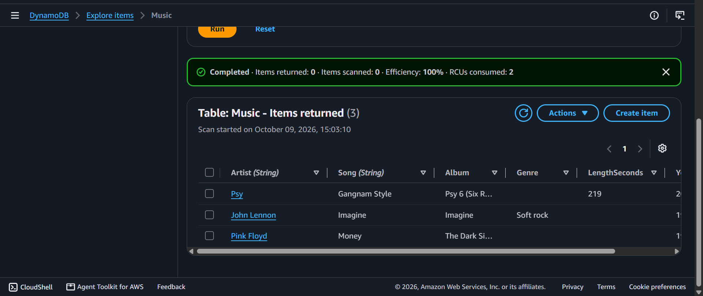
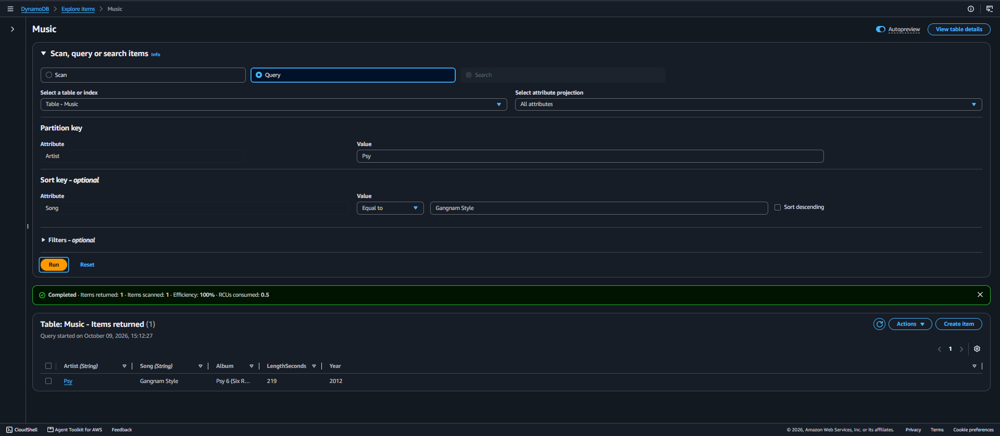
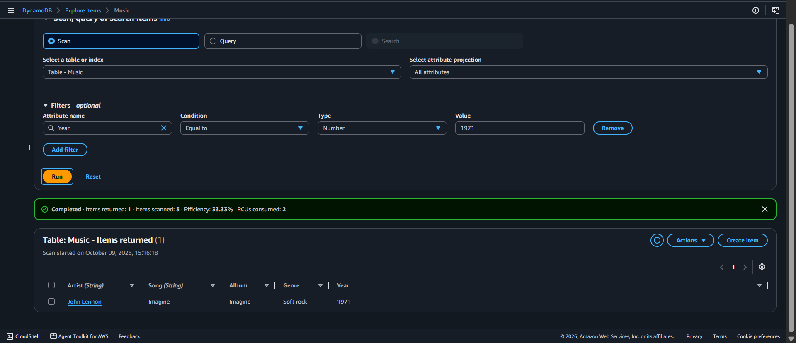

# AWS Data Architecture: NoSQL Architecture - DynamoDB - Schema-less Document Stores, Key-Value Partitioning & Data Retrieval Metrics

## 📌 Section Overview
This module documents the practical infrastructure configuration, item state mutations, and retrieval mechanics of non-relational distributed databases using **Amazon DynamoDB**. To analyze the structural differences between SQL engines and NoSQL data stores, we provisioned an active key-value document table, implemented heterogenous items carrying diverse, un-predefined attributes, performed runtime record updates, and analyzed performance variations by executing targeted indexed **Queries** against complete table **Scans**.

---

## 🚀 Relational vs. Non-Relational Architecture Tradeoffs

### 1. Comparative Analysis: SQL vs. NoSQL Topologies
Modern cloud microservices rely on separate database systems depending on transactional speed, scale, and data structural rigidity requirements:
- **Relational Databases (SQL):** Enforce absolute structural schemas. Every record row must contain identical column headings matching predefined data type constraints. Scaling requires expanding compute sizes vertically (**Scale-Up**).
- **Non-Relational Databases (NoSQL):** Enforce no structural schemas. Data is treated as independent document objects. Scaling is achieved by sharding data partitions horizontally across thousands of global commodity servers (**Scale-Out**), delivering single-digit millisecond latency at massive scale.

### 2. Core Elements of Amazon DynamoDB
Amazon DynamoDB is a fully managed, multi-region, serverless NoSQL database engine designed to run high-throughput applications seamlessly:
- **Tables, Items, and Attributes:** A *Table* is a collection of records. An *Item* represents a single row object containing unique variables. An *Attribute* is the fundamental data element component matching standard column configurations.
- **The Schema-less Advantage:** DynamoDB requires no pre-defined structural column limits. While an application grows, developers inject entirely new attributes (columns) into individual items on the fly without running heavy database migration alterations or suffering table downtime.
- **Composite Primary Keys:** Uniquely mapping records requires defining a primary index containing two properties:
  - **Partition Key (HASH):** Passed into an internal cryptographic hashing algorithm to determine the exact physical storage drive location where the item resides.
  - **Sort Key (RANGE):** Organizes and clusters identical partition records sequentially on the disk volume, unlocking rapid range search evaluations.
- **Global Tables:** Automatically replicates database modifications across selected multi-region AWS locations synchronously, providing active-active high availability for global audiences.

---

## 🛠️ Data Retrieval Paradigms: Query vs. Scan Operations

Isolating and harvesting records from a NoSQL architecture requires careful pipeline planning to control cloud compute costs and latency:
- **The Query Operation (High Velocity):** Searches for target items utilizing *strictly* the Partition Key value and optionally the Sort Key parameter constraints. Because it hits fully indexed lookups directly, it immediately targets the exact physical memory slot, making execution fast and highly cost-efficient regardless of database size.
- **The Scan Operation (High Latency):** Evaluates *every single item present inside the entire data table* from top to bottom, applying custom logic filters afterwards to strip out mismatches. For large scale production environments, running raw Scans is an architectural anti-pattern; it causes heavy disk I/O performance bottlenecks and drives up operational costs rapidly.

---

## 📸 Technical Verification Proofs

### Schema-less Item Flexibility: Non-Uniform Attributes Co-Existing Inside a Single Table Frame

### High-Velocity Query Ingestion: Direct Indexed Retrieval via Primary Partition Keys

### Table Scan Evaluation: Scanning Complete Data Volumes to Filter Target Attributes

