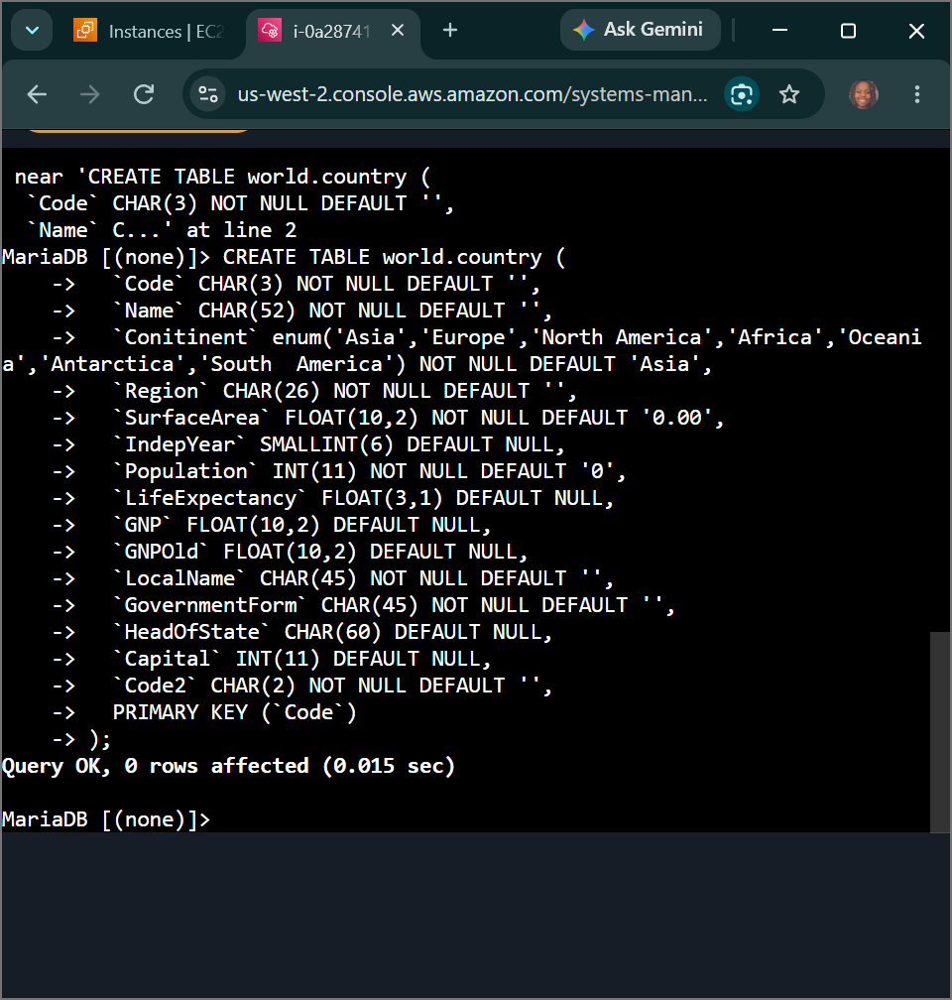
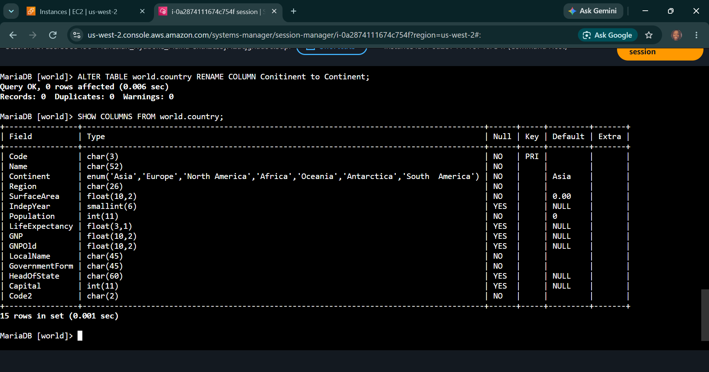
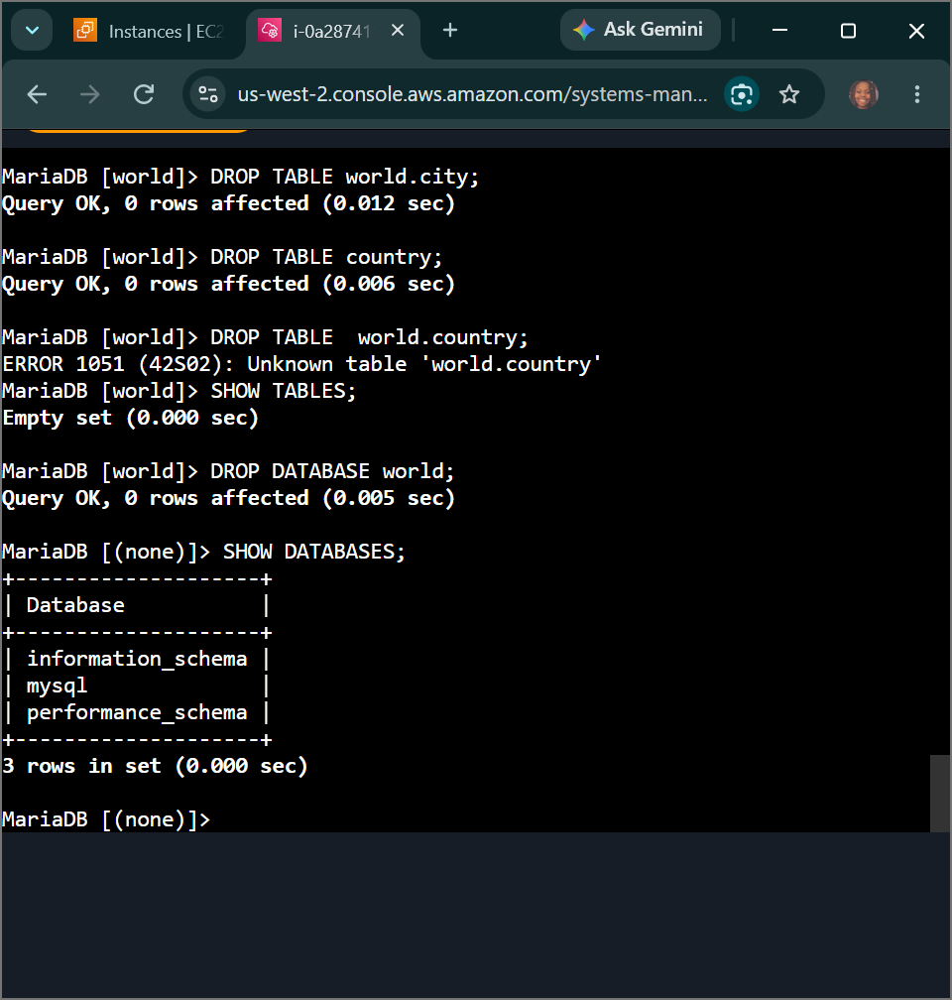

# AWS Data Architecture: Creating Tables & Data Types - DDL Schema Design, Relational Integrity & Data Engine Constraints

## 📌 Section Overview
This module documents the practical engineering implementation of **Data Definition Language (DDL), Column Data Types, and Relational Constraints** inside a live Database Management System (DBMS). To evaluate how structural blueprints partition physical disk volumes, we established a terminal-native shell connection over an encrypted AWS SSM session to a relational database engine. We engineered custom table schemas, handled column datatype definitions, implemented constraint parameters, modified live tables via schema migration ciphers, and executed complete infrastructure cleanup drops.

---

## 🚀 SQL Language Disciplines & Relational Anatomy

### 1. The Anatomy of SQL Commands
Structured Query Language (SQL) is decoupled into clear operational sub-languages that dictate how software interacts with database engines:
- **DDL (Data Definition Language):** Command strings that construct, alter, or destroy the *physical database blueprint structures* themselves (e.g., `CREATE`, `ALTER`, `DROP`). DDL changes are metadata updates that directly mutate the database engine's core system dictionary tables.
- **DML (Data Manipulation Language):** Statement structures designed to interface directly with the *individual data records* inside those tables without altering the outer schema containers (e.g., `INSERT`, `UPDATE`, `DELETE`).
- **DCL (Data Control Language):** Security configuration scripts handling access control parameters and user permission boundaries (e.g., `GRANT`, `REVOKE`).

### 2. Predefined Data Types, Identifiers & Constraints
- **Identifiers & Reserved Terms:** Table and column names serve as identifiers used to trace fields. These labels must avoid protected SQL reserved words (like `TABLE`, `DATABASE`, `SELECT`) to prevent interpreter processing faults.
- **Primitive Data Types Evaluated:**
  - `CHAR(x)`: Fixed-length character string padding memory blocks uniformly to optimize lookups.
  - `INT` & `SMALLINT`: Native numeric integers processing signed or unsigned whole metrics.
  - `FLOAT(M,D)`: High-precision approximate numeric values tracking floating decimals.
  - `ENUM(...)`: A highly optimized string object constraint that restricts column entry records strictly to a predefined list of text parameters.
- **Constraints & Keys:** Enforcing structural limits like `NOT NULL` or `DEFAULT` guarantees that incoming records match corporate data quality rules. The **Primary Key (PK)** acts as the absolute unique row locator string, ensuring data records stay clean and protecting **Referential Integrity** across tables.

---

## 🛠️ Step-by-Step Data Engineering Lifecycle

### 1. Client Shell Link & Database Initialization
- Authenticated into the `Command Host` instance terminal using secure AWS Session Manager tunnels to run commands safely.
- Injected SQL credentials into the native engine prompt (`mysql -u root -p`) to launch an active database query shell.
- Analyzed available namespaces (`SHOW DATABASES;`) and initialized a fresh, isolated storage environment space: `CREATE DATABASE world;`.

### 2. Engineering the Table Schemas & Handling Structural Modifications
- Compiled an extensive DDL creation script defining the `world.country` layout, manually assigning fields to fixed characters, variable floats, data enums, and setting `PRIMARY KEY (Code)` to enforce record unique uniqueness.
- Identified an error in the schema footprint where a column was misspelled. Executed a real-time schema patch loop to modify the table footprint configuration without tearing down the object structure:
  ```sql
  ALTER TABLE world.country RENAME COLUMN Conitinent TO Continent;
  ```
- **Challenge 1 Execution:** Designed a standalone city model (`world.city`) utilizing fixed-length text strings (`CHAR`) to store geographical mapping details.

### 3. Executing Structural Purges and Storage Teardown
- Orchestrated full environment cleanup blocks using structural `DROP` statements to release disk space.
- **Challenge 2 Execution:** Purged the country target schema safely using direct DDL commands:
  ```sql
  DROP TABLE world.country;
  ```
- Wiped the entire parent database cluster container safely (`DROP DATABASE world;`), running final validation checks (`SHOW DATABASES;`) to verify that 100% of the lab storage footprint was fully dismantled.

---

## 📸 Technical Verification Proofs

### Relational Table Operations: Initializing DDL Table Schemas Inside the MySQL Shell


### Live Schema Migration Patch: Successful Column Rename Verification Tracking


### Storage Infrastructure Teardown: Completed Table Drops and Database Purge Auditing

