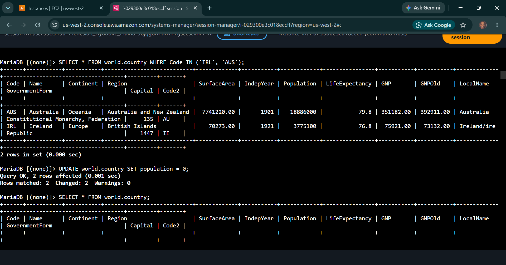
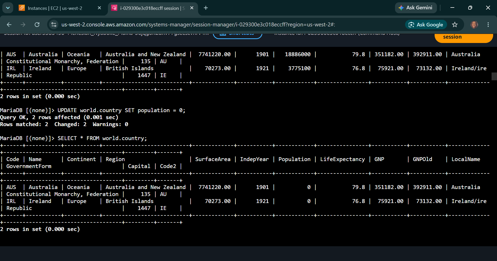
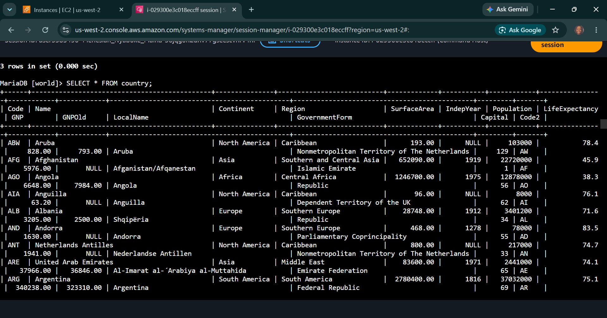

# AWS Data Architecture: Data Manipulation & Triage - DML Primitives, Unconditional State Updates & Automated SQL Seeding Pipelines

## 📌 Section Overview
This module documents the practical engineering implementation of **Data Manipulation Language (DML) Primitives, Data State Triage, and Bulk Script Ingestion** within database lifecycles. To analyze how operational modifications affect live application datasets and evaluate the risks of unconditional state updates, we executed manual record insertions, performed bulk variable overrides, executed full table deletions, and leveraged shell input redirection ciphers (`<`) to stream a complete database seed file from storage disks straight into the relational database engine.

---

## 🚀 Data Manipulation Engineering & Pipeline Ingestion

### 1. The Core Operations of Data Manipulation Language (DML)
While Data Definition Language (DDL) controls the structural layout container, DML acts directly on the dynamic business information residing inside those arrays:
- **`INSERT` statement:** Provisions a brand-new data tuple entry block, filling defined columns with literal values. Data payloads must strictly match the data types and column sequence order mandated by the database schema.
- **`UPDATE` statement:** Mutates existing row parameters inside the storage table. Executing an `UPDATE` command without an explicit conditional filter (`WHERE`) forces an unconditional override, changing that parameter globally across 100% of the entries.
- **`DELETE` statement:** Permanently strips data rows from a table. Running a `DELETE` command without filters wipes out all data logs cleanly while keeping the outer table schema container structure intact.

### 2. File Integration & Database Seeding Paradigms
- **The Limits of Manual Insertion:** Entering data records line-by-line is inefficient and introduces formatting risks. Production data management relies on automated ingestion pipelines.
- **Tabular Data Interchange Formats (.csv):** Comma-Separated Values files act as standard plain-text sheets to move datasets across separate software platforms cleanly.
- **SQL Bulk Script Redirection (`<`):** Utilizing native system shells to stream pre-compiled production backup files (`.sql`) directly into the relational engine. This automates multi-table generation, handles referential integrity setups, and seeds millions of transactional data values in seconds.

---

## 📸 Technical Verification Proofs

### DML Record Ingestion: Successful Character Mapping and Value Inserion

### Unconditional Override Triage: Global Variable Mutation and Selection Verification

### Automated Data Seeding: Ingesting Complete Database Architectures via Input Redirects

