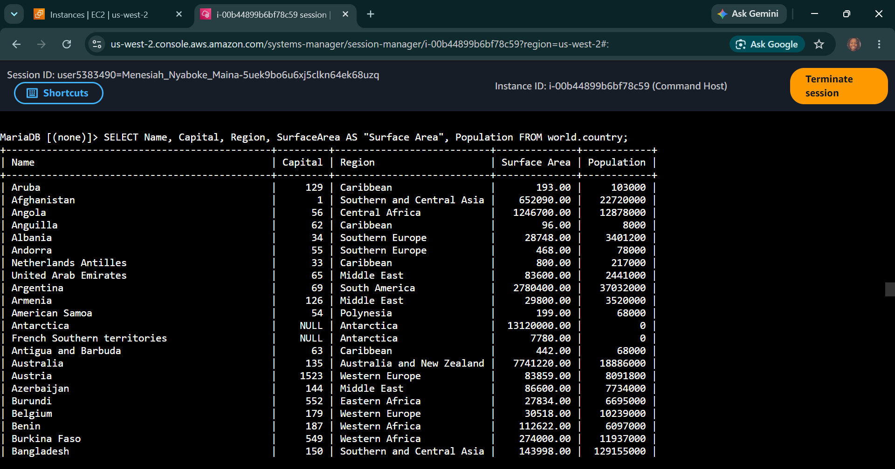
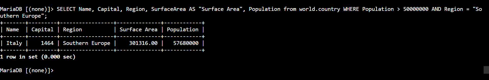

# AWS Data Architecture: Selecting & Querying Data - Advanced Projections, Column Aliasing & Multi-Conditional Filtering

## 📌 Section Overview
This module documents the practical engineering implementation of **Data Retrieval Projections, Column Aliasing, Ascending/Descending Sorting Matrices, and Logical Search Boundaries** inside a live Database Management System (DBMS). To evaluate how query parameters optimize memory use and isolate target data, we compiled granular column statements (`SELECT`), mapped human-readable data headers (`AS`), enforced strict numeric sorting limits (`ORDER BY DESC`), and deployed multi-conditional logic checks (`AND`) to resolve localized population challenges.

---

## 🚀 Query Projections & Filtering Architecture

### 1. The Mechanics of Data Projections
- **The Wildcard Scan (`SELECT *`):** Instructs the database engine to pull all columns and rows across the physical disk block. In large-scale cloud operations, this is treated as an anti-pattern for regular use due to increased network I/O latency.
- **Granular Projections:** Explicitly naming column attributes to extract only the necessary variables. This minimizes data transit sizes and optimizes server memory.
- **Column Aliasing (`AS`):** Programmatically renaming raw schema headings to clear, user-friendly labels in the output view without modifying the underlying physical database schema dictionary.

### 2. Result Sorting and Logic Boundaries
- **Sorting Controllers (`ORDER BY`):** Sorting data arrays sequentially. Relational engines default to ascending values. Appending the descending keyword (`DESC`) inverts the processing stack, ordering rows from largest to smallest.
- **Conditional Logic Filters (`WHERE`):** resticts database rows to a specific subset that matches strict evaluation parameters. 
- **Logical Intersection (`AND`):** Combines multiple criteria into a single statement. The database engine will only return records where every single listed condition evaluates as true simultaneously.

---

## 🛠️ Step-by-Step Data Analysis Lifecycle

### 1. Ingestion Profiling & Aliasing
- Query baseline to verify metadata availability and parsed total row metrics via aggregate calculations (`COUNT(*)`).
- Restructured un-optimized headings using quotes to introduce clean data presentation streams:
  ```sql
  SELECT SurfaceArea AS "Surface Area" FROM world.country;
  ```

### 2. Engineering Compound Search Filters
- Deployed strict multi-conditional boundaries using comparison operators (`>`) combined with logical intersections (`AND`) to target specific population blocks:
  ```sql
  WHERE Population > 50000000 AND Population  50000000;
  ```
- **Result Output:** Flawlessly isolated **Italy** (Population: ~57.6M) as the absolute matching datum.

---

## 📸 Technical Verification Proofs

### Metadata Projections: Executing Column Aliases inside the Database Engine


### Compound Filtering: Multi-Conditional Logic Boundaries and Descending Sort Sequences


### Capstone Challenge Resolution: Successful Isolation of Southern Europe Demographics

