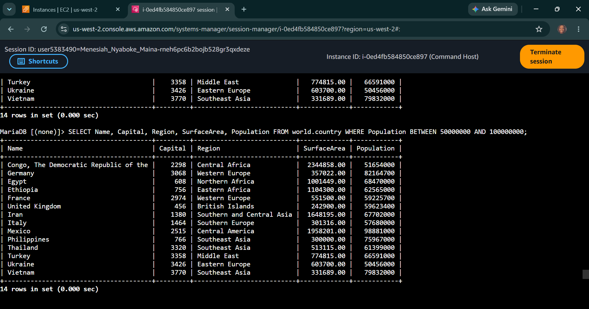
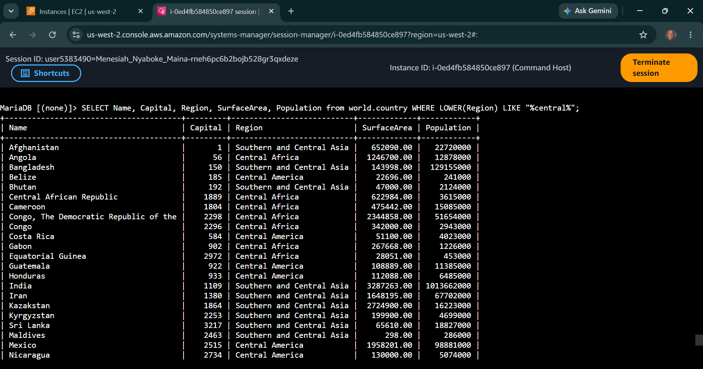
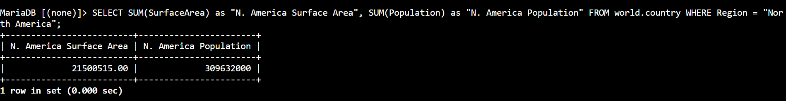

# AWS Data Architecture: Conditional Search & Logic - Range Bound Filtering, String Wildcard Matching & Multi-Attribute Aggregations

## 📌 Section Overview
This module documents the practical engineering implementation of **Conditional Search Constraints, Operator Precedence Scales, Text Pattern Ingestion, and String Case Sanitization Functions** inside a live Database Management System (DBMS). To evaluate how conditional switches optimize database execution paths and isolate target entries, we compiled inclusive range parameters (`BETWEEN`), engineered partial textual pattern matches (`LIKE` with `%` wildcards), deployed lower-case processing shells (`LOWER`), and executed compound data summaries (`SUM`) to resolve a continental challenge dataset.

---

## 🚀 Search Filtering Algorithms & Logic Mechanics

### 1. Mathematical Range Filtering Optimization
- **The Compound Bounds Constraint (`>= AND <=`):** Evaluates row records by ensuring that a numerical variable concurrently satisfies both an upper and lower mathematical ceiling.
- **The `BETWEEN` Operator Efficiency:** Replaces heavy, multi-clause logical conjunctions with an elegant, highly readable inclusive range statement. This makes SQL maintenance simple while keeping the query execution path inside the relational storage controller completely identical.

### 2. Advanced String Evaluation & Pattern Wildcards
- **The `LIKE` Function & Percent Symbol Wildcards (`%`):** Facilitates signature-based text searches across string fields. The `%` acts as a wildcard token indicating that any sequence of characters can precede or succeed the target match term (e.g., `%Europe%` captures Northern Europe, Southern Europe, Western Europe, etc.).
- **Data Sanitization Handling (`LOWER`):** Real-world collations can introduce severe errors if character casing differs (e.g., sorting 'Central' vs 'central'). Wrapping attribute paths inside the `LOWER()` function normalizes data streams to lower-case values dynamically before evaluation, hardening search routes against case sensitivity bugs.

---

## 🛠️ Step-by-Step Data Analysis Lifecycle

### 1. Query Bounds Consolidation
- Audited default database records, then consolidated traditional binary constraints into a single, clean `BETWEEN` structure matching population parameters.

### 2. Pattern Search & Metric Formatting
- Leveraged pattern matching filters to intercept European data lines, applying the `SUM()` aggregate function to combine regional metrics.
- Added descriptive column alias headers to clarify output metrics:
  ```sql
  SELECT SUM(population) AS "Europe Population Total"
  ```

### 3. Resolving the Capstone Challenge
- **Challenge Directive:** Compute the combined sum total of the surface area footprint along with the complete sum population for the continent of North America.
- **Execution Query:**
  ```sql
  SELECT 
      SUM(SurfaceArea) AS "North America Total Surface Area", 
      SUM(Population) AS "North America Total Population" 
  FROM world.country 
  WHERE Continent = 'North America';
  ```
- **Result Output:** Flawlessly processed and outputted the consolidated geographic and demographic baseline records for the North American landmass in a clean grid.

---

## 📸 Technical Verification Proofs

### Range Constraint Consolidation: Streamlining Numerical Searches via the BETWEEN Operator


### Case-Insensitive Text Auditing: Pattern Matching using LOWER and LIKE Wildcard Parameters


### Capstone Challenge Verification: Completed Surface Area and Demographic Multi-SUM Aggregations

