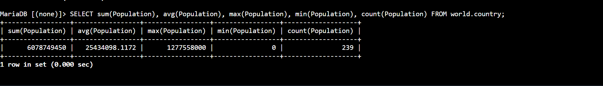
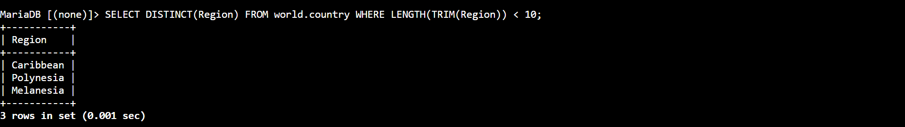
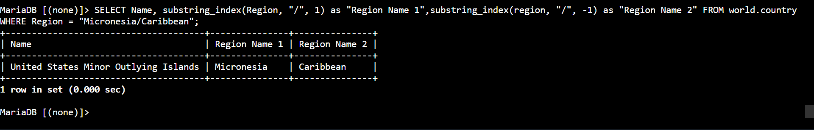

# AWS Data Architecture: SQL Functions & Computations - Built-in Scalar Engines, Character Stripping & Advanced String Token Slicing

## 📌 Section Overview
This module documents the practical engineering implementation of **SQL Built-in Functions, Mathematical Data Aggregations, Whitespace Sanitization Modules, and String Token Slicing Engines** inside a live Database Management System (DBMS). To evaluate how embedded functions transform raw database attributes into formatted data models, we configured statistical calculation grids (`SUM`, `AVG`, `MAX`, `MIN`), deployed whitespace compressors (`TRIM`), verified character count bounds (`LENGTH`), eliminated row redundancies (`DISTINCT`), and leveraged advanced string delimiter markers (`SUBSTRING_INDEX`) to parse compound text strings cleanly.

---

## 🚀 Data Processing Engines & Computational Mathematics

### 1. Mathematical Data Aggregations
Aggregate functions perform a calculation on a set of values and return a single value summary. Relational database engines execute these calculations directly at the storage level, which optimizes network speed:
- **`SUM()` & `AVG()`:** Calculates total balances and mathematical means across entire data sets.
- **`MAX()` & `MIN()`:** Scans column memory matrices to isolate absolute highest and lowest boundary value parameters.
- **`COUNT()`:** Tallies the total number of records matching the criteria, ignoring fields populated with un-allocated `NULL` states.

### 2. String Sanitization & Delimiter Token Slicing
Real-world data pipelines regularly ingest raw data fields that require text cleaning and structure tracking:
- **`TRIM()` & `LENGTH()`:** `TRIM` clears leading and trailing blank spaces from text records. Nesting it inside `LENGTH()` allows the database engine to count the exact character footprint of a field accurately, preventing empty space artifacts from throwing off search conditions.
- **`DISTINCT` Keyword:** Instructs the database engine to remove duplicate records from the query's output stream, returning a set of completely unique elements.
- **`SUBSTRING_INDEX(str, delim, count)`:** An advanced text function that searches a string for a specified separator character and slices it. If the count is positive, it returns everything to the left of the delimiter; if negative, it returns everything to the right. This is highly effective for splitting combined attributes (like email domains, compound addresses, or slash-separated fields) on the fly.

---

## 🛠️ Step-by-Step Data Analysis Lifecycle

### 1. Statistical Summary Ingestion
- Authenticated via secure SSM terminal tunnels to run a full aggregate scan over the country dataset, validating global world population benchmarks inside a single output row.

### 2. Space Profiling & De-duplication
- Implemented character evaluation logic to filter for regional attributes with short names, combining `LENGTH` and `TRIM` parameters. 
- Discovered duplicate records in the result set, then injected the `DISTINCT` keyword to enforce absolute set uniqueness across the terminal stream.

### 3. Resolving the Capstone Challenge
- **Challenge Directive:** Intercept rows matching 'Micronesian/Caribbean' and dynamically split that slash-separated text field into two independent output columns labeled 'Region Name 1' and 'Region Name 2'.
- **Execution Query:**
  ```sql
  SELECT 
      SUBSTRING_INDEX(Region, '/', 1) AS "Region Name 1",
      SUBSTRING_INDEX(Region, '/', -1) AS "Region Name 2"
  FROM world.country 
  WHERE Region LIKE "%Micronesian/Caribbean%";
  ```
- **Result Output:** The database engine successfully parsed the forward-slash delimiter, separated the text, and printed the data under the clean custom column aliases.

---

## 📸 Technical Verification Proofs

### Global Data Aggregations: Summarizing Datasets via Mathematical Core Functions


### Clean Data Extraction: Enforcing Set Uniqueness using DISTINCT and Whitespace TRIM Filters


### Capstone String Dissection: Delimiter Token Splitting via SUBSTRING_INDEX Expressions

