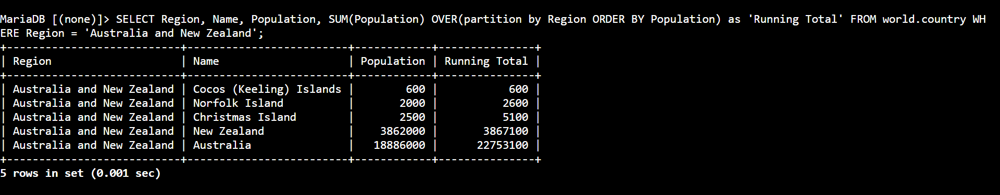
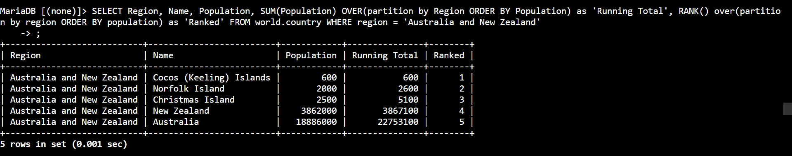
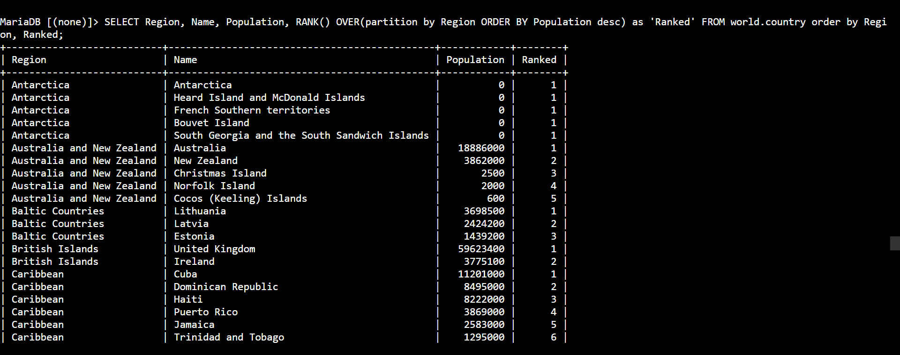

# AWS Data Architecture: Data Organization & Sorting - Analytical Window Functions, Rolling Aggregations & Partition Rank Formulations

## 📌 Section Overview
This module documents the practical engineering implementation of **Data Grouping Controls, Advanced Sort Routines, Windowing Partition Functions, and Dynamic Rank Indexes** inside a live Database Management System (DBMS). To evaluate how data engines organize large-scale relational matrices, we configured consolidated row aggregations (`GROUP BY`), engineered real-time running calculation models using inline partition hooks (`SUM OVER`), and deployed analytical positioning filters (`RANK OVER`) to compile localized population benchmarks globally.

---

## 🚀 Data Ingestion Architecture & Analytical Windowing

### 1. Traditional Grouping vs. Advanced Window Functions
- **The Group By Paradigm (`GROUP BY`):** Collapses individual rows into a single summary row based on matching column values. While effective for generating macro totals, it completely discards individual row metadata profiles within the output view.
- **The Windowing Paradigm (`OVER`):** Executes calculations across a specific set of table rows that are logically linked to the current row. Unlike a traditional group operation, window functions compute aggregated values *while preserving the explicit identity of every single row record* in the final query stream.

### 2. Deep Dive: Window Function Syntaxes & Elements
- **`PARTITION BY` Boundary Control:** Instructs the database processing engine to segment the data table into isolated, independent processing pools based on identical field definitions (e.g., breaking out records by unique `Region` blocks).
- **`SUM() OVER(...)` Running Totals:** Generates a rolling cumulative aggregation line-by-line. As the query steps forward, it adds the current row's numeric value to the running total of the preceding rows within that specific partition boundary.
- **`RANK() OVER(...)` Positional Indices:** Programmatically evaluates a numeric variable within a partition and assigns a sequential ranking integer starting at `1`. By pairing this with descending sort rules (`ORDER BY DESC`), engineers can instantly isolate the highest-performing or highest-risk records inside localized data trees.

---

## 🛠️ Step-by-Step Data Analysis Lifecycle

### 1. Categorical Aggregation Ingestion
- Authenticated via secure SSM terminal tunnels to run direct sorted queries inside the `world` database environment, consolidating population metrics for specific geographic regions using basic group wrappers.

### 2. Engineering Real-Time Rolling Telemetry
- Upgraded the query pipeline to include complex window functions, computing rolling metrics that output individual country sizes right alongside a dynamic regional calculation tracker.
- Combined the data with positional sorting filters to append an inline evaluation rating column using the `RANK()` standard library engine.

### 3. Resolving the Capstone Challenge
- **Challenge Directive:** Write an optimized analytical query to rank every country in *each* global region by its population from largest to smallest.
- **Execution Query:**
  ```sql
  SELECT 
      Region,
      Name,
      Population,
      RANK() OVER(PARTITION BY Region ORDER BY Population DESC) AS 'Regional Rank'
  FROM world.country;
  ```
- **Result Output:** The database engine successfully parsed the entire dataset, isolated individual regional clusters, sorted their internal entries from highest to lowest population, and printed a clean ranking index that dynamically resets to `1` as each new region begins.

---

## 📸 Technical Verification Proofs

### Dynamic Rolling Telemetry: Generating Complex Running Totals via Windowing Partitioning


### Positional Index Calculations: Appending Sequence Rankings via the RANK OVER Engine


### Capstone Challenge Resolution: Completed Real-Time Multi-Region Population Rank Formulations

