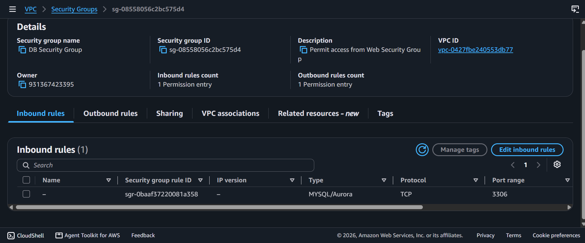
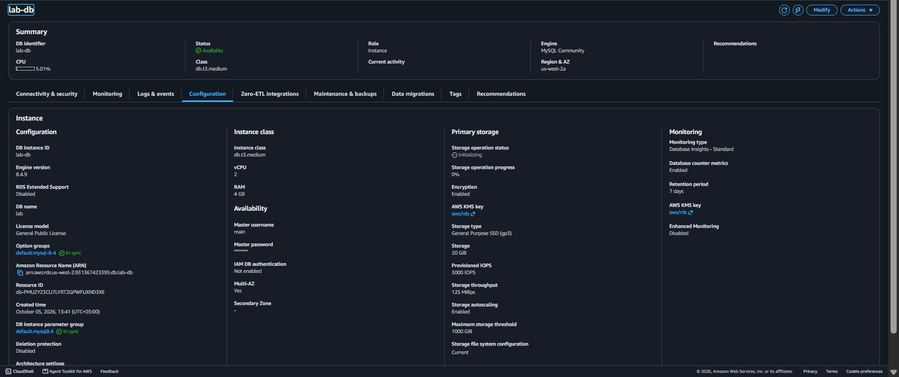
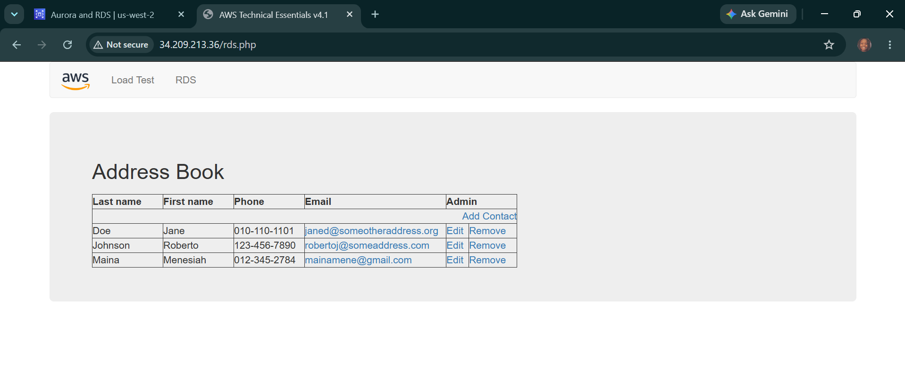

# AWS Cloud Architecture: Multi-Tier Server Integration - Managed Amazon RDS Deployments, Multi-AZ High-Availability Subnet Isolation & Security Group Cross-Referencing

## 📌 Section Overview
This module documents the practical infrastructure implementation of a secure, production-grade **Three-Tier Cloud Web Application Architecture** utilizing managed **Amazon Relational Database Service (RDS)**. To evaluate how cloud storage layer engines isolate application contexts and maintain continuous durability, we engineered a dedicated Database Security Group using cross-referenced firewall source rules, provisioned an isolated DB Subnet Group across multiple Availability Zones, launched a Multi-AZ synchronously replicated MySQL database instance, and linked a live EC2-hosted application front-end directly to the backend storage endpoint.

---

## 🚀 Cloud Infrastructure Topology & Relational Storage Governance

### 1. Amazon RDS Multi-AZ High-Availability Architecture
Deploying enterprise relational workloads requires absolute fault tolerance to mitigate regional data center outages:
- **Synchronous Storage Replication:** When a Multi-AZ database deployment is provisioned, Amazon RDS automatically spins up a **Primary DB Instance** in one Availability Zone and a **Standby DB Instance** in a completely separate Availability Zone. Data writes are committed synchronously across both storage arrays simultaneously.
- **Automated Failover Matrix:** If the primary host suffers a hardware failure, power blackout, or network disruption, the cloud infrastructure engine automatically re-routes the application’s DNS endpoint connection token straight to the standby node with zero human intervention required, preventing corporate system downtime.

### 2. Network Isolation & Security Group Firewall Cascading
- **DB Subnet Groups:** A dedicated collection of subnets designated for your RDS engines within a Virtual Private Cloud (VPC). To enforce security baselines, databases are locked inside **Private Subnets** (`10.0.1.0/24` and `10.0.3.0/24`), blocking direct inbound internet access strings.
- **Cross-Referenced Security Groups (Firewall Cascading):** Rather than opening port `3306` to arbitrary IP addresses, the database firewall is configured to accept traffic *only if the inbound request token originates from a resource actively bound to the Web Security Group*. This establishes a tight security boundary where only the designated app servers can communicate with the data layer.

### 3. Data Retrieval Frameworks: Set Operators & Relational Joins
- **Set Operators (`UNION`, `INTERSECT`, `EXCEPT`):** Used to combine the output matrices of separate query statements into a single, unified result set vertically.
- **Relational Joins (`INNER`, `LEFT`, `RIGHT`, `FULL OUTER`):** Critical data engineering mechanisms that query records across multiple tables simultaneously by linking matching Primary Key (PK) and Foreign Key (FK) attributes horizontally.

---

## 🛠️ Step-by-Step Cloud Deployment Lifecycle

### 1. Hardening the Network Access Layer
- Navigated to the Amazon VPC console and generated **`DB Security Group`** over the `Lab VPC` canvas.
- Attached a custom inbound firewall rule opening the database port framework (**MySQL/Aurora 3306**), explicitly configuring the Source parameter to point to the security group ID of the **`Web Security Group`**.

### 2. Provisioning the Private Subnet Cluster
- Accessed the Amazon RDS console and initialized the **`DB Subnet Group`**.
- Mapped the network boundary constraints across two distinct Availability Zones, anchoring the database paths strictly inside **Private Subnet 1** and **Private Subnet 2** to isolate data assets.

### 3. Launching the Managed RDS MySQL Instance
- Provisioned a Full Configuration database instance using the standard **MySQL Engine** template.
- Implemented high-availability parameters by selecting the **Multi-AZ DB Instance deployment** track, configuring the machine size to a burstable `db.t3.medium` template carrying a 20GB `gp3` solid-state storage allocation.
- Attached the newly minted `DB Subnet Group` and `DB Security Group`, disabled public visibility completely, and set the initial internal database workspace name to `lab`.

### 4. Application Integration & Handshake Verification
- Collected the generated database endpoint string: `lab-db.xxxxxx.us-west-2.rds.amazonaws.com`.
- Connected to the public IP address of the `WebServer` compute node via an external web browser tab to interact with the application tier dashboard.
- Navigated to the RDS configuration interface and entered the connection credentials (Endpoint, Database Name, Master Username, and Password).
- **Result Output:** The application successfully initialized an automated migration script, connected to the backend RDS cluster over the private network pipeline, and rendered a live database-backed **Address Book Application** tracking persistent contact additions seamlessly.

---

## 📸 Technical Verification Proofs

### Firewall Cascading: Cross-Referencing Security Groups to Protect Database Port 3306

### Managed Storage Infrastructure: Multi-AZ Synchronous RDS MySQL Instance Available Output

### Multi-Tier Application Integration: Successful Frontend Handshake to the Amazon RDS Database

